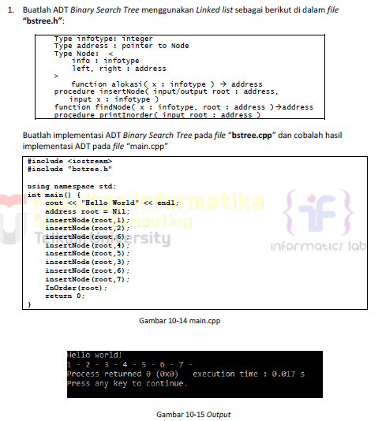
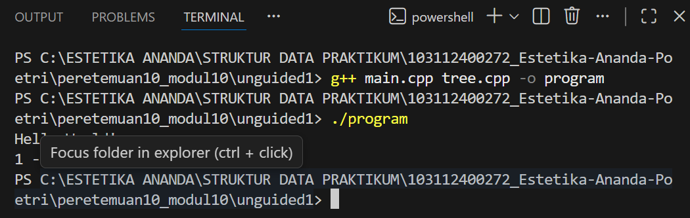
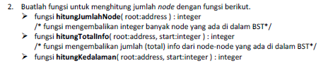
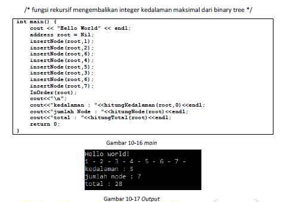
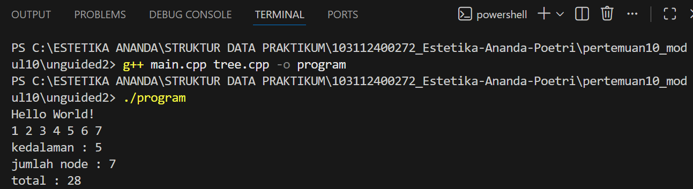
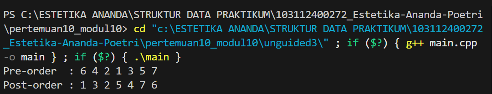

# <h1 align="center">Laporan Praktikum Modul 10 - Tree (bagian pertama)</h1>
<p align="center">Estetika Ananda Poetri Hariyanto - 103112400272</p>

## Dasar Teori
Secara umum, tree dalam data structure adalah kumpulan simpul (nodes) yang terhubung melalui cabang (edges) dan disusun dalam bentuk hierarki. Dalam situasi ini, setiap pohon memiliki satu simpul utama, atau akar, dan simpul lain yang berfungsi sebagai anak dari simpul utama. Konsep tree ini sangat penting dalam pengorganisasian data yang kompleks, seperti struktur file pada sistem operasi atau basis data relasional.

Struktur ini berbeda dengan struktur linear seperti array atau linked list, karena tidak memiliki urutan elemen yang tetap. Sebaliknya, tree memberikan fleksibilitas dalam representasi data hierarkis dan memungkinkan berbagai teknik traversal atau penelusuran yang efisien. [1].

### A. ...<br/>
...
#### 1. ...
#### 2. ...
#### 3. ...

### B. ...<br/>
...
#### 1. ...
#### 2. ...
#### 3. ...

## Guided

### 1. Guided 1

bst.cpp
```C++
#include "bst.h"
#include <iostream>

using namespace std;

//NOTE : parameter tree disini maksudnya merujuk ke node; baik itu node root atau node lain dari tree

bool isEmpty(BinTree tree){
    if(tree == Nil){
        return true;
    } else {
        return false;
    }
}

void createTree(BinTree &tree){
    tree = Nil;
}

node alokasi(int angkaInput){
    node nodeBaru = new BST;
    nodeBaru->angka = angkaInput;
    nodeBaru->left = Nil;
    nodeBaru->right = Nil;
    return nodeBaru;
}

void dealokasi(node nodeHapus){
    delete nodeHapus;
}

void insertNode(BinTree &tree, node nodeBaru){
    if(tree == Nil){
        tree = nodeBaru;
        cout << "Node " << nodeBaru->angka << " berhasil ditambahkan ke dalam tree!" << endl;
        return;
    } else if(nodeBaru->angka < tree->angka){
        insertNode(tree->left, nodeBaru);
    } else if(nodeBaru->angka > tree->angka){
        insertNode(tree->right, nodeBaru);
    }
}

void searchByData(BinTree tree, int angkaCari){
    if(isEmpty(tree) == true){
        cout << "Tree kosong!" << endl;
    } else {
        node nodeBantu = tree;
        node parent = Nil;
        bool ketemu = false;
        while(nodeBantu != Nil){
            if(angkaCari < nodeBantu->angka){
                parent = nodeBantu;
                nodeBantu = nodeBantu->left;
            } else if(angkaCari > nodeBantu->angka){
                parent = nodeBantu;
                nodeBantu = nodeBantu->right;
            } else if(angkaCari == nodeBantu->angka){
                ketemu = true;
                break;
            }
        }
        if(ketemu == false){
            cout << "Data tidak ditemukan" << endl;
        } else if(ketemu == true){
            cout << "Data ditemukan didalam tree!" << endl;
            cout << "Data Angka : " << nodeBantu->angka << endl;

            //menampilkan parentnya & pengecekan sibling
            node sibling = Nil;
            if(parent != Nil){
                cout << "Parent : " << parent->angka << endl;
                if(parent->left == nodeBantu){
                    sibling = parent->right;
                } else if(parent->right == nodeBantu){
                    sibling = parent->left;
                }
            } else {
                cout << "Parent : - (node root)"<< endl;
            }

            //menampilkan siblingnya
            if(sibling != Nil){
                cout << "Sibling : " << sibling->angka << endl;
            } else {
                cout << "Sibling : - " << endl;
            }

            //menampilkan childnya
            if(nodeBantu->left != Nil){
                cout << "Child kiri : " << nodeBantu->left->angka << endl;
            } else if(nodeBantu->left == Nil){
                cout << "Child kiri : -" << endl;
            }
            if(nodeBantu->right != Nil){
                cout << "Child kanan : " << nodeBantu->right->angka << endl;
            } else if(nodeBantu->right == Nil){
                cout << "Child kanan : -" << endl;
            }
        }
    }
}

void preOrder(BinTree tree){ //tengah - kiri - kanan atau root - child kiri - child kanan
    if(tree == Nil){
        return;
    }
    cout << tree->angka << " - ";
    preOrder(tree->left);
    preOrder(tree->right);
}

void inOrder(BinTree tree){ //kiri - tengah - kanan atau child kiri - root - child kanan
    if(tree == Nil){
        return;
    }
    inOrder(tree->left);
    cout << tree->angka << " - ";
    inOrder(tree->right);
}

void postOrder(BinTree tree){ //kiri - kanan - tengah atau child kiri - child kanan - root
    if(tree == Nil){
        return;
    }
    postOrder(tree->left);
    postOrder(tree->right);
    cout << tree->angka << " - ";
}


bool deleteNode(BinTree &tree, int angka) {
    if (tree == Nil) {
        return false; //data tidak ditemukan di subtree ini
    } else {
        if (angka < tree->angka) {
            return deleteNode(tree->left, angka);
        } else if (angka > tree->angka) {
            return deleteNode(tree->right, angka);
        } else {
            //jika node yang mau dihapus ditemukan
            //Case 1 : node yang mau dihapus adalah leaf
            if (tree->left == Nil && tree->right == Nil) {
                node tmp = tree;
                tree = Nil;
                dealokasi(tmp);
            }
            //Case 2 : node yang mau dihapus hanya punya right child
            else if (tree->left == Nil) {
                node tmp = tree;
                tree = tree->right;
                dealokasi(tmp);
            }
            //Case 3 : node yang mau dihapus hanya punya left child
            else if (tree->right == Nil) {
                node tmp = tree;
                tree = tree->left;
                dealokasi(tmp);
            }
            // Case 4 : jika node yang mau dihapus punya dua child, maka ambil mostleft dari subtree kanan untuk menggantikan node yang mau dihapus
            else {
                //mostleft dari subtree kanan = node successor (node penerus)
                node successor = mostLeft(tree->right);
                //salin data successor ke node saat ini
                tree->angka = successor->angka;
                //hapus successor pada subtree kanan
                return deleteNode(tree->right, successor->angka);
            }
            return true; //berhasil dihapus
        }
    }
}

node mostRight(BinTree tree){
    while (tree->right != Nil){
        tree = tree->right;
    }
    return tree;    
}

node mostLeft(BinTree tree){
    while (tree->left != Nil){
        tree = tree->left;
    }
    return tree;
}

void deleteTree(BinTree &tree){
    if(tree == Nil){
        return;
    } else {
        deleteTree(tree->left);
        deleteTree(tree->right);
        dealokasi(tree);
        tree = Nil;
    }
}

int size(BinTree tree){ //mengembalikan jumlah semua node
    if(isEmpty(tree) == true){
        return 0;
    } else {
        return 1 + size(tree->left) + size(tree->right);
    }
    cout << endl;
}

int height(BinTree tree){ //mengembalikan jumlah level tree
    if(isEmpty(tree) == true){
        return -1; //tree kosong jika height = -1
    } else {
        int hl = height(tree->left);
        int hr = height(tree->right);
        int maxHeight;
        if (hl > hr){
            maxHeight = hl;
        } else {
            maxHeight = hr;
        }
        return 1 + maxHeight;
    }
    cout << endl;
}
```

bst.h

``` C++
#ifndef BST_H
#define BST_H 
#define Nil NULL

using namespace std;

typedef struct BST *node; // alias pointer = node

struct BST { //nama  struct nya BST
    int angka;
    node left;
    node right;

};

typedef node BinTree; // alias tree = BinTree (merujuk ke node root dari BST)

bool isEmpty(BinTree tree);
void createTree(BinTree &tree);
node alokasi(int angka);
void dealokasi(node nodeHapus);

void insertNode(BinTree &tree, node nodeBaru);
void searchByData(BinTree tree, int angka);
void preOrder(BinTree tree);
void inOrder(BinTree tree);
void postOrder(BinTree tree);

bool deleteNode(BinTree &tree, int angka);
node mostRight(BinTree tree);
node mostLeft(BinTree tree);
void deleteTree(BinTree &tree);
int size(BinTree tree);
int height(BinTree tree);

#endif
```

main.cpp
```C++
#include <iostream>
#include "bst.h"

using namespace std;

int main() {
    BinTree tree;
    createTree(tree);

    int pilih, angka;

    do {
        cout << "========= MENU BST =========" << endl;
        cout << "1. Insert Node" << endl;
        cout << "2. Delete Node" << endl;
        cout << "3. Search Data" << endl;
        cout << "4. Tampilkan PreOrder" << endl;
        cout << "5. Tampilkan InOrder" << endl;
        cout << "6. Tampilkan PostOrder" << endl;
        cout << "7. Size Tree (jumlah node)" << endl;
        cout << "8. Height Tree (tinggi level)" << endl;
        cout << "9. Tampilkan mostright" << endl;
        cout << "10. Tampilkan mostleft" << endl;
        cout << "11. Delete Seluruh Tree" << endl;
        cout << "0. Keluar" << endl;
        cout << "pilihan anda : ";
        cin >> pilih;
        cout << endl;

        switch (pilih){
        case 1:
            cout << "Masukkan angka: ";
            cin >> angka;
            insertNode(tree, alokasi(angka));
            cout << endl;
            break;

        case 2:
            if(isEmpty(tree) == true){
                cout << "Tree kosong!" << endl;
            } else {
                cout << "Masukkan angka yang ingin dihapus: ";
                cin >> angka;
                if(deleteNode(tree, angka)){
                    cout << "Data " << angka << " berhasil dihapus!" << endl;
                } else {
                    cout << "Data " << angka << " tidak ditemukan!" << endl;
                }
            }
            cout << endl;
            break;

        case 3:
            if(isEmpty(tree) == true){
                cout << "Tree kosong!" << endl;
            } else {
                cout << "Masukkan angka yang ingin dicari: ";
                cin >> angka;
                searchByData(tree, angka);
            }
            cout << endl;
            break;

        case 4:
            if(isEmpty(tree) == true){
                cout << "Tree kosong!" << endl;
            } else {
                cout << "PreOrder : ";
                preOrder(tree);
                cout << endl;
            }
            cout << endl;
            break;

        case 5:
            if(isEmpty(tree) == true){
                cout << "Tree kosong!" << endl;
            } else {
                cout << "InOrder : ";
                inOrder(tree);
                cout << endl;
            }
            cout << endl;
            break;

        case 6:
            if(isEmpty(tree) == true){
                cout << "Tree kosong!" << endl;
            } else {
                cout << "PostOrder : ";
                postOrder(tree);
                cout << endl;
            }
            cout << endl;
            break;

        case 7:
            cout << "Size Tree = " << size(tree) << endl;
            cout << endl;
            break;

        case 8:
            cout << "Height Tree = " << height(tree) << endl;
            cout << endl;
            break;

        case 9: 
            if(isEmpty(tree) == true){
                cout << "Tree kosong!" << endl;
                cout << endl;
            } else {
                cout << "Mostright : " << mostRight(tree)->angka << endl;
                cout << endl;
            }
            break;
        
        case 10:
            if(isEmpty(tree) == true){
                cout << "Tree kosong!" << endl;
                cout << endl;
            } else {
                cout << "Mostleft : " << mostLeft(tree)->angka << endl;
                cout << endl;
            }
            break;

        case 11:
            if(isEmpty(tree) == true){
                cout << "Tree kosong!" << endl;
            } else {
                deleteTree(tree);
                cout << "Seluruh tree berhasil dihapus!" << endl;
            }
            cout << endl;
            break;

        case 0:
            cout << "Keluar dari program..." << endl;
            break;

        default:
            cout << "Pilihan tidak valid!" << endl;
            break;
        }

    } while (pilih != 0);

    return 0;
}
```
Program ini dipakai untuk menyimpan, mencari, dan menghapus data angka menggunakan struktur Binary Search Tree (BST). Data akan otomatis tersusun: angka kecil di kiri, angka besar di kanan, sehingga proses pencarian jadi lebih cepat.

Program ini juga bisa menampilkan data dalam urutan tertentu (preorder, inorder, dan postorder), menghitung jumlah data, melihat tinggi tree, serta mengetahui nilai terkecil dan terbesar. Jika diperlukan, seluruh tree juga bisa dihapus dan dikosongkan kembali.


## Unguided 

### 1. 

tree.cpp
```C++
#include <iostream>
#include "tree.h"
using namespace std;

int main() {
    cout << "Hello World!" << endl;

    Node* root = nullptr;

    insertNode(root, 4);
    insertNode(root, 2);
    insertNode(root, 1);
    insertNode(root, 3);
    insertNode(root, 6);
    insertNode(root, 5);
    insertNode(root, 7);

    inOrder(root);

    return 0;
}
```

tree.h
```C++
#ifndef TREE_H
#define TREE_H

struct Node {
    int info;
    Node* left;
    Node* right;
};

Node* alokasi(int x);

void insertNode(Node*& root, int x);

void inOrder(Node* root);

#endif
```

main.cpp
```C++
#include <iostream>
#include "tree.h"
using namespace std;

int main() {
    cout << "Hello World!" << endl;

    Node* root = nullptr;

    insertNode(root, 4);
    insertNode(root, 2);
    insertNode(root, 1);
    insertNode(root, 3);
    insertNode(root, 6);
    insertNode(root, 5);
    insertNode(root, 7);

    inOrder(root);

    return 0;
}
```
### Output Unguided 1 :

##### Output 1


>> File bstree.h
File ini hanya berisi deklarasi atau “daftar fungsi” yang akan dipakai.
Isinya:
- Struktur Node → tempat menyimpan angka + pointer kiri dan kanan
- Fungsi membuat node baru (alokasi)
- Fungsi memasukkan angka ke BST (insertNode)
- Fungsi menampilkan isi pohon secara in-order (inOrder)
Ini seperti “daftar menu” bagi program utama.

>>  File bstree.cpp
File ini berisi cara kerjanya atau implementasi dari BST.
Isinya:
- Membuat node baru
Setiap node menyimpan angka dan punya anak kiri dan kanan.
- Insert angka 
Logikanya:
Kalau belum ada node → langsung buat root
Kalau angka lebih kecil → masuk kiri
Kalau angka lebih besar → masuk kanan
Ini membuat data otomatis tersusun rapi.
- InOrder traversal
InOrder artinya:
Kunjungi kiri
Tampilkan node
Kunjungi kanan
Urutan ini membuat angka tampil dari kecil → besar.

>> File main.cpp
Bagian ini menjalankan program.
Langkahnya:
Tulis “Hello World!”
Buat BST yang masih kosong
Masukkan angka:
4, 2, 1, 3, 6, 5, 7
Tampilkan hasilnya dalam urutan in-order

### 2. 


main.cpp
```C++
#include "tree.h"

int main() {
    cout << "Hello World!" << endl;

    address root = NULL;

    insertNode(root, 1);
    insertNode(root, 3);
    insertNode(root, 2);
    insertNode(root, 6);
    insertNode(root, 5);
    insertNode(root, 4);
    insertNode(root, 7);

    InOrder(root);
    cout << endl;

    cout << "kedalaman : " << hitungKedalaman(root) << endl;
    cout << "jumlah node : " << hitungJumlahNode(root) << endl;
    cout << "total : " << hitungTotalInfo(root) << endl;

    return 0;
}
```
tree.cpp
```C++
#include "tree.h"

address newNode(int x) {
    address p = new Node;
    p->info = x;
    p->left = p->right = NULL;
    return p;
}

void insertNode(address &root, int x) {
    if (root == NULL) {
        root = newNode(x);
    } else if (x < root->info) {
        insertNode(root->left, x);
    } else {
        insertNode(root->right, x);
    }
}

void InOrder(address root) {
    if (root != NULL) {
        InOrder(root->left);
        cout << root->info << " ";
        InOrder(root->right);
    }
}

int hitungJumlahNode(address root) {
    if (root == NULL) return 0;
    return 1 + hitungJumlahNode(root->left) + hitungJumlahNode(root->right);
}

int hitungTotalInfo(address root, int start) {
    if (root == NULL) return 0;
    return root->info 
        + hitungTotalInfo(root->left) 
        + hitungTotalInfo(root->right);
}

int hitungKedalaman(address root, int start) {
    if (root == NULL) return 0;
    int leftDepth  = hitungKedalaman(root->left);
    int rightDepth = hitungKedalaman(root->right);
    return 1 + max(leftDepth, rightDepth);
}
```

tree.h
```C++
#ifndef tree_H
#define tree_H

#include <iostream>
using namespace std;

struct Node {
    int info;
    Node *left, *right;
};

typedef Node* address;

address newNode(int x);
void insertNode(address &root, int x);
void InOrder(address root);

int hitungJumlahNode(address root);
int hitungTotalInfo(address root, int start = 0);
int hitungKedalaman(address root, int start = 0);

#endif
```

### Output Unguided 2 :

##### Output 1


1. tree.h
Ini file yang berisi:
- Struktur data Node
Setiap node menyimpan:
info → nilai angka
left → anak kiri
right → anak kanan
- Tipe alias
typedef Node* address;
biar lebih pendek waktu dipakai
- Deklarasi fungsi
Semua fungsi BST dideklarasikan di sini:
buat node → newNode
insert → insertNode
inorder → InOrder
hitung jumlah node → hitungJumlahNode
hitung total info → hitungTotalInfo
hitung kedalaman → hitungKedalaman

2. tree.cpp
- newNode
Bikin node baru.
- insertNode
Memasukkan angka ke dalam BST dengan aturan:
lebih kecil → kiri
lebih besar → kanan
- InOrder
Traversal untuk menampilkan data urut dari kecil ke besar.
- hitungJumlahNode
Menghitung total node.
Caranya:
titik ini + subtree kiri + subtree kanan
- hitungTotalInfo
Menjumlahkan semua nilai dalam pohon.
- hitungKedalaman
Menghitung kedalaman paling dalam dari tree.
Caranya:
cek kedalaman subtree kiri
cek kedalaman subtree kanan
pilih yang terbesar

3. main.cpp
Isinya:
- Tampilkan “Hello World!”
- Buat root BST
address root = NULL;
- Insert beberapa data
1, 3, 2, 6, 5, 4, 7
Ini menghasilkan struktur tree tertentu.
- Tampilkan isi tree (InOrder)
Hasilnya akan urut:
1 2 3 4 5 6 7
- Tampilkan:
Kedalaman tree
Jumlah node
Total nilai node

### 3. 

```C++
#include <iostream>
using namespace std;

struct Node {
    int info;
    Node *left, *right;
};

//fungsi untuk membuat node baru
Node* newNode(int x) {
    Node* p = new Node;
    p->info = x;
    p->left = p->right = NULL;
    return p;
}

//pre-order: root -> left -> right
void preorder(Node* root) {
    if (root != NULL) {
        cout << root->info << " ";
        preorder(root->left);
        preorder(root->right);
    }
}

//post-order: left -> right -> root
void postorder(Node* root) {
    if (root != NULL) {
        postorder(root->left);
        postorder(root->right);
        cout << root->info << " ";
    }
}

int main() {
    //bentuk tree sesuai soal
    Node* root = newNode(6);
    root->left = newNode(4);
    root->right = newNode(7);

    root->left->left = newNode(2);
    root->left->right = newNode(5);

    root->left->left->left = newNode(1);
    root->left->left->right = newNode(3);

    //memunculkan output
    cout << "Pre-order  : ";
    preorder(root);     // Hasil: 6 4 2 1 3 5 7
    cout << endl;

    cout << "Post-order : ";
    postorder(root);    // Hasil: 1 3 2 5 4 7 6
    cout << endl;

    return 0;
}
```

### Output Unguided 3 :

##### Output 1


Program ini sebenarnya cuma dipakai buat ngebaca isi tree dengan dua cara berbeda. Pertama-tama, program bikin dulu node-node yang isinya angka, terus node-node itu disusun jadi tree yang sama persis seperti gambar soal.
Setelah treenya jadi, program jalanin dua jenis “cara baca”:

Pre-order
Di cara ini, program ngeliat bagian atas dulu (root), habis itu jalan ke kiri, baru ke kanan.
Karena itu hasil akhirnya muncul: 6, 4, 2, 1, 3, 5, 7.

Post-order
Kalau yang ini kebalik: program ke kiri dulu, lalu kanan, dan root belakangan.
Jadi hasilnya: 1, 3, 2, 5, 4, 7, 6.

## Kesimpulan
Secara keseluruhan, materi ini membahas bagaimana Binary Search Tree (BST) digunakan untuk mengelola data angka secara terstruktur. BST menyimpan data dengan aturan sederhana: nilai yang lebih kecil ditempatkan di sisi kiri, sedangkan nilai yang lebih besar berada di sisi kanan. Aturan ini membuat proses pencarian, penambahan, dan penghapusan data menjadi lebih cepat dan efisien dibandingkan struktur data linear.

Pada bagian Guided, program BST dibuat secara lengkap, mulai dari membuat node baru, memasukkan data, mencari data hingga menampilkan informasi parent, sibling, dan child. Program juga mampu menghapus node dengan berbagai kondisi, menampilkan isi tree lewat beberapa jenis traversal (preorder, inorder, postorder), menghitung jumlah node, menentukan tinggi tree, hingga menemukan nilai terbesar dan terkecil.

Sementara pada bagian Unguided, berlatih membuat versi BST yang lebih sederhana. Latihan tersebut mencakup membangun tree dari sejumlah nilai, menampilkan isi tree, menghitung total node, menjumlahkan semua nilai, mengukur kedalaman tree, serta membaca tree dengan metode preorder dan postorder.

Secara umum, seluruh rangkaian program menunjukkan bahwa BST merupakan struktur data yang efektif untuk mengatur dan memproses data angka, karena mampu menyusun data secara otomatis dan menyediakan berbagai operasi yang mendukung pengolahan data secara cepat dan terstruktur.

## Referensi
[1] [https://bds.telkomuniversity.ac.id/struktur-data-tree-konsep-jenis-dan-aplikasinya/]

