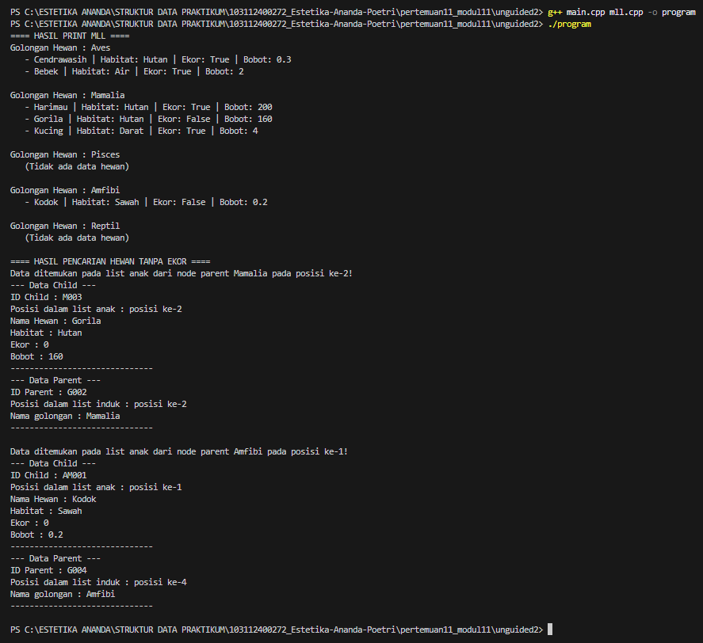
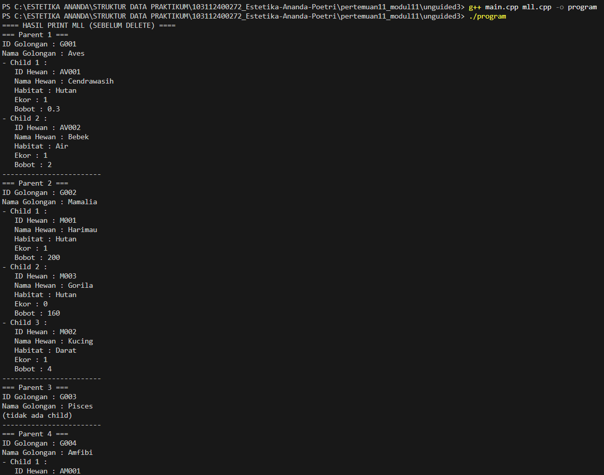

# <h1 align="center">Laporan Praktikum Modul 13 - Multi Linked List</h1>
<p align="center">Estetika Ananda Poetri Hariyanto - 103112400272</p>

## Dasar Teori
Multiple linked list merupakan senarai berantai yang memiliki link atau pointer lebih darisatu. Untuk multiple linked list yang memiliki dua link biasanya disebut sebagai doublylinked list (senarai berantai ganda). Senarai berantai ganda memiliki dua buah pointer yang biasanya masing-masing menunjuk ke simpul sebelumnya dan ke simpulsesudahnya. [1].

### A. ...<br/>
...
#### 1. ...
#### 2. ...
#### 3. ...

### B. ...<br/>
...
#### 1. ...
#### 2. ...
#### 3. ...

## Guided

### 1. Guided 1

mll.cpp
```C++
#include "mll.h"
#include <iostream>
#include <string>

using namespace std;

//isEmpty & create list
bool isEmptyInduk(listInduk LInduk){
    if(LInduk.first == NULL){
        return true;
    } else {
        return false;
    }
}

bool isEmptyAnak(listAnak LAnak){
    if(LAnak.first == NULL){
        return true;
    } else {
        return false;
    }
}

void createListInduk(listInduk &LInduk) {
    LInduk.first = LInduk.last = NULL;
}

void createListAnak(listAnak &LAnak) {
    LAnak.first = LAnak.last = NULL;
}

//alokasi & dealokasi
NodeParent alokasiNodeParent(string idKategori, string namaKategori) {
    NodeParent nodeBaruParent = new nodeParent;
    nodeBaruParent->isidata.idKategori = idKategori;
    nodeBaruParent->isidata.namaKategori = namaKategori;
    nodeBaruParent->next = NULL;
    nodeBaruParent->prev = NULL;
    createListAnak(nodeBaruParent->L_Anak);
    return nodeBaruParent;
}

NodeChild alokasiNodeChild(string idMakanan, string namaMakanan, float harga) {
    NodeChild nodeBaruChild = new nodeChild;
    nodeBaruChild->isidata.idMakanan = idMakanan;
    nodeBaruChild->isidata.namaMakanan = namaMakanan;
    nodeBaruChild->isidata.harga = harga;
    nodeBaruChild->next = NULL;
    nodeBaruChild->prev = NULL;
    return nodeBaruChild;
}

void dealokasiNodeChild(NodeChild &nodeAnak) {
    if(nodeAnak != NULL) {
        nodeAnak->next = nodeAnak->prev = NULL;
        delete nodeAnak;
        nodeAnak = NULL;
    }
}

void dealokasiNodeParent(NodeParent &nodeInduk) {
    if(nodeInduk != NULL) {
        nodeInduk->next = nodeInduk->prev = NULL;
        delete nodeInduk;
        nodeInduk = NULL;
    }
}

//operasi pada parent
void insertFirstParent(listInduk &LInduk, NodeParent nodeBaruParent) {
    if(isEmptyInduk(LInduk) == true) {
        LInduk.first = LInduk.last = nodeBaruParent;
    } else {
        nodeBaruParent->next = LInduk.first;
        LInduk.first->prev = nodeBaruParent;
        LInduk.first = nodeBaruParent;
    }
    cout << "Node parent "<< nodeBaruParent->isidata.namaKategori << " berhasil ditambahkan kedalam urutan pertama di list Induk!" << endl;
}

void insertLastParent(listInduk &LInduk, NodeParent nodeBaruParent) {
    if(isEmptyInduk(LInduk) == true) {
        LInduk.first = LInduk.last = nodeBaruParent;
    } else {
        nodeBaruParent->prev = LInduk.last;
        LInduk.last->next = nodeBaruParent;
        LInduk.last = nodeBaruParent;
    }
    cout << "Node parent "<< nodeBaruParent->isidata.namaKategori << " berhasil ditambahkan kedalam urutan terakhir di list Induk!" << endl;
}

void insertAfterParent(listInduk &LInduk, NodeParent nodeBaruParent, NodeParent nodePrevParent) {
    if(nodePrevParent == NULL) {
        cout << "Node Prev Parent tidak valid!" << endl;
    } else {
        if(nodePrevParent == LInduk.last){
            insertLastParent(LInduk, nodeBaruParent);
            return;
        } else {
            nodeBaruParent->next = nodePrevParent->next;
            nodeBaruParent->prev = nodePrevParent;
            (nodePrevParent->next)->prev = nodeBaruParent;
            nodePrevParent->next = nodeBaruParent;
            cout << "Node parent "<< nodeBaruParent->isidata.namaKategori << " berhasil ditambahkan kedalam list induk setelah node parent "<< nodePrevParent->isidata.namaKategori << endl;
        }
    }
}

void deleteFirstParent(listInduk &LInduk){
    if(isEmptyInduk(LInduk) == true){
        cout << "List Induk kosong!" << endl;
    } else {
        NodeParent nodeHapus = LInduk.first;
        if (LInduk.first == LInduk.last) { 
            LInduk.first = NULL;
            LInduk.last = NULL;
        } else {
            LInduk.first = LInduk.first->next;
            LInduk.first->prev = NULL;
            nodeHapus->next = NULL;
        }
        if(nodeHapus->L_Anak.first != NULL){
            hapusListAnak(nodeHapus->L_Anak);
        }
        dealokasiNodeParent(nodeHapus);
        cout << "Node pertama list induk berhasil dihapus beserta anak-anaknya!" << endl;
    }
}

void deleteLastParent(listInduk &LInduk){
    if(isEmptyInduk(LInduk) == true){
        cout << "List Induk kosong!" << endl;
    } else {
        NodeParent nodeHapus = LInduk.last;
        if (LInduk.first == LInduk.last) {
            LInduk.first = NULL;
            LInduk.last = NULL;
        } else {
            LInduk.last = LInduk.last->prev;
            nodeHapus->prev = NULL;
            LInduk.last->next = NULL;
        }
        if(nodeHapus->L_Anak.first != NULL){
            hapusListAnak(nodeHapus->L_Anak);
        }
        dealokasiNodeParent(nodeHapus);
        cout << "Node terakhir list induk berhasil dihapus beserta anak-anaknya!" << endl;
    }
}

void deleteAfterParent(listInduk &LInduk, NodeParent nodePrev){
    if(isEmptyInduk(LInduk) == true){
        cout << "List induk kosong!" << endl;
    } else {
        if(nodePrev != NULL && nodePrev->next != NULL){
            NodeParent nodeHapus = nodePrev->next;
            nodePrev->next = nodeHapus->next;
            if (nodeHapus->next != NULL){
                (nodeHapus->next)->prev = nodePrev;
            } else {
                LInduk.last = nodePrev;
            }
            nodeHapus->next = NULL;
            if(nodeHapus->L_Anak.first != NULL){
                hapusListAnak(nodeHapus->L_Anak);
            }
            dealokasiNodeParent(nodeHapus);
            cout << "Node parent setelah node " << nodePrev->isidata.namaKategori << " berhasil dihapus beserta anak-anaknya!" << endl;
        } else {
            cout << "Node prev tidak valid!" << endl;
        }
    }
}

void findParentByID(listInduk &LInduk, string IDCari){
    if(isEmptyInduk(LInduk) == true){
        cout << "List induk kosong!" << endl;
    } else {
        NodeParent nodeBantu = LInduk.first;
        int index = 1;
        int ketemu = false;
        while(nodeBantu != NULL){
            if(nodeBantu->isidata.idKategori == IDCari){
                cout << "Data ID parent ditemukan pada list induk posisi ke-" << index << "!" << endl;
                cout << "ID : " << nodeBantu->isidata.idKategori << endl;
                cout << "Posisi dalam list induk : posisi ke-" << index << endl;
                cout << "Nama Kategori : " << nodeBantu->isidata.namaKategori << endl;
                ketemu = true;
                break;
            } else {
                nodeBantu = nodeBantu->next;
                index++;
            }
        }
        if(!ketemu){
            cout << "Data ID parent tidak ditemukan didalam list induk!" << endl;
        }
    }
}

void updateDataParentByID(listInduk &LInduk, string IDCari, string newNamaKategori) {
    if (isEmptyInduk(LInduk) == true) {
        cout << "List Induk kosong!" << endl;
    } else {
        NodeParent nodeBantu = LInduk.first;
        bool ketemu = false;
        while (nodeBantu != NULL) {
            if (nodeBantu->isidata.idKategori == IDCari) {
                // Proses Update
                nodeBantu->isidata.namaKategori = newNamaKategori;
                cout << "Update Parent Berhasil!" << endl;
                cout << "Node parent dengan ID " << IDCari << " berhasil diupdate menjadi : " << endl;
                cout << "Nama Kategori baru  : " << newNamaKategori << endl;
                ketemu = true;
                break; 
            } else {
                nodeBantu = nodeBantu->next;
            }
        }
        if (!ketemu) {
            cout << "Parent dengan ID " << IDCari << " tidak ditemukan" << endl;
        }
    }
}

void insertFirstChild(listAnak &LAnak, NodeChild nodeBaruChild) {
    if(isEmptyAnak(LAnak)) {
        LAnak.first = LAnak.last = nodeBaruChild;
    } else {
        nodeBaruChild->next = LAnak.first;
        LAnak.first->prev = nodeBaruChild;
        LAnak.first = nodeBaruChild;
    }
    cout << "Node child "<< nodeBaruChild->isidata.namaMakanan << " berhasil ditambahkan kedalam urutan pertama di list Anak!" << endl;
}

void insertLastChild(listAnak &LAnak, NodeChild nodeBaruChild) {
    if(isEmptyAnak(LAnak)) {
        LAnak.first = LAnak.last = nodeBaruChild;
    } else {
        nodeBaruChild->prev = LAnak.last;
        LAnak.last->next = nodeBaruChild;
        LAnak.last = nodeBaruChild;
    }
    cout << "Node child "<< nodeBaruChild->isidata.namaMakanan << " berhasil ditambahkan kedalam urutan terakhir di list Anak!" << endl;
}

void insertAfterChild(listAnak &LAnak, NodeChild nodeBaruChild, NodeChild nodePrevChild) {
    if(nodePrevChild == NULL) {
        cout << "Node Prev Parent tidak valid!" << endl;
    } else {
        if(nodePrevChild == LAnak.last){
            insertLastChild(LAnak, nodeBaruChild);
            return;
        } else {
            nodeBaruChild->next = nodePrevChild->next;
            nodeBaruChild->prev = nodePrevChild;
            (nodePrevChild->next)->prev = nodeBaruChild;
            nodePrevChild->next = nodeBaruChild;
            cout << "Node child "<< nodeBaruChild->isidata.namaMakanan << " berhasil ditambahkan kedalam list anak setelah node child "<< nodePrevChild->isidata.namaMakanan << endl;
        }
    }
}

void deleteFirstChild(listAnak &LAnak){
    if(isEmptyAnak(LAnak) == true){
        cout << "List anak kosong!" << endl;
    } else {
        NodeChild nodeHapus = LAnak.first;
        if (LAnak.first == LAnak.last) { 
            LAnak.first = NULL;
            LAnak.last = NULL;
        } else {
            LAnak.first = LAnak.first->next;
            LAnak.first->prev = NULL;
            nodeHapus->next = NULL;
        }
        dealokasiNodeChild(nodeHapus);
        cout << "Node pertama list anak berhasil dihapus!" << endl;
    }
}

void deleteLastChild(listAnak &LAnak){
    if(isEmptyAnak(LAnak) == true){
        cout << "List anak kosong!" << endl;
    } else {
        NodeChild nodeHapus = LAnak.last;
        if (LAnak.first == LAnak.last) {
            LAnak.first = NULL;
            LAnak.last = NULL;
        } else {
            LAnak.last = LAnak.last->prev;
            nodeHapus->prev = NULL;
            LAnak.last->next = NULL;
        }
        dealokasiNodeChild(nodeHapus);
        cout << "Node terakhir list anak berhasil dihapus!" << endl;
    }
}

void deleteAfterChild(listAnak &LAnak, NodeChild nodePrev){
    if(isEmptyAnak(LAnak) == true){
        cout << "List induk kosong!" << endl;
    } else {
        if(nodePrev != NULL && nodePrev->next != NULL){
            NodeChild nodeHapus = nodePrev->next;
            nodePrev->next = nodeHapus->next;
            if (nodeHapus->next != NULL){
                (nodeHapus->next)->prev = nodePrev;
            } else {
                LAnak.last = nodePrev;
            }
            nodeHapus->next = NULL;
            dealokasiNodeChild(nodeHapus);
            cout << "Node child setelah node " << nodePrev->isidata.namaMakanan << " berhasil dihapus!" << endl;
        } else {
            cout << "Node prev tidak valid!" << endl;
        }
    }
}

void findChildByID(listInduk &LInduk, string IDCari){
    if(isEmptyInduk(LInduk) == true){
        cout << "List induk kosong!" << endl;
    } else {
        NodeParent nodeBantuParent = LInduk.first;
        int indexParent = 1;
        int ketemu = false;
        while(nodeBantuParent != NULL){
            NodeChild nodeBantuChild = nodeBantuParent->L_Anak.first;
            int indexChild = 1;
            while(nodeBantuChild != NULL){
                if(nodeBantuChild->isidata.idMakanan == IDCari) {
                    cout << "Data ID child ditemukan pada list anak dari node parent " << nodeBantuParent->isidata.namaKategori << " pada posisi ke-" << indexChild << "!" << endl;
                    cout << "--- Data Child ---" << endl;
                    cout << "ID Child : " << nodeBantuChild->isidata.idMakanan << endl;
                    cout << "Posisi dalam list anak : posisi ke-" << indexChild << endl;
                    cout << "Nama Makanan : " << nodeBantuChild->isidata.namaMakanan << endl;
                    cout << "Harga : " << nodeBantuChild->isidata.harga << endl;
                    cout << "---------------------------" << endl;
                    cout << "--- Data Parent ---" << endl;
                    cout << "ID Parent : " << nodeBantuParent->isidata.idKategori << endl;
                    cout << "Posisi dalam list induk : posisi ke-" << indexParent << endl;
                    cout << "Nama kategori : " << nodeBantuParent->isidata.namaKategori << endl;
                    ketemu = true;
                    break;
                } else {
                    nodeBantuChild = nodeBantuChild->next;
                    indexChild++;
                }
            }
            if(ketemu){
                break;
            } else {
                nodeBantuParent = nodeBantuParent->next;
                indexParent++;
            }
        }
        if(!ketemu){
            cout << "Data ID child tidak ditemukan didalam list anak!" << endl;
        }
    }
}

void updateDataChildByID(listInduk &LInduk, string IDCari, string newNamaMakanan, float newHarga) {
    if (isEmptyInduk(LInduk) == true) {
        cout << "List Induk kosong!" << endl;
    } else {
        NodeParent nodeBantuParent = LInduk.first;
        bool ketemu = false;

        while (nodeBantuParent != NULL) {
            NodeChild nodeBantuChild = nodeBantuParent->L_Anak.first;
  
            while (nodeBantuChild != NULL) {
                if (nodeBantuChild->isidata.idMakanan == IDCari) {

                    nodeBantuChild->isidata.namaMakanan = newNamaMakanan;
                    nodeBantuChild->isidata.harga = newHarga;
                    cout << "Update Child Berhasil!" << endl;
                    cout << "Lokasi : Ada di dalam Parent " << nodeBantuParent->isidata.namaKategori << endl;
                    cout << "Node child dengan ID " << IDCari << " berhasil diupdate menjadi : " << endl;
                    cout << "Nama Makanan Baru  : " << newNamaMakanan << endl;
                    cout << "Harga Baru : " << newHarga << endl;
                    ketemu = true;
                    break; 
                } else {
                    nodeBantuChild = nodeBantuChild->next;
                }
            }
            if (ketemu){
                break; 
            } else {
                nodeBantuParent = nodeBantuParent->next;
            }
        }
        if (!ketemu) {
            cout << "Child dengan ID " << IDCari << " tidak ditemukan di parent manapun." << endl;
        }
    }
}

void printStrukturMLL(listInduk &LInduk) {
    if(isEmptyInduk(LInduk)) {
        cout << "List induk kosong!" << endl;
    } else {
        NodeParent nodeBantuParent = LInduk.first;
        int indexParent = 1;
        while(nodeBantuParent != NULL) {
            cout << "=== Parent " << indexParent << " ===" << endl;
            cout << "ID Kategori : " << nodeBantuParent->isidata.idKategori << endl;
            cout << "Nama Kategori : " << nodeBantuParent->isidata.namaKategori << endl;

            NodeChild nodeBantuChild = nodeBantuParent->L_Anak.first;
            if(nodeBantuChild == NULL) {
                cout << "  (tidak ada child)" << endl;
            } else {
                int indexChild = 1;
                while(nodeBantuChild != NULL) {
                    cout << "  - Child " << indexChild << " :" << endl;
                    cout << "      ID Makanan : " << nodeBantuChild->isidata.idMakanan << endl;
                    cout << "      Nama Makanan : " << nodeBantuChild->isidata.namaMakanan << endl;
                    cout << "      Harga : " << nodeBantuChild->isidata.harga << endl;
                    nodeBantuChild = nodeBantuChild->next;
                    indexChild++;
                }
            }
            cout << "---------------------------" << endl;
            nodeBantuParent = nodeBantuParent->next;
            indexParent++;
        }
    }
}

void printListInduk(listInduk &LInduk) {
    if(isEmptyInduk(LInduk)) {
        cout << "List induk Kosong!" << endl;
    } else {
        NodeParent nodeBantuParent = LInduk.first;
        int index = 1;
        while(nodeBantuParent != NULL) {
            cout << "=== Parent " << index << " ===" << endl;
            cout << "ID Kategori : " << nodeBantuParent->isidata.idKategori << endl;
            cout << "Nama Kategori : " << nodeBantuParent->isidata.namaKategori << endl;
            cout << "---------------------------" << endl;
            nodeBantuParent = nodeBantuParent->next;
            index++;
        }
    }
}

void printListAnak(listInduk &LInduk, NodeParent nodeInduk) {
    if(isEmptyInduk(LInduk) == true || nodeInduk == NULL){
        cout << "List induk kosong atau node induk tidak valid!" << endl;
    } else {
        NodeChild nodeBantuChild = nodeInduk->L_Anak.first;
        if(nodeBantuChild == NULL) {
            cout << "node parent " << nodeInduk->isidata.namaKategori << " tidak memiliki list anak!" << endl;
        } else {
            cout << "=== List Anak Node Parent " << nodeInduk->isidata.namaKategori << " ===" << endl;
            int index = 1;
            while(nodeBantuChild != NULL) {
                cout << "Child " << index << " :" << endl;
                cout << "ID Makanan : " << nodeBantuChild->isidata.idMakanan << endl;
                cout << "Nama Makanan : " << nodeBantuChild->isidata.namaMakanan << endl;
                cout << "Harga : " << nodeBantuChild->isidata.harga << endl;
                cout << "---------------------------" << endl;
                nodeBantuChild = nodeBantuChild->next;
                index++;
            }
        }
    }
}

void hapusListInduk(listInduk &LInduk) {
    NodeParent nodeBantu = LInduk.first;
    while(nodeBantu != NULL) {
        NodeParent nodeHapus = nodeBantu;
        nodeBantu = nodeBantu->next;
        hapusListAnak(nodeHapus->L_Anak);
        dealokasiNodeParent(nodeHapus);
    }
    LInduk.first = LInduk.last = NULL;
}

void hapusListAnak(listAnak &LAnak) {
    NodeChild nodeBantu = LAnak.first;
    while(nodeBantu != NULL) {
        NodeChild nodeHapus = nodeBantu;
        nodeBantu = nodeBantu->next;
        dealokasiNodeChild(nodeHapus);
    }
    LAnak.first = LAnak.last = NULL;
}
```

mll.h

``` C++
#ifndef MLL_H
#define MLL_H

#include <iostream>
#include <string>

using namespace std;

struct DataMakanan {
    string idMakanan;
    string namaMakanan;
    float harga;
};

struct KategoriMakanan {
    string idKategori;
    string namaKategori;
};

typedef struct nodeParent *NodeParent;
typedef struct nodeChild *NodeChild;

struct nodeChild {
    DataMakanan isidata;
    NodeChild next;
    NodeChild prev;
};

struct listAnak {
    NodeChild first;
    NodeChild last;
};

struct nodeParent {
    KategoriMakanan isidata;
    NodeParent next;
    NodeParent prev;
    listAnak L_Anak;
};

struct listInduk {
    NodeParent first;
    NodeParent last;
};

//isEmpty & create list
bool isEmptyInduk(listInduk LInduk);
bool isEmptyAnak(listAnak LAnak);
void createListInduk(listInduk &LInduk);
void createListAnak(listAnak &LAnak);

//alokasi & dealokasi
NodeParent alokasiNodeParent(string idKategori, string namaKategori);
NodeChild alokasiNodeChild(string idMakanan, string namaMakanan, float harga);
void dealokasiNodeChild(NodeChild &nodeAnak);
void dealokasiNodeParent(NodeParent &nodeInduk);

//operasi pada parent
void insertFirstParent(listInduk &LInduk, NodeParent nodeBaruParent);
void insertLastParent(listInduk &LInduk, NodeParent nodeBaruParent);
void insertAfterParent(listInduk &LInduk, NodeParent nodeBaruParent, NodeParent nodePrevParent);
void deleteFirstParent(listInduk &LInduk);
void deleteLastParent(listInduk &LInduk);
void deleteAfterParent(listInduk &LInduk, NodeParent nodePrev);
void findParentByID(listInduk &LInduk, string IDCari);
void updateDataParentByID(listInduk &LInduk, string IDCari, string newNamaKategori);

//operasi pada child
void insertFirstChild(listAnak &LAnak, NodeChild nodeBaruChild);
void insertLastChild(listAnak &LAnak, NodeChild nodeBaruChild);
void insertAfterChild(listAnak &LAnak, NodeChild nodeBaruChild, NodeChild nodePrevChild);
void deleteFirstChild(listAnak &LAnak);
void deleteLastChild(listAnak &LAnak);
void deleteAfterChild(listAnak &LAnak, NodeChild nodePrev);
void findChildByID(listInduk &LInduk, string IDCari);
void updateDataChildByID(listInduk &LInduk, string IDCari, string newNamaMakanan, float newHarga);

//operasi print
void printStrukturMLL(listInduk &LInduk);
void printListInduk(listInduk &LInduk);
void printListAnak(listInduk &LInduk, NodeParent nodeInduk);

//operasi hapus list
void hapusListInduk(listInduk &LInduk);
void hapusListAnak(listAnak &LAnak);

#endif
```

main.cpp
```C++
#include "mll.h"
#include <iostream>

using namespace std;

int main() {
    // 1. Inisialisasi List
    listInduk L;
    createListInduk(L);
    cout << "=== MENU RESTORAN DIBUAT ===" << endl << endl;

    // 2. Membuat Data Parent (Kategori Makanan)
    // Kita simpan pointer-nya agar mudah memasukkan anak nanti
    NodeParent Kat1 = alokasiNodeParent("K01", "Makanan Berat");
    insertFirstParent(L, Kat1);

    NodeParent Kat2 = alokasiNodeParent("K02", "Minuman");
    insertAfterParent(L, Kat2, Kat1);

    NodeParent Kat3 = alokasiNodeParent("K03", "Dessert");
    insertLastParent(L, Kat3);
    
    cout << endl;

    // 3. Memasukkan Data Child (Menu Makanan) ke Kategori Tertentu
    
    // --> Isi Kategori Makanan Berat (K01)
    NodeChild Mkn1 = alokasiNodeChild("M01", "Nasi Goreng Spesial", 25000);
    insertFirstChild(Kat1->L_Anak, Mkn1);

    NodeChild Mkn2 = alokasiNodeChild("M02", "Ayam Bakar Madu", 30000);
    insertLastChild(Kat1->L_Anak, Mkn2);

    // --> Isi Kategori Minuman (K02)
    NodeChild Min1 = alokasiNodeChild("D01", "Es Teh Manis", 5000);
    insertLastChild(Kat2->L_Anak, Min1);
    
    NodeChild Min2 = alokasiNodeChild("D02", "Jus Alpukat", 15000);
    insertFirstChild(Kat2->L_Anak, Min2);

    // --> Isi Kategori Dessert (K03)
    NodeChild Des1 = alokasiNodeChild("S01", "Puding Coklat", 10000);
    insertLastChild(Kat3->L_Anak, Des1);
    cout << endl;

    cout << "=== TAMPILAN AWAL MENU ===" << endl;
    printStrukturMLL(L);
    cout << endl;

    // 4. Test Pencarian (Find)
    cout << "=== TEST PENCARIAN ===" << endl;
    findParentByID(L, "K02"); // Cari Kategori Minuman
    cout << "---------------------------" << endl;
    findChildByID(L, "M01");  // Cari Nasi Goreng
    cout << "---------------------------" << endl;
    findChildByID(L, "X99");  // Cari data ngawur (harus not found)
    cout << "---------------------------" << endl;
    cout << endl;

    // 5. Test Update Data
    cout << "=== TEST UPDATE ===" << endl;
    // Update Nama Kategori (Parent)
    // Mengubah "Dessert" menjadi "Makanan Penutup"
    updateDataParentByID(L, "K03", "Makanan Penutup");
    cout << "---------------------------" << endl;
    
    // Update Data Makanan (Child)
    // Mengubah "Nasi Goreng Spesial" jadi "Nasgor Gila", harga naik jadi 28000
    updateDataChildByID(L, "M01", "Nasgor Gila", 28000);
    cout << "---------------------------" << endl;
    
    cout << "\n=== SETELAH UPDATE ===" << endl;
    // Kita cek apakah data berubah
    printListInduk(L); // Cek nama kategori saja
    cout << endl;
    printListAnak(L, Kat1); // Cek list anak di kategori 1
    cout << endl;

    // 6. Test Penghapusan (Delete)
    cout << "=== TEST DELETE ===" << endl;
    
    // Hapus Child: Hapus Jus Alpukat (D02) dari Minuman
    cout << "> Menghapus Child D02..." << endl;
    deleteFirstChild(Kat2->L_Anak); 
    
    // Hapus Parent: Hapus Kategori Dessert/Makanan Penutup (K03)
    // DeleteLastParent akan menghapus elemen terakhir (K03)
    cout << "> Menghapus Parent Terakhir (K03)..." << endl;
    deleteLastParent(L); 

    cout << "\n=== TAMPILAN AKHIR MENU ===" << endl;
    printStrukturMLL(L);

    return 0;
}
```
Program ini mengelola data menu restoran dalam bentuk Multi Linked List,
di mana setiap kategori (parent) memiliki daftar menu makanan (child).

## Unguided 

### 1. Program ini dibuat untuk mengimplementasikan ADT Multi Linked List, yaitu struktur data yang memungkinkan satu node parent memiliki satu list anak (child) secara mandiri. Pada kasus ini, node parent mewakili golongan hewan, sedangkan node child mewakili data hewan yang termasuk ke dalam golongan tersebut.
Program terdiri dari tiga file utama:
MultiLL.h – berisi deklarasi struktur data (struct), deklarasi pointer, dan prototype semua fungsi/prosedur yang digunakan.

MultiLL.cpp – berisi implementasi lengkap operasi Multi Linked List, seperti membuat list, mengecek list kosong, alokasi/dealokasi node, operasi insert, delete, serta prosedur untuk menampilkan struktur data.

main.cpp – berisi proses pengisian data (insert parent dan child) sesuai contoh pada soal, kemudian mencetak hasil struktur Multi Linked List menggunakan fungsi printMLLStructure().

Pada bagian parent, terdapat lima golongan hewan: Aves, Mamalia, Pisces, Amfibi, dan Reptil.
Setiap parent memiliki list child yang berisi data hewan seperti nama hewan, habitat, ekor (true/false), dan bobot. Contohnya, golongan Aves memiliki anak berupa Cendrawasih dan Bebek, sedangkan golongan Mamalia memiliki Harimau, Gorila, dan Kucing.

Setelah seluruh data dimasukkan, program menampilkan struktur Multi Linked List lengkap sehingga terlihat hubungan antara golongan hewan (parent) dengan daftar hewan di bawahnya (child). Struktur output yang ditampilkan sesuai dengan contoh hasil yang terdapat pada soal.

mll.cpp
```C++
#include "mll.h"

bool isEmptyParent(listParent LParent) {
    return (LParent.first == NULL);
}

bool isEmptyChild(listChild LChild) {
    return (LChild.first == NULL);
}

void createListParent(listParent &LParent) {
    LParent.first = NULL;
    LParent.last = NULL;
}

void createListChild(listChild &LChild) {
    LChild.first = NULL;
    LChild.last = NULL;
}

NodeParent allocNodeParent(string idGol, string namaGol) {
    NodeParent NP = new nodeParent;
    NP->isidata.idGolongan = idGol;
    NP->isidata.namaGolongan = namaGol;
    NP->next = NULL;
    NP->prev = NULL;
    createListChild(NP->L_Child);
    return NP;
}

NodeChild allocNodeChild(string idHwn, string namaHwn, string habitat, bool tail, float weight) {
    NodeChild NC = new nodeChild;
    NC->isidata.idHewan = idHwn;
    NC->isidata.namaHewan = namaHwn;
    NC->isidata.habitat = habitat;
    NC->isidata.ekor = tail;
    NC->isidata.bobot = weight;
    NC->next = NULL;
    NC->prev = NULL;
    return NC;
}

void deallocNodeParent(NodeParent &NParent) {
    delete NParent;
    NParent = NULL;
}

void deallocNodeChild(NodeChild &NChild) {
    delete NChild;
    NChild = NULL;
}

void insertFirstParent(listParent &LParent, NodeParent newNParent) {
    if (isEmptyParent(LParent)) {
        LParent.first = newNParent;
        LParent.last = newNParent;
    } else {
        newNParent->next = LParent.first;
        LParent.first->prev = newNParent;
        LParent.first = newNParent;
    }
}

void insertLastParent(listParent &LParent, NodeParent newNParent) {
    if (isEmptyParent(LParent)) {
        insertFirstParent(LParent, newNParent);
    } else {
        LParent.last->next = newNParent;
        newNParent->prev = LParent.last;
        LParent.last = newNParent;
    }
}

void deleteFirstParent(listParent &LParent) {
    if (!isEmptyParent(LParent)) {
        NodeParent del = LParent.first;
        if (LParent.first == LParent.last) {
            LParent.first = LParent.last = NULL;
        } else {
            LParent.first = del->next;
            del->next->prev = NULL;
        }
        deleteListChild(del->L_Child);
        deallocNodeParent(del);
    }
}

void deleteAfterParent(listParent &LParent, NodeParent NPrev) {
    if (NPrev != NULL && NPrev->next != NULL) {
        NodeParent del = NPrev->next;
        NPrev->next = del->next;

        if (del == LParent.last) {
            LParent.last = NPrev;
        } else {
            del->next->prev = NPrev;
        }

        deleteListChild(del->L_Child);
        deallocNodeParent(del);
    }
}

void insertFirstChild(listChild &LChild, NodeChild newNChild) {
    if (isEmptyChild(LChild)) {
        LChild.first = newNChild;
        LChild.last = newNChild;
    } else {
        newNChild->next = LChild.first;
        LChild.first->prev = newNChild;
        LChild.first = newNChild;
    }
}

void insertLastChild(listChild &LChild, NodeChild newNChild) {
    if (isEmptyChild(LChild)) {
        insertFirstChild(LChild, newNChild);
    } else {
        LChild.last->next = newNChild;
        newNChild->prev = LChild.last;
        LChild.last = newNChild;
    }
}

void deleteFirstChild(listChild &LChild) {
    if (!isEmptyChild(LChild)) {
        NodeChild del = LChild.first;
        if (LChild.first == LChild.last) {
            LChild.first = LChild.last = NULL;
        } else {
            LChild.first = del->next;
            del->next->prev = NULL;
        }
        deallocNodeChild(del);
    }
}

void deleteAfterChild(listChild &LChild, NodeChild NPrev) {
    if (NPrev != NULL && NPrev->next != NULL) {
        NodeChild del = NPrev->next;
        NPrev->next = del->next;

        if (del == LChild.last) {
            LChild.last = NPrev;
        } else {
            del->next->prev = NPrev;
        }

        deallocNodeChild(del);
    }
}


void deleteListChild(listChild &LChild) {
    while (!isEmptyChild(LChild)) {
        deleteFirstChild(LChild);
    }
}

void printMLLStructure(listParent LParent) {
    NodeParent P = LParent.first;

    while (P != NULL) {
        cout << "Golongan Hewan : " << P->isidata.namaGolongan << endl;

        NodeChild C = P->L_Child.first;
        if (C == NULL) {
            cout << "   (Tidak ada data hewan)" << endl;
        } else {
            while (C != NULL) {
                cout << "   - " << C->isidata.namaHewan
                     << " | Habitat: " << C->isidata.habitat
                     << " | Ekor: " << (C->isidata.ekor ? "True" : "False")
                     << " | Bobot: " << C->isidata.bobot << endl;
                C = C->next;
            }
        }
        cout << endl;
        P = P->next;
    }
}
```

mll.h
```C++
#ifndef MLL_H
#define MLL_H

#include <iostream>
#include <string>
using namespace std;

struct golonganHewan {
    string idGolongan;
    string namaGolongan;
};

struct dataHewan {
    string idHewan;
    string namaHewan;
    string habitat;
    bool ekor;    
    float bobot;   
};

typedef struct nodeParent *NodeParent;
typedef struct nodeChild *NodeChild;

struct nodeChild {
    dataHewan isidata;
    NodeChild next;
    NodeChild prev;
};

struct listChild {
    NodeChild first;
    NodeChild last;
};

struct nodeParent {
    golonganHewan isidata;
    NodeParent next;
    NodeParent prev;
    listChild L_Child;
};

struct listParent {
    NodeParent first;
    NodeParent last;
};

bool isEmptyParent(listParent LParent);

bool isEmptyChild(listChild LChild);

void createListParent(listParent &LParent);
void createListChild(listChild &LChild);

NodeParent allocNodeParent(string idGol, string namaGol);
NodeChild  allocNodeChild(string idHwn, string namaHwn, string habitat, bool tail, float weight);

void deallocNodeParent(NodeParent &NParent);
void deallocNodeChild(NodeChild &NChild);

void insertFirstParent(listParent &LParent, NodeParent newNParent);
void insertLastParent(listParent &LParent, NodeParent newNParent);

void deleteFirstParent(listParent &LParent);
void deleteAfterParent(listParent &LParent, NodeParent NPrev);

void insertFirstChild(listChild &LChild, NodeChild newNChild);
void insertLastChild(listChild &LChild, NodeChild newNChild);

void deleteFirstChild(listChild &LChild);
void deleteAfterChild(listChild &LChild, NodeChild NPrev);

void printMLLStructure(listParent LParent);

void deleteListChild(listChild &LChild);

#endif
```

main.cpp
```C++
#include "mll.h"

int main() {
    listParent LP;
    createListParent(LP);
    insertLastParent(LP, allocNodeParent("G001", "Aves"));
    insertLastParent(LP, allocNodeParent("G002", "Mamalia"));
    insertLastParent(LP, allocNodeParent("G003", "Pisces"));
    insertLastParent(LP, allocNodeParent("G004", "Amfibi"));
    insertLastParent(LP, allocNodeParent("G005", "Reptil"));

    NodeParent Aves = LP.first;
    insertLastChild(Aves->L_Child, allocNodeChild("AV001", "Cendrawasih", "Hutan", true, 0.3));
    insertLastChild(Aves->L_Child, allocNodeChild("AV002", "Bebek", "Air", true, 2));

    NodeParent Mamalia = Aves->next;
    insertLastChild(Mamalia->L_Child, allocNodeChild("M001", "Harimau", "Hutan", true, 200));
    insertLastChild(Mamalia->L_Child, allocNodeChild("M003", "Gorila", "Hutan", false, 160));
    insertLastChild(Mamalia->L_Child, allocNodeChild("M002", "Kucing", "Darat", true, 4));

    NodeParent Amfibi = Mamalia->next->next;
    insertLastChild(Amfibi->L_Child, allocNodeChild("AM001", "Kodok", "Sawah", false, 0.2));

    printMLLStructure(LP);

    return 0;
}
```
### Output Unguided 1 :

##### Output 1


Program ini membuat sebuah Multi Linked List, yaitu struktur data yang mirip list bersarang.
Setiap node parent mewakili golongan hewan, dan setiap parent memiliki list anak (child list) berisi hewan–hewan yang termasuk dalam golongan tersebut.

Jadi bentuk datanya seperti ini:

Parent (Golongan Hewan)
→ punya daftar Child (Data Hewan)

Contohnya:
Aves → berisi Cendrawasih, Bebek
Mamalia → berisi Harimau, Gorila, Kucing
Amfibi → berisi Kodok

1. Struct dan ADT (di MultiLL.h)
Program mendefinisikan beberapa struct:
a. golonganHewan (parent data)
Berisi:
idGolongan
namaGolongan
b. dataHewan (child data)
Berisi:
idHewan
namaHewan
habitat
ekor (true/false)
bobot
c. nodeChild dan listChild
nodeChild menyimpan:
data hewan
pointer next dan prev
listChild menyimpan:
pointer first dan last
d. nodeParent dan listParent
nodeParent menyimpan:
data golonga
pointer next dan prev
sebuah listChild
listParent menyimpan:
pointer first dan last
Ini memungkinkan satu parent memiliki banyak anak.

2. Fungsi Implementasi (MultiLL.cpp)
a. Fungsi Cek List Kosong
isEmptyParent()
isEmptyChild()
Digunakan untuk mengetahui apakah list masih kosong.
b. createListParent() & createListChild()
Menginisialisasi list agar siap dipakai (first = last = NULL).
c. allocNodeParent() & allocNodeChild()
Untuk membuat node baru parent/child.
Fungsinya mengisi data, lalu mengembalikan pointer node siap pakai.
d. insertParent / insertChild
Ada dua jenis insert:
insertFirst → menyisipkan di awal
insertLast → menyisipkan di akhir
Digunakan untuk memasukkan data golongan hewan dan data hewan.
e. deleteParent / deleteChild
Menghapus node tertentu dan memperbaiki pointer
Sebelum parent dihapus, seluruh anak (child) yang ada di parent itu juga dihapus.
f. printMLLStructure()
Adalah fungsi untuk mencetak seluruh isi Multi Linked List:
Akan menampilkan nama golongan
Lalu daftar hewan yang ada di bawahnya
Ini adalah fungsi yang menghasilkan output yang diminta di soal.

3. Program Utama (main.cpp)
Pada main.cpp dilakukan beberapa langkah:
a. Membuat list parent
createListParent(LP);
b. Memasukkan golongan hewan
Golongan yang dimasukkan:
Aves
Mamalia
Pisces
Amfibi
Reptil
Menggunakan:
insertLastParent(LP, allocNodeParent("G001", "Aves"));
c. Memasukkan hewan ke masing-masing parent
Contoh:
Aves
Cendrawasih
Bebek
Mamalia
Harimau
Gorila
Kucing
Amfibi
Kodok
Setiap hewan dimasukkan dengan:
insertLastChild(parent->L_Child, allocNodeChild(...));
d. Mencetak seluruh isi MLL
Terakhir, program memanggil:
printMLLStructure(LP);

Output akan menampilkan setiap golongan hewan dan daftar hewan di bawahnya.

### 2. Tambahkan prosedur searchHewanByEkor(input/output LParent : listParent, input tail : Boolean) yang digunakan untuk melakukan operasi SEARCHING hewan-hewan yang memiliki EKOR FALSE (pencarian dilakukan dengan menelusuri list child yang ada pada masing-masing node parent). Kemudian panggil prosedur tersebut pada main.cpp.

main.cpp
```C++
#include "mll.h"

int main() {
    listParent LP;
    createListParent(LP);

    insertLastParent(LP, allocNodeParent("G001", "Aves"));
    insertLastParent(LP, allocNodeParent("G002", "Mamalia"));
    insertLastParent(LP, allocNodeParent("G003", "Pisces"));
    insertLastParent(LP, allocNodeParent("G004", "Amfibi"));
    insertLastParent(LP, allocNodeParent("G005", "Reptil"));

    NodeParent Aves = LP.first;
    insertLastChild(Aves->L_Child, allocNodeChild("AV001", "Cendrawasih", "Hutan", true, 0.3));
    insertLastChild(Aves->L_Child, allocNodeChild("AV002", "Bebek", "Air", true, 2));

    NodeParent Mamalia = Aves->next;
    insertLastChild(Mamalia->L_Child, allocNodeChild("M001", "Harimau", "Hutan", true, 200));
    insertLastChild(Mamalia->L_Child, allocNodeChild("M003", "Gorila", "Hutan", false, 160));
    insertLastChild(Mamalia->L_Child, allocNodeChild("M002", "Kucing", "Darat", true, 4));

    NodeParent Amfibi = Mamalia->next->next;
    insertLastChild(Amfibi->L_Child, allocNodeChild("AM001", "Kodok", "Sawah", false, 0.2));

    cout << "==== HASIL PRINT MLL ====" << endl;
    printMLLStructure(LP);

    cout << "==== HASIL PENCARIAN HEWAN TANPA EKOR ====" << endl;
    searchHewanByEkor(LP, false);

    return 0;
}
```
mll.cpp
```C++
#include "mll.h"

bool isEmptyParent(listParent LParent) {
    return (LParent.first == NULL);
}

bool isEmptyChild(listChild LChild) {
    return (LChild.first == NULL);
}

void createListParent(listParent &LParent) {
    LParent.first = NULL;
    LParent.last = NULL;
}

void createListChild(listChild &LChild) {
    LChild.first = NULL;
    LChild.last = NULL;
}

NodeParent allocNodeParent(string idGol, string namaGol) {
    NodeParent NP = new nodeParent;
    NP->isidata.idGolongan = idGol;
    NP->isidata.namaGolongan = namaGol;
    NP->next = NULL;
    NP->prev = NULL;
    createListChild(NP->L_Child);
    return NP;
}

NodeChild allocNodeChild(string idHwn, string namaHwn, string habitat, bool tail, float weight) {
    NodeChild NC = new nodeChild;
    NC->isidata.idHewan = idHwn;
    NC->isidata.namaHewan = namaHwn;
    NC->isidata.habitat = habitat;
    NC->isidata.ekor = tail;
    NC->isidata.bobot = weight;
    NC->next = NULL;
    NC->prev = NULL;
    return NC;
}

void deallocNodeParent(NodeParent &NParent) {
    delete NParent;
    NParent = NULL;
}

void deallocNodeChild(NodeChild &NChild) {
    delete NChild;
    NChild = NULL;
}

void insertFirstParent(listParent &LParent, NodeParent newNParent) {
    if (isEmptyParent(LParent)) {
        LParent.first = LParent.last = newNParent;
    } else {
        newNParent->next = LParent.first;
        LParent.first->prev = newNParent;
        LParent.first = newNParent;
    }
}

void insertLastParent(listParent &LParent, NodeParent newNParent) {
    if (isEmptyParent(LParent)) {
        insertFirstParent(LParent, newNParent);
    } else {
        LParent.last->next = newNParent;
        newNParent->prev = LParent.last;
        LParent.last = newNParent;
    }
}

void deleteFirstParent(listParent &LParent) {
    if (!isEmptyParent(LParent)) {
        NodeParent del = LParent.first;

        if (LParent.first == LParent.last) {
            LParent.first = LParent.last = NULL;
        } else {
            LParent.first = del->next;
            del->next->prev = NULL;
        }

        deleteListChild(del->L_Child);
        deallocNodeParent(del);
    }
}

void deleteAfterParent(listParent &LParent, NodeParent NPrev) {
    if (NPrev != NULL && NPrev->next != NULL) {
        NodeParent del = NPrev->next;
        NPrev->next = del->next;

        if (del == LParent.last) {
            LParent.last = NPrev;
        } else {
            del->next->prev = NPrev;
        }

        deleteListChild(del->L_Child);
        deallocNodeParent(del);
    }
}

void insertFirstChild(listChild &LChild, NodeChild newNChild) {
    if (isEmptyChild(LChild)) {
        LChild.first = LChild.last = newNChild;
    } else {
        newNChild->next = LChild.first;
        LChild.first->prev = newNChild;
        LChild.first = newNChild;
    }
}

void insertLastChild(listChild &LChild, NodeChild newNChild) {
    if (isEmptyChild(LChild)) {
        insertFirstChild(LChild, newNChild);
    } else {
        LChild.last->next = newNChild;
        newNChild->prev = LChild.last;
        LChild.last = newNChild;
    }
}

void deleteFirstChild(listChild &LChild) {
    if (!isEmptyChild(LChild)) {
        NodeChild del = LChild.first;

        if (LChild.first == LChild.last) {
            LChild.first = LChild.last = NULL;
        } else {
            LChild.first = del->next;
            del->next->prev = NULL;
        }

        deallocNodeChild(del);
    }
}

void deleteAfterChild(listChild &LChild, NodeChild NPrev) {
    if (NPrev != NULL && NPrev->next != NULL) {
        NodeChild del = NPrev->next;
        NPrev->next = del->next;

        if (del == LChild.last) {
            LChild.last = NPrev;
        } else {
            del->next->prev = NPrev;
        }

        deallocNodeChild(del);
    }
}

void deleteListChild(listChild &LChild) {
    while (!isEmptyChild(LChild)) {
        deleteFirstChild(LChild);
    }
}

void printMLLStructure(listParent LParent) {
    NodeParent P = LParent.first;

    while (P != NULL) {
        cout << "Golongan Hewan : " << P->isidata.namaGolongan << endl;

        NodeChild C = P->L_Child.first;

        if (C == NULL) {
            cout << "   (Tidak ada data hewan)" << endl;
        } else {
            while (C != NULL) {
                cout << "   - " << C->isidata.namaHewan
                     << " | Habitat: " << C->isidata.habitat
                     << " | Ekor: " << (C->isidata.ekor ? "True" : "False")
                     << " | Bobot: " << C->isidata.bobot
                     << endl;
                C = C->next;
            }
        }

        cout << endl;
        P = P->next;
    }
}

void searchHewanByEkor(listParent LParent, bool tail) {
    NodeParent P = LParent.first;
    int posisiParent = 1;

    while (P != NULL) {
        NodeChild C = P->L_Child.first;
        int posisiChild = 1;

        while (C != NULL) {
            if (C->isidata.ekor == tail) {

                cout << "Data ditemukan pada list anak dari node parent "
                     << P->isidata.namaGolongan
                     << " pada posisi ke-" << posisiChild << "!" << endl;

                cout << "--- Data Child ---" << endl;
                cout << "ID Child : " << C->isidata.idHewan << endl;
                cout << "Posisi dalam list anak : posisi ke-" << posisiChild << endl;
                cout << "Nama Hewan : " << C->isidata.namaHewan << endl;
                cout << "Habitat : " << C->isidata.habitat << endl;
                cout << "Ekor : " << (C->isidata.ekor ? 1 : 0) << endl;
                cout << "Bobot : " << C->isidata.bobot << endl;
                cout << "------------------------------" << endl;

                cout << "--- Data Parent ---" << endl;
                cout << "ID Parent : " << P->isidata.idGolongan << endl;
                cout << "Posisi dalam list induk : posisi ke-" << posisiParent << endl;
                cout << "Nama golongan : " << P->isidata.namaGolongan << endl;
                cout << "------------------------------" << endl;
                cout << endl;
            }

            C = C->next;
            posisiChild++;
        }

        P = P->next;
        posisiParent++;
    }
}
```

mll.h
```C++
#ifndef mll_H
#define mll_H

#include <iostream>
#include <string>
using namespace std;

struct golonganHewan {
    string idGolongan;
    string namaGolongan;
};

struct dataHewan {
    string idHewan;
    string namaHewan;
    string habitat;
    bool ekor;
    float bobot;
};

typedef struct nodeParent *NodeParent;
typedef struct nodeChild *NodeChild;

struct nodeChild {
    dataHewan isidata;
    NodeChild next;
    NodeChild prev;
};

struct listChild {
    NodeChild first;
    NodeChild last;
};

struct nodeParent {
    golonganHewan isidata;
    NodeParent next;
    NodeParent prev;
    listChild L_Child;
};

struct listParent {
    NodeParent first;
    NodeParent last;
};

bool isEmptyParent(listParent LParent);
bool isEmptyChild(listChild LChild);

void createListParent(listParent &LParent);
void createListChild(listChild &LChild);

NodeParent allocNodeParent(string idGol, string namaGol);
NodeChild  allocNodeChild(string idHwn, string namaHwn, string habitat, bool tail, float weight);

void deallocNodeParent(NodeParent &NParent);
void deallocNodeChild(NodeChild &NChild);

void insertFirstParent(listParent &LParent, NodeParent newNParent);
void insertLastParent(listParent &LParent, NodeParent newNParent);

void deleteFirstParent(listParent &LParent);
void deleteAfterParent(listParent &LParent, NodeParent NPrev);

void insertFirstChild(listChild &LChild, NodeChild newNChild);
void insertLastChild(listChild &LChild, NodeChild newNChild);

void deleteFirstChild(listChild &LChild);
void deleteAfterChild(listChild &LChild, NodeChild NPrev);

void deleteListChild(listChild &LChild);

void printMLLStructure(listParent LParent);

void searchHewanByEkor(listParent LParent, bool tail);

#endif
```

### Output Unguided 2 :

##### Output 1


Program ini mengimplementasikan Multi Linked List, yaitu struktur data yang terdiri dari:
List Parent → menyimpan golongan hewan
List Child di dalam setiap parent → menyimpan daftar hewan yang termasuk dalam golongan tersebut

### 3. Lakukan operasi DELETE dengan menghapus node G004 yang ada pada list parent (list child dari node tersebut juga terhapus), kemudian lakukan lagi operasi PRINT dengan memanggil prosedur printMLLStructure().

mll.h
```C++
#ifndef mll_h
#define mll_h

#include <iostream>
#include <string>
using namespace std;

//Struct Parent
struct golonganHewan {
    string idGolongan;
    string namaGolongan;
};

//Struct Child
struct dataHewan {
    string idHewan;
    string namaHewan;
    string habitat;
    bool ekor;
    float bobot;
};

typedef struct nodeParent *NodeParent;
typedef struct nodeChild *NodeChild;

//Node Child
struct nodeChild {
    dataHewan isidata;
    NodeChild next;
    NodeChild prev;
};

//List Child
struct listChild {
    NodeChild first;
    NodeChild last;
};

//Node Parent
struct nodeParent {
    golonganHewan isidata;
    NodeParent next;
    NodeParent prev;
    listChild L_Child;
};

//List Parent
struct listParent {
    NodeParent first;
    NodeParent last;
};

bool isEmptyParent(listParent LParent);
bool isEmptyChild(listChild LChild);

void createListParent(listParent &LParent);
void createListChild(listChild &LChild);

NodeParent allocNodeParent(string idGol, string namaGol);
NodeChild  allocNodeChild(string idHwn, string namaHwn, string habitat, bool tail, float weight);

void deallocNodeParent(NodeParent &NParent);
void deallocNodeChild(NodeChild &NChild);

void insertFirstParent(listParent &LParent, NodeParent newNParent);
void insertLastParent(listParent &LParent, NodeParent newNParent);

void deleteFirstParent(listParent &LParent);
void deleteAfterParent(listParent &LParent, NodeParent NPrev);
void deleteParentByID(listParent &LParent, string idGol);

void insertFirstChild(listChild &LChild, NodeChild newNChild);
void insertLastChild(listChild &LChild, NodeChild newNChild);

void deleteFirstChild(listChild &LChild);
void deleteAfterChild(listChild &LChild, NodeChild NPrev);

void deleteListChild(listChild &LChild);

void printMLLStructure(listParent LParent);

void searchHewanByEkor(listParent LParent, bool tail);

#endif
```

mll.cpp
```C++
#include "mll.h"
bool isEmptyParent(listParent LParent) {
    return (LParent.first == NULL);
}

bool isEmptyChild(listChild LChild) {
    return (LChild.first == NULL);
}

void createListParent(listParent &LParent) {
    LParent.first = NULL;
    LParent.last = NULL;
}

void createListChild(listChild &LChild) {
    LChild.first = NULL;
    LChild.last = NULL;
}

NodeParent allocNodeParent(string idGol, string namaGol) {
    NodeParent NP = new nodeParent;
    NP->isidata.idGolongan = idGol;
    NP->isidata.namaGolongan = namaGol;
    NP->next = NULL;
    NP->prev = NULL;
    createListChild(NP->L_Child);
    return NP;
}

NodeChild allocNodeChild(string idHwn, string namaHwn, string habitat, bool tail, float weight) {
    NodeChild NC = new nodeChild;
    NC->isidata.idHewan = idHwn;
    NC->isidata.namaHewan = namaHwn;
    NC->isidata.habitat = habitat;
    NC->isidata.ekor = tail;
    NC->isidata.bobot = weight;
    NC->next = NULL;
    NC->prev = NULL;
    return NC;
}

void deallocNodeParent(NodeParent &NParent) {
    delete NParent;
    NParent = NULL;
}

void deallocNodeChild(NodeChild &NChild) {
    delete NChild;
    NChild = NULL;
}

void insertFirstParent(listParent &LParent, NodeParent newNParent) {
    if (isEmptyParent(LParent)) {
        LParent.first = LParent.last = newNParent;
    } else {
        newNParent->next = LParent.first;
        LParent.first->prev = newNParent;
        LParent.first = newNParent;
    }
}

void insertLastParent(listParent &LParent, NodeParent newNParent) {
    if (isEmptyParent(LParent)) {
        insertFirstParent(LParent, newNParent);
    } else {
        LParent.last->next = newNParent;
        newNParent->prev = LParent.last;
        LParent.last = newNParent;
    }
}

void deleteFirstParent(listParent &LParent) {
    if (!isEmptyParent(LParent)) {
        NodeParent del = LParent.first;

        if (LParent.first == LParent.last) {
            LParent.first = LParent.last = NULL;
        } else {
            LParent.first = del->next;
            del->next->prev = NULL;
        }

        deleteListChild(del->L_Child);
        deallocNodeParent(del);
    }
}

void deleteAfterParent(listParent &LParent, NodeParent NPrev) {
    if (NPrev != NULL && NPrev->next != NULL) {
        NodeParent del = NPrev->next;
        NPrev->next = del->next;

        if (del == LParent.last) {
            LParent.last = NPrev;
        } else {
            del->next->prev = NPrev;
        }

        deleteListChild(del->L_Child);
        deallocNodeParent(del);
    }
}

void deleteParentByID(listParent &LParent, string idGol) {
    if (isEmptyParent(LParent)) return;

    NodeParent P = LParent.first;

    if (P->isidata.idGolongan == idGol) {
        deleteFirstParent(LParent);
        return;
    }

    while (P != NULL) {
        if (P->next != NULL && P->next->isidata.idGolongan == idGol) {
            deleteAfterParent(LParent, P);
            return;
        }
        P = P->next;
    }
}

void insertFirstChild(listChild &LChild, NodeChild newNChild) {
    if (isEmptyChild(LChild)) {
        LChild.first = LChild.last = newNChild;
    } else {
        newNChild->next = LChild.first;
        LChild.first->prev = newNChild;
        LChild.first = newNChild;
    }
}

void insertLastChild(listChild &LChild, NodeChild newNChild) {
    if (isEmptyChild(LChild)) {
        insertFirstChild(LChild, newNChild);
    } else {
        LChild.last->next = newNChild;
        newNChild->prev = LChild.last;
        LChild.last = newNChild;
    }
}

void deleteFirstChild(listChild &LChild) {
    if (!isEmptyChild(LChild)) {
        NodeChild del = LChild.first;

        if (LChild.first == LChild.last) {
            LChild.first = LChild.last = NULL;
        } else {
            LChild.first = del->next;
            del->next->prev = NULL;
        }

        deallocNodeChild(del);
    }
}

void deleteAfterChild(listChild &LChild, NodeChild NPrev) {
    if (NPrev != NULL && NPrev->next != NULL) {
        NodeChild del = NPrev->next;
        NPrev->next = del->next;

        if (del == LChild.last) {
            LChild.last = NPrev;
        } else {
            del->next->prev = NPrev;
        }

        deallocNodeChild(del);
    }
}

void deleteListChild(listChild &LChild) {
    while (!isEmptyChild(LChild)) {
        deleteFirstChild(LChild);
    }
}

void printMLLStructure(listParent LParent) {
    NodeParent P = LParent.first;
    int parentPos = 1;

    while (P != NULL) {
        cout << "=== Parent " << parentPos << " ===" << endl;
        cout << "ID Golongan : " << P->isidata.idGolongan << endl;
        cout << "Nama Golongan : " << P->isidata.namaGolongan << endl;

        NodeChild C = P->L_Child.first;
        int childPos = 1;

        if (C == NULL) {
            cout << "(tidak ada child)" << endl;
        } else {
            while (C != NULL) {
                cout << "- Child " << childPos << " :" << endl;
                cout << "   ID Hewan : " << C->isidata.idHewan << endl;
                cout << "   Nama Hewan : " << C->isidata.namaHewan << endl;
                cout << "   Habitat : " << C->isidata.habitat << endl;
                cout << "   Ekor : " << (C->isidata.ekor ? 1 : 0) << endl;
                cout << "   Bobot : " << C->isidata.bobot << endl;

                C = C->next;
                childPos++;
            }
        }

        cout << "------------------------" << endl;

        P = P->next;
        parentPos++;
    }
}

void searchHewanByEkor(listParent LParent, bool tail) {
    NodeParent P = LParent.first;
    int posisiParent = 1;

    while (P != NULL) {
        NodeChild C = P->L_Child.first;
        int posisiChild = 1;

        while (C != NULL) {
            if (C->isidata.ekor == tail) {

                cout << "Data ditemukan pada list anak dari node parent "
                    << P->isidata.namaGolongan
                    << " pada posisi ke-" << posisiChild << "!" << endl;

                cout << "--- Data Child ---" << endl;
                cout << "ID Child : " << C->isidata.idHewan << endl;
                cout << "Posisi dalam list anak : posisi ke-" << posisiChild << endl;
                cout << "Nama Hewan : " << C->isidata.namaHewan << endl;
                cout << "Habitat : " << C->isidata.habitat << endl;
                cout << "Ekor : " << (C->isidata.ekor ? 1 : 0) << endl;
                cout << "Bobot : " << C->isidata.bobot << endl;
                cout << "------------------------------" << endl;

                cout << "--- Data Parent ---" << endl;
                cout << "ID Parent : " << P->isidata.idGolongan << endl;
                cout << "Posisi dalam list induk : posisi ke-" << posisiParent << endl;
                cout << "Nama golongan : " << P->isidata.namaGolongan << endl;
                cout << "------------------------------\n" << endl;
            }

            C = C->next;
            posisiChild++;
        }

        P = P->next;
        posisiParent++;
    }
}
```

main.cpp
```C++
#include "mll.h"

int main() {
    listParent LP;
    createListParent(LP);

    insertLastParent(LP, allocNodeParent("G001", "Aves"));
    insertLastParent(LP, allocNodeParent("G002", "Mamalia"));
    insertLastParent(LP, allocNodeParent("G003", "Pisces"));
    insertLastParent(LP, allocNodeParent("G004", "Amfibi"));
    insertLastParent(LP, allocNodeParent("G005", "Reptil"));

    NodeParent Aves = LP.first;
    insertLastChild(Aves->L_Child, allocNodeChild("AV001", "Cendrawasih", "Hutan", true, 0.3));
    insertLastChild(Aves->L_Child, allocNodeChild("AV002", "Bebek", "Air", true, 2));

    NodeParent Mamalia = Aves->next;
    insertLastChild(Mamalia->L_Child, allocNodeChild("M001", "Harimau", "Hutan", true, 200));
    insertLastChild(Mamalia->L_Child, allocNodeChild("M003", "Gorila", "Hutan", false, 160));
    insertLastChild(Mamalia->L_Child, allocNodeChild("M002", "Kucing", "Darat", true, 4));

    NodeParent Amfibi = Mamalia->next->next;
    insertLastChild(Amfibi->L_Child, allocNodeChild("AM001", "Kodok", "Sawah", false, 0.2));

    cout << "==== HASIL PRINT MLL (SEBELUM DELETE) ====\n";
    printMLLStructure(LP);

    cout << "\n==== HASIL PENCARIAN HEWAN TANPA EKOR ====\n";
    searchHewanByEkor(LP, false);

    cout << "\n==== DELETE PARENT G004 (Amfibi) ====\n";
    deleteParentByID(LP, "G004");

    cout << "\n==== HASIL PRINT SETELAH DELETE ====\n";
    printMLLStructure(LP);

    return 0;
}
```

### Output Unguided 3 :

##### Output 1



rogram ini basically ngatur data hewan yang dikelompokkan berdasarkan golongannya. Jadi konsepnya tuh gini: ada parent buat golongan hewan, dan tiap parent punya child yang isinya hewan-hewan yang masuk golongan itu. Bentuknya kayak list di dalam list, atau biasa disebut Multi Linked List (MLL).
Di awal program, kita bikin dulu daftar parent, yaitu:
Aves
Mamalia
Pisces
Amfibi
Reptil
Habis bikin parentnya, kita masukin hewan sesuai golongannya. Contohnya:
Aves punya Cendrawasih dan Bebek
Mamalia punya Harimau, Gorila, Kucing
Amfibi punya Kodok
Nah setelah semua data dimasukin, program bisa nampilin semuanya dengan format yang rapi. Jadi tiap parent ditampilinnya lengkap sama child-nya.
Di bagian kedua, program disuruh nyari hewan yang nggak punya ekor. Caranya, program ngecek satu-satu tiap parent, lalu cek lagi child di dalamnya. Kalau nemu hewan yang nggak punya ekor, program langsung tampilin datanya plus parent tempat hewan itu berada. Contohnya Gorila dan Kodok bakal ketemu.
Lanjut ke bagian ketiga, program disuruh ngapus parent Amfibi (G004) bareng semua hewan di dalamnya. Setelah dihapus, otomatis golongan Amfibi dan hewannya (Kodok) hilang dari list. Setelah itu program nampilin ulang list parent yang tersisa, yaitu Aves, Mamalia, Pisces, dan Reptil.
Intinya, program ini nunjukkin gimana cara:
nambah parent
nambah child
nampilin semua data
nyari data tertentu
dan ngapus parent sekaligus child-nya
Semua dilakukan pake konsep Multi Linked List.

## Kesimpulan
Secara keseluruhan, program ini sudah mampu menjalankan seluruh fungsi yang diminta pada soal 1, 2, dan 3. Program dapat membuat struktur Multi Linked List dengan benar, menambah serta menampilkan data parent–child secara lengkap, melakukan pencarian data child berdasarkan kondisi tertentu, dan juga menghapus parent beserta seluruh child yang ada di dalamnya. Semua fitur tersebut bekerja dengan baik sesuai tujuan dan skenario yang diberikan.

## Referensi
[1] [https://firmaninformatika.blogspot.com/2014/11/referensi-multiple-linked-list-multi.html]

