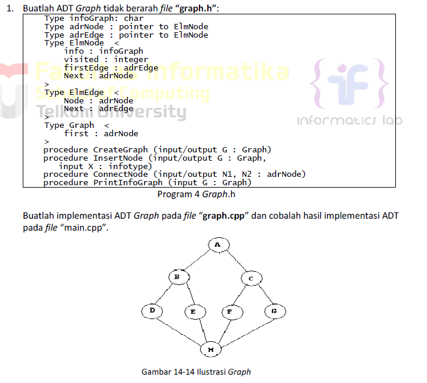
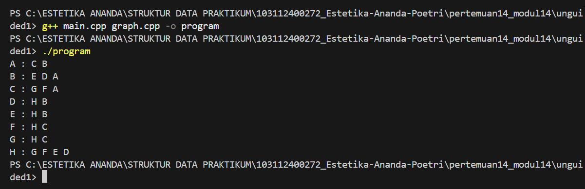
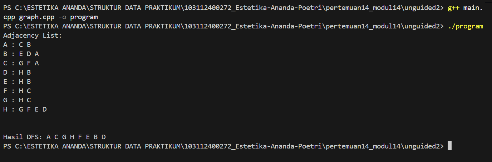
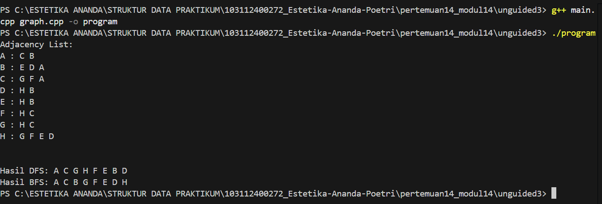

# <h1 align="center">Laporan Praktikum Modul 14 - Graph</h1>
<p align="center">Estetika Ananda Poetri Hariyanto - 103112400272</p>

## Dasar Teori
Sebuah graf G didefinisikan sebagai pasangan himpunan (V,E) , dengan V adalah himpunan tak kosong dari simpul-simpul (vertices) pada G. Sedangkan E adalah himpunan rusuk (edge) pada G yang menghubungkan sepasang simpul. Himpunan simpul pada G dinotasikan sebagai V, dan himpunan rusuk pada G dinotasikan sebagai E. [1].

### A. ...<br/>
...
#### 1. ...
#### 2. ...
#### 3. ...

### B. ...<br/>
...
#### 1. ...
#### 2. ...
#### 3. ...

## Guided

### 1. Guided 1

graph.cpp
```C++
#include "graph.h"
#include <iostream>
#include <queue>
#include <stack>
using namespace std;

void CreateGraph(Graph &G) {
    G.First = NULL;
}

adrNode AlokasiNode(infoGraph data) {
    adrNode nodeBaru = new ElmNode;
    nodeBaru->info = data;
    nodeBaru->visited = 0;
    nodeBaru->firstEdge = NULL;
    nodeBaru->Next = NULL;
    return nodeBaru;
}

adrEdge AlokasiEdge(adrNode nodeTujuan) {
    adrEdge edgeBaru = new ElmEdge;
    edgeBaru->Node = nodeTujuan;
    edgeBaru->Next = NULL;
    return edgeBaru;
}

void InsertNode(Graph &G, infoGraph data) {
    adrNode nodeBaru = AlokasiNode(data);
    if (G.First == NULL) {
        G.First = nodeBaru;
    } else {
        adrNode nodeBantu = G.First;
        while (nodeBantu->Next != NULL) {
            nodeBantu = nodeBantu->Next;
        }
        nodeBantu->Next = nodeBaru;
    }
}

adrNode FindNode(Graph G, infoGraph data) {
    adrNode nodeBantu = G.First;
    while (nodeBantu != NULL) {
        if (nodeBantu->info == data) {
            return nodeBantu;
        }
        nodeBantu = nodeBantu->Next;
    }
    return NULL;
}

void ConnectNode(Graph &G, infoGraph info1, infoGraph info2) {
    adrNode node1 = FindNode(G, info1);
    adrNode node2 = FindNode(G, info2);

    if (node1 != NULL && node2 != NULL) {
        adrEdge Edge1 = AlokasiEdge(node2);
        Edge1->Next = node1->firstEdge;
        node1->firstEdge = Edge1;

        adrEdge Edge2 = AlokasiEdge(node1);
        Edge2->Next = node2->firstEdge;
        node2->firstEdge = Edge2;
    } else {
        cout << "Node tidak ditemukan!" << endl;
    }
}

void DisconnectNode(adrNode node1, adrNode node2) {
    if (node1 != NULL && node2 != NULL) {
        adrEdge edgeBantu = node1->firstEdge;
        adrEdge PrevE = NULL;

        while (edgeBantu != NULL && edgeBantu->Node != node2) {
            PrevE = edgeBantu;
            edgeBantu = edgeBantu->Next;
        }

        if (edgeBantu != NULL) {
            if (PrevE == NULL) {
                node1->firstEdge = edgeBantu->Next;
            } else {
                PrevE->Next = edgeBantu->Next;
            }
            delete edgeBantu;
        }
    }
}

void DeleteNode(Graph &G, infoGraph X) {
    adrNode nodeHapus = FindNode(G, X);
    if (nodeHapus == NULL) {
        cout << "Node tidak ditemukan." << endl;
        return;
    }

    adrNode nodeLainnya = G.First;
    while (nodeLainnya != NULL) {
        DisconnectNode(nodeLainnya, nodeHapus);
        nodeLainnya = nodeLainnya->Next;
    }

    adrEdge edgeBantu = nodeHapus->firstEdge;
    while (edgeBantu != NULL) {
        adrEdge temp = edgeBantu;
        edgeBantu = edgeBantu->Next;
        delete temp;
    }
    nodeHapus->firstEdge = NULL;

    if (G.First == nodeHapus) {
        G.First = nodeHapus->Next;
    } else {
        adrNode bantu = G.First;
        while (bantu->Next != nodeHapus) {
            bantu = bantu->Next;
        }
        bantu->Next = nodeHapus->Next;
    }

    delete nodeHapus;
}

void PrintInfoGraph(Graph G) {
    adrNode nodeBantu = G.First;
    while (nodeBantu != NULL) {
        cout << "Node " << nodeBantu->info << " terhubung ke: ";
        adrEdge edgeBantu = nodeBantu->firstEdge;
        while (edgeBantu != NULL) {
            cout << edgeBantu->Node->info << " ";
            edgeBantu = edgeBantu->Next;
        }
        cout << endl;
        nodeBantu = nodeBantu->Next;
    }
}

void ResetVisited(Graph &G) {
    adrNode bantu = G.First;
    while (bantu != NULL) {
        bantu->visited = 0;
        bantu = bantu->Next;
    }
}

void PrintBFS(Graph G, infoGraph StartInfo) {
    ResetVisited(G);
    adrNode StartNode = FindNode(G, StartInfo);
    if (StartNode == NULL) return;

    queue<adrNode> Q;

    Q.push(StartNode);
    StartNode->visited = 1;

    cout << "BFS Traversal: ";
    while (!Q.empty()) {
        adrNode bantu = Q.front();
        Q.pop();
        cout << bantu->info << " - ";

        adrEdge e = bantu->firstEdge;
        while (e != NULL) {
            if (e->Node->visited == 0) {
                e->Node->visited = 1;
                Q.push(e->Node);
            }
            e = e->Next;
        }
    }
    cout << endl;
}

void PrintDFS(Graph G, infoGraph StartInfo) {
    ResetVisited(G);
    adrNode StartNode = FindNode(G, StartInfo);
    if (StartNode == NULL) return;

    stack<adrNode> S;
    S.push(StartNode);

    cout << "DFS Traversal: ";
    while (!S.empty()) {
        adrNode bantu = S.top();
        S.pop();

        if (bantu->visited == 0) {
            bantu->visited = 1;
            cout << bantu->info << " - ";

            adrEdge e = bantu->firstEdge;
            while (e != NULL) {
                if (e->Node->visited == 0) {
                    S.push(e->Node);
                }
                e = e->Next;
            }
        }
    }
    cout << endl;
}
```

graph.h
``` C++
#ifndef GRAPH_H
#define GRAPH_H

#include <iostream>

using namespace std;

typedef char infoGraph;
typedef struct ElmNode *adrNode;
typedef struct ElmEdge *adrEdge;

struct ElmNode {
    infoGraph info;
    int visited;
    adrEdge firstEdge;
    adrNode Next;
};

struct ElmEdge {
    adrNode Node;
    adrEdge Next;
};

struct Graph {
    adrNode First;
};

void CreateGraph(Graph &G);
adrNode AlokasiNode(infoGraph data);
adrEdge AlokasiEdge(adrNode nodeTujuan);
void InsertNode(Graph &G, infoGraph data);
adrNode FindNode(Graph G, infoGraph data);
void ConnectNode(Graph &G, infoGraph info1, infoGraph info2);
void DisconnectNode(adrNode node1, adrNode node2);
void DeleteNode(Graph &G, infoGraph X);
void PrintInfoGraph(Graph G);
void ResetVisited(Graph &G);
void PrintBFS(Graph G, infoGraph StartInfo);
void PrintDFS(Graph G, infoGraph StartInfo);

#endif
```

main.cpp
```C++
#include "graph.h"
#include <iostream>
using namespace std;

int main() {
    Graph G;
    CreateGraph(G);

    InsertNode(G, 'A');
    InsertNode(G, 'B');
    InsertNode(G, 'C');
    InsertNode(G, 'D');
    InsertNode(G, 'E');
    InsertNode(G, 'F');

    ConnectNode(G, 'A', 'D');
    ConnectNode(G, 'A', 'B');
    ConnectNode(G, 'B', 'C');
    ConnectNode(G, 'C', 'D');
    ConnectNode(G, 'C', 'E');
    ConnectNode(G, 'D', 'E');
    ConnectNode(G, 'E', 'F');

    cout << "=== REPRESENTASI ADJACENCY LIST ===\\n";
    PrintInfoGraph(G);

    cout << "\\n";
    PrintBFS(G, 'A');

    cout << "\\n";
    PrintDFS(G, 'A');

    return 0;
}
```
Program ini merupakan implementasi graph tidak berarah (undirected graph) menggunakan adjacency list dalam bahasa C++. Setiap node direpresentasikan oleh sebuah karakter, sedangkan hubungan antar node disimpan dalam bentuk linked list edge.

Program diawali dengan inisialisasi graph kosong, kemudian menyediakan fungsi untuk membuat dan menambahkan node, mencari node, serta menghubungkan dua node secara dua arah. Selain itu, program juga dapat memutus hubungan dan menghapus node beserta seluruh edge yang terhubung dengannya.

Untuk menampilkan struktur graph, program mencetak setiap node beserta node-node yang terhubung dalam bentuk adjacency list. Program ini juga mendukung penelusuran graph menggunakan dua metode, yaitu Breadth First Search (BFS) yang menelusuri graph secara melebar menggunakan queue, dan Depth First Search (DFS) yang menelusuri graph secara mendalam menggunakan stack.

Pada bagian utama program, graph dibentuk dengan beberapa node dan hubungan tertentu, kemudian ditampilkan representasinya serta hasil traversal BFS dan DFS yang dimulai dari node A.

## Unguided 

### 1. 

graph.cpp
```C++
#include "graph.h"

void CreateGraph(Graph &G) {
    G.First = NULL;
}

adrNode InsertNode(Graph &G, infoGraph X) {
    adrNode N = new ElmNode;
    N->info = X;
    N->visited = 0;
    N->FirstEdge = NULL;
    N->Next = NULL;

    if (G.First == NULL) {
        G.First = N;
    } else {
        adrNode P = G.First;
        while (P->Next != NULL)
            P = P->Next;
        P->Next = N;
    }
    return N;
}

void ConnectNode(adrNode N1, adrNode N2) {
    adrEdge E1 = new ElmEdge;
    E1->Node = N2;
    E1->Next = N1->FirstEdge;
    N1->FirstEdge = E1;

    adrEdge E2 = new ElmEdge;
    E2->Node = N1;
    E2->Next = N2->FirstEdge;
    N2->FirstEdge = E2;
}

void PrintInfoGraph(Graph G) {
    adrNode P = G.First;
    while (P != NULL) {
        cout << P->info << " : ";
        adrEdge E = P->FirstEdge;
        while (E != NULL) {
            cout << E->Node->info << " ";
            E = E->Next;
        }
        cout << endl;
        P = P->Next;
    }
}
```

graph.h
```C++
#ifndef GRAPH_H
#define GRAPH_H

#include <iostream>
using namespace std;

typedef char infoGraph;
typedef struct ElmNode *adrNode;
typedef struct ElmEdge *adrEdge;

struct ElmEdge {
    adrNode Node;
    adrEdge Next;
};

struct ElmNode {
    infoGraph info;
    int visited;
    adrEdge FirstEdge;
    adrNode Next;
};

struct Graph {
    adrNode First;
};

void CreateGraph(Graph &G);
adrNode InsertNode(Graph &G, infoGraph X);
void ConnectNode(adrNode N1, adrNode N2);
void PrintInfoGraph(Graph G);

#endif
```

main.cpp
```C++
#include "graph.h"

int main() {
    Graph G;
    CreateGraph(G);

    adrNode A = InsertNode(G, 'A');
    adrNode B = InsertNode(G, 'B');
    adrNode C = InsertNode(G, 'C');
    adrNode D = InsertNode(G, 'D');
    adrNode E = InsertNode(G, 'E');
    adrNode F = InsertNode(G, 'F');
    adrNode Gg = InsertNode(G, 'G');
    adrNode H = InsertNode(G, 'H');

    ConnectNode(A, B);
    ConnectNode(A, C);
    ConnectNode(B, D);
    ConnectNode(B, E);
    ConnectNode(C, F);
    ConnectNode(C, Gg);
    ConnectNode(D, H);
    ConnectNode(E, H);
    ConnectNode(F, H);
    ConnectNode(Gg, H);

    PrintInfoGraph(G);
    return 0;
}
```
### Output Unguided 1 :

##### Output 1


1. graph.h (Definisi ADT Graph)
berisi struktur data dan prototype fungsi.
- infoGraph
Menyimpan data node berupa char (A, B, C, dst).
- ElmNode
Merepresentasikan node/vertex, berisi:
info : nama node
visited : penanda kunjungan
FirstEdge : pointer ke edge pertama
Next : pointer ke node berikutnya
- ElmEdge
Merepresentasikan edge, berisi:
Node : node tujuan
Next : edge berikutnya
- Graph
Menyimpan pointer First ke node pertama.
- Fungsi utama:
CreateGraph : membuat graph kosong
InsertNode : menambah node ke graph
ConnectNode : menghubungkan dua node
PrintInfoGraph : menampilkan isi graph

2. graph.cpp (Implementasi Fungsi)
- CreateGraph
Menginisialisasi graph dengan First = NULL.
- InsertNode
Membuat node baru, lalu menambahkannya ke akhir daftar node graph.
- ConnectNode
Menghubungkan dua node secara tidak berarah, yaitu:
N1 → N2
N2 → N1
- PrintInfoGraph
Menampilkan setiap node beserta node-node yang terhubung dengannya.

3. main.cpp (Program Utama)
- Membuat graph kosong
- Menambahkan node A sampai H
- Menghubungkan node sesuai ilustrasi gambar:
A ke B dan C
B ke D dan E
C ke F dan G
D, E, F, G ke H
- Dan Menampilkan hasil graph ke layar

### 2. Buatlah prosedur untuk menampilkanhasil penelusuran DFS.
prosedur PrintDFS (Graph G, adrNode N);

main.cpp
```C++
#include "graph.h"

int main() {
    Graph G;
    CreateGraph(G);

    adrNode A = InsertNode(G, 'A');
    adrNode B = InsertNode(G, 'B');
    adrNode C = InsertNode(G, 'C');
    adrNode D = InsertNode(G, 'D');
    adrNode E = InsertNode(G, 'E');
    adrNode F = InsertNode(G, 'F');
    adrNode Gg = InsertNode(G, 'G');
    adrNode H = InsertNode(G, 'H');

    ConnectNode(A, B);
    ConnectNode(A, C);
    ConnectNode(B, D);
    ConnectNode(B, E);
    ConnectNode(C, F);
    ConnectNode(C, Gg);
    ConnectNode(D, H);
    ConnectNode(E, H);
    ConnectNode(F, H);
    ConnectNode(Gg, H);

    cout << "Adjacency List:" << endl;
    PrintInfoGraph(G);

    cout << "\nHasil DFS: ";
    PrintDFS(G, A);
    cout << endl;

    return 0;
}
```
graph.cpp
```C++
#include "graph.h"

void CreateGraph(Graph &G) {
    G.First = NULL;
}

adrNode InsertNode(Graph &G, infoGraph X) {
    adrNode N = new ElmNode;
    N->info = X;
    N->visited = 0;
    N->FirstEdge = NULL;
    N->Next = NULL;

    if (G.First == NULL) {
        G.First = N;
    } else {
        adrNode P = G.First;
        while (P->Next != NULL)
            P = P->Next;
        P->Next = N;
    }
    return N;
}

void ConnectNode(adrNode N1, adrNode N2) {
    adrEdge E1 = new ElmEdge;
    E1->Node = N2;
    E1->Next = N1->FirstEdge;
    N1->FirstEdge = E1;

    adrEdge E2 = new ElmEdge;
    E2->Node = N1;
    E2->Next = N2->FirstEdge;
    N2->FirstEdge = E2;
}

void PrintInfoGraph(Graph G) {
    adrNode P = G.First;
    while (P != NULL) {
        cout << P->info << " : ";
        adrEdge E = P->FirstEdge;
        while (E != NULL) {
            cout << E->Node->info << " ";
            E = E->Next;
        }
        cout << endl;
        P = P->Next;
    }
}

void PrintDFS(Graph G, adrNode N) {
    if (N == NULL) return;

    cout << N->info << " ";
    N->visited = 1;

    adrEdge E = N->FirstEdge;
    while (E != NULL) {
        if (E->Node->visited == 0) {
            PrintDFS(G, E->Node);
        }
        E = E->Next;
    }
}
```

graph.h
```C++
#ifndef GRAPH_H
#define GRAPH_H

#include <iostream>
using namespace std;

typedef char infoGraph;
typedef struct ElmNode *adrNode;
typedef struct ElmEdge *adrEdge;

struct ElmEdge {
    adrNode Node;
    adrEdge Next;
};

struct ElmNode {
    infoGraph info;
    int visited;
    adrEdge FirstEdge;
    adrNode Next;
};

struct Graph {
    adrNode First;
};

void CreateGraph(Graph &G);
adrNode InsertNode(Graph &G, infoGraph X);
void ConnectNode(adrNode N1, adrNode N2);
void PrintInfoGraph(Graph G);
void PrintDFS(Graph G, adrNode N);

#endif
```

### Output Unguided 2 :

##### Output 1


>> Pada file graph.h, program mendefinisikan struktur data dan fungsi yang digunakan untuk membangun graph.
Struktur ElmNode digunakan untuk menyimpan sebuah node pada graph. Di dalamnya terdapat data node berupa huruf (seperti A, B, C), penanda apakah node sudah dikunjungi atau belum (visited), daftar edge yang terhubung dengan node tersebut, serta pointer ke node berikutnya.

Struktur ElmEdge berfungsi untuk menyimpan hubungan atau koneksi antar node. Setiap edge menunjuk ke node tujuan dan ke edge berikutnya.
Struktur Graph digunakan untuk menyimpan graph secara keseluruhan, yaitu dengan menyimpan alamat node pertama.

Selain itu, pada file ini juga didefinisikan beberapa fungsi, yaitu CreateGraph untuk membuat graph kosong, InsertNode untuk menambahkan node ke dalam graph, ConnectNode untuk menghubungkan dua node secara dua arah, PrintInfoGraph untuk menampilkan isi graph, dan PrintDFS untuk menampilkan hasil penelusuran graph menggunakan metode DFS.

>> graph.cpp berisi implementasi fungsi-fungsi utama pada graph.
Fungsi CreateGraph digunakan untuk membuat graph kosong. InsertNode berfungsi membuat dan menambahkan node baru ke dalam graph. ConnectNode digunakan untuk menghubungkan dua node secara tidak berarah. PrintInfoGraph menampilkan setiap node beserta node-node yang terhubung dengannya. Sementara itu, PrintDFS digunakan untuk menelusuri graph menggunakan metode DFS secara rekursif dan menampilkan urutan kunjungannya.

>> File main.cpp berisi program utama yang digunakan untuk membuat graph, menambahkan node dari A sampai H, menghubungkan node sesuai ilustrasi, menampilkan adjacency list, dan menampilkan hasil penelusuran DFS yang dimulai dari node A.

Cara Kerja nya :
Kunjungi node awal
Tandai node sebagai visited
Masuk ke node tetangga yang belum dikunjungi
Ulangi hingga tidak ada tetangga yang bisa dikunjungi
Kembali (backtracking)

### 3. Buatlah prosedur untuk menampilkanhasil penelusuran DFS.
prosedur PrintBFS (Graph G, adrNode N);

graph.h
```C++
#ifndef GRAPH_H
#define GRAPH_H

#include <iostream>
using namespace std;

typedef char infoGraph;
typedef struct ElmNode *adrNode;
typedef struct ElmEdge *adrEdge;

struct ElmEdge {
    adrNode Node;
    adrEdge Next;
};

struct ElmNode {
    infoGraph info;
    int visited;
    adrEdge FirstEdge;
    adrNode Next;
};

struct Graph {
    adrNode First;
};

void CreateGraph(Graph &G);
adrNode InsertNode(Graph &G, infoGraph X);
void ConnectNode(adrNode N1, adrNode N2);
void PrintInfoGraph(Graph G);
void PrintDFS(Graph G, adrNode N);
void PrintBFS(Graph G, adrNode N);

#endif
```

graph.cpp
```C++
#include "graph.h"
#include <queue>

void CreateGraph(Graph &G) {
    G.First = NULL;
}

adrNode InsertNode(Graph &G, infoGraph X) {
    adrNode N = new ElmNode;
    N->info = X;
    N->visited = 0;
    N->FirstEdge = NULL;
    N->Next = NULL;

    if (G.First == NULL) {
        G.First = N;
    } else {
        adrNode P = G.First;
        while (P->Next != NULL)
            P = P->Next;
        P->Next = N;
    }
    return N;
}

void ConnectNode(adrNode N1, adrNode N2) {
    adrEdge E1 = new ElmEdge;
    E1->Node = N2;
    E1->Next = N1->FirstEdge;
    N1->FirstEdge = E1;

    adrEdge E2 = new ElmEdge;
    E2->Node = N1;
    E2->Next = N2->FirstEdge;
    N2->FirstEdge = E2;
}

void PrintInfoGraph(Graph G) {
    adrNode P = G.First;
    while (P != NULL) {
        cout << P->info << " : ";
        adrEdge E = P->FirstEdge;
        while (E != NULL) {
            cout << E->Node->info << " ";
            E = E->Next;
        }
        cout << endl;
        P = P->Next;
    }
}

void PrintDFS(Graph G, adrNode N) {
    if (N == NULL) return;

    cout << N->info << " ";
    N->visited = 1;

    adrEdge E = N->FirstEdge;
    while (E != NULL) {
        if (E->Node->visited == 0) {
            PrintDFS(G, E->Node);
        }
        E = E->Next;
    }
}

void PrintBFS(Graph G, adrNode N) {
    if (N == NULL) return;

    queue<adrNode> Q;
    N->visited = 1;
    Q.push(N);

    while (!Q.empty()) {
        adrNode P = Q.front();
        Q.pop();
        cout << P->info << " ";

        adrEdge E = P->FirstEdge;
        while (E != NULL) {
            if (E->Node->visited == 0) {
                E->Node->visited = 1;
                Q.push(E->Node);
            }
            E = E->Next;
        }
    }
}
```

main.cpp
```C++
#include "graph.h"

void ResetVisited(Graph &G) {
    adrNode P = G.First;
    while (P != NULL) {
        P->visited = 0;
        P = P->Next;
    }
}

int main() {
    Graph G;
    CreateGraph(G);

    adrNode A = InsertNode(G, 'A');
    adrNode B = InsertNode(G, 'B');
    adrNode C = InsertNode(G, 'C');
    adrNode D = InsertNode(G, 'D');
    adrNode E = InsertNode(G, 'E');
    adrNode F = InsertNode(G, 'F');
    adrNode Gg = InsertNode(G, 'G');
    adrNode H = InsertNode(G, 'H');

    ConnectNode(A, B);
    ConnectNode(A, C);
    ConnectNode(B, D);
    ConnectNode(B, E);
    ConnectNode(C, F);
    ConnectNode(C, Gg);
    ConnectNode(D, H);
    ConnectNode(E, H);
    ConnectNode(F, H);
    ConnectNode(Gg, H);

    cout << "Adjacency List:\n";
    PrintInfoGraph(G);

    cout << "\nHasil DFS: ";
    PrintDFS(G, A);
    cout << endl;

    ResetVisited(G);

    cout << "Hasil BFS: ";
    PrintBFS(G, A);
    cout << endl;

    return 0;
}
```

### Output Unguided 3 :

##### Output 1


Program ini membangun graph tidak berarah dengan adjacency list, lalu menampilkan hasil DFS (menelusuri sedalam mungkin) dan BFS (menelusuri per level) dari node A.

## Kesimpulan
Kesimpulannya, dari tiga soal yang dikerjakan, program ini berhasil membentuk sebuah graph tidak berarah, menghubungkan setiap node sesuai ilustrasi, dan menampilkan hubungan antar node dengan jelas. Selain itu, graph juga dapat ditelusuri menggunakan metode DFS dan BFS, sehingga urutan kunjungan node dapat dilihat dengan mudah dan membantu memahami cara kerja penelusuran pada graph.

## Referensi
[1] [chrome-extension://efaidnbmnnnibpcajpcglclefindmkaj/https://eprints.uny.ac.id/28787/2/c.BAB%20II.pdf]

