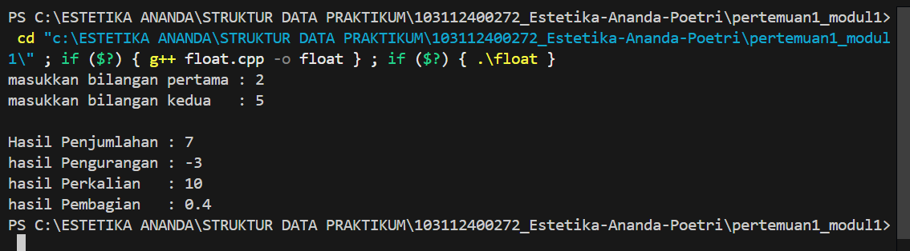

# <h1 align="center">Laporan Praktikum Modul 1 - Codeblocks IDE & Pengenalan Bahas C++ (Bagian Pertama)</h1>
<p align="center">Estetika Ananda Poetri Hariyanto - 103112400272</p>

## Dasar Teori
C++ adalah Bahasa pemrograman yang dikembangkan oleh Bjarne Stroustrup pada tahun 1979. Nama C++ menunjukkan bahwa itu adalah ekstensi dari bahasa C. Bahasa C++ menjadi standar ISO pada tahun 1998 dengan nama "C++98" dan beberapa kali mengalami perubahan melalui standar seperti C++11, C++14, C++17, dan C++20. C++ digunakan oleh para programer dalam pengembangan perangkat lunak sistem, Game, dan berbagai aplikasi lainnya [1].

### A. ...<br/>
...
#### 1. ...
#### 2. ...
#### 3. ...

### B. ...<br/>
...
#### 1. ...
#### 2. ...
#### 3. ...

## Guided 

### 1. Operasi Aritmatika

```C++
#include <iostream>
using namespace std;

int main() {
    int angka1, angka2;
    cout << "Masukkan angka1: ";
    cin >> angka1;
    cout << "Masukkan angka2: ";
    cin >> angka2;

    // penjumlahan
    cout << "Hasil penjumlahan: " << angka1 + angka2 << endl;
    // pengurangan
    cout << "Hasil pengurangan: " << angka1 - angka2 << endl;
    // perkalian
    cout << "Hasil perkalian: " << angka1 * angka2 << endl;

    // pembagian dan modulus (dicek dulu angka2 != 0)
    if (angka2 != 0) {
        cout << "Hasil pembagian: " << angka1 / angka2 << endl;
        cout << "Hasil modulus: " << angka1 % angka2 << endl;
    } else {
        cout << "Pembagian dan modulus tidak bisa dilakukan (angka2 = 0)" << endl;
    }

    return 0;
}
```
Program ini dibuat untuk menghitung operasi aritmatika dasar dengan dua input angka dari user. Setelah angka dimasukkan, program akan menampilkan hasil dari:
- Penjumlahan (angka1 + angka2)
- Pengurangan (angka1 - angka2)
- Perkalian (angka1 * angka2)
Pembagian dan modulus (angka1 / angka2 dan angka1 % angka2), tapi hanya dijalankan kalau angka2 tidak bernilai 0.
Kalau angka2 bernilai 0, program otomatis menampilkan pesan bahwa pembagian dan modulus tidak bisa dilakukan karena tidak valid.

### 2. Operasi Logika Aritmatika

```C++
#include <iostream>
using namespace std;

int main() {
    int angka1, angka2;
    cout << "Masukkan angka1: ";
    cin >> angka1;
    cout << "Masukkan angka2: ";
    cin >> angka2;

    if (angka1 > angka2) {
        cout << angka1 << " lebih besar dari " << angka2 << endl;
    } else if (angka1 < angka2) {
        cout << angka1 << " lebih kecil dari " << angka2 << endl;
    } else {
        cout << angka1 << " sama dengan " << angka2 << endl;
    }

    return 0;
}
```
Di program C++ lagi mainin logika aritmatika sederhana. Flow-nya:
pertama user disuruh masukin dua angka (angka1 sama angka2).
Itu kayak lagi ngetik angka di keyboard buat dibandingin.
kedua Terus ada percabangan if-else. Nah, bagian ini ibaratnya program lagi nanya ke dirinya sendiri:
Kalau angka1 > angka2 → berarti angka1 lebih gede dari angka2.
Kalau angka1 < angka2 → berarti angka1 lebih kecil dari angka2.
Kalau enggak dua-duanya → otomatis angka1 sama dengan angka2.

### 3. Operasi Perulangan For

```C++
#include <iostream>
using namespace std;

int main() {
    int angka1, angka2;
    cout << "Masukkan angka1: ";
    cin >> angka1;
    cout << "Masukkan angka2: ";
    cin >> angka2;

    // perulangan for pertama
    for (int i = 0; i < angka1; i++) {
        cout << i << " - ";
    }

    cout << endl;

    // perulangan for kedua
    for (int i = 0; i < angka2; i++) {
        cout << i << " - ";
    }

    cout << endl;

    return 0;
}
```
program ini pakai perulangan for buat ngulangin suatu proses. For itu ibaratnya kasih tahu komputer: 'Mulai dari angka segini, berhenti kalau udah nyampe sini, tiap langkah naik segini'. Nah, di contoh ini ada dua for loop. Yang pertama nge-print angka dari 0 sampai sebelum angka1, terus yang kedua nge-print angka dari 0 sampai sebelum angka2. Intinya, biar tidak lagi lagi nulis cout berkali-kali, cukup pake for aja.

### 4. Operasi Perulangan While

```C++
#include <iostream>
using namespace std;

int main() {
    int angka1, angka2;
    cout << "Masukkan angka1: ";
    cin >> angka1;
    cout << "Masukkan angka2: ";
    cin >> angka2;

    int i = 0;
    int j = 0;

    // perulangan while
    while (i < angka1) {
        cout << i << " - ";
        i++;
    }

    cout << endl;

    // perulangan do-while
    do {
        cout << j << " - ";
        j++;
    } while (j < angka2);  // <- diganti angka2

    cout << endl;

    return 0;
}
```
Perulangan while itu bekerja dengan cara memeriksa kondisi terlebih dahulu. Kalau kondisi bernilai true, maka perulangan dijalankan. Namun, jika sejak pertama kondisinya adalah false, maka perulangan tidak akan berjalan sama sekali.
Sedangkan perulangan do-while Bagian perulangannya akan dijalankan terlebih dahulu satu kali, kemudian baru memeriksa kondisi. Artinya, meskipun kondisi bernilai false sejak pertama, perulangan tetap akan dieksekusi minimal satu kali.

### 5. Struct

```C++
#include <iostream>
#include <string>
using namespace std;

int main() {
    const int jumlah = 3; // contoh, biar ga kepanjangan

    struct rapot {
        string nama;
        int nilai;
    };

    rapot siswa[jumlah];

    for (int i = 0; i < jumlah; i++) {
        cout << "Masukkan nama siswa: ";
        getline(cin, siswa[i].nama);

        cout << "Masukkan jumlah nilai: ";
        cin >> siswa[i].nilai;
        cin.ignore(); // buang newline setelah input angka
    }

    cout << "\n=== Data Siswa ===\n";
    int i = 0;
    while (i < jumlah) {
        cout << "Nama: " << siswa[i].nama 
             << " | Nilai: " << siswa[i].nilai << endl;
        i++;
    }

    return 0;
}
```
program ini untuk menyimpan data rapot mahasiswa pakai struct.
jadi, struct rapot itu seperti wadah custom  yang isinya hanya ada nama sama nilai saja. Lalu siswa[jumlah] untuk menyimpan beberapa data.

## Unguided 

### 1. Buatlah program yang menerima input an dua buah bilangan bertipe float, kemudian memberikan output an hasil penjumlahan, pengurangan, perkalian, dan pembagian dari dua bilangan tersebut.

```C++
#include <iostream>
using namespace std;

#include <iostream>
using namespace std;

int main() {
    float angka1, angka2;
    cout << "masukkan bilangan pertama : ";
    cin >> angka1;
    cout << "masukkan bilangan kedua   : ";
    cin >> angka2;

    cout << "\nHasil Penjumlahan : " << angka1 + angka2 << endl;
    cout << "hasil Pengurangan : " << angka1 - angka2 << endl;
    cout << "hasil Perkalian   : " << angka1 * angka2 << endl;

    if (angka2 != 0) {
        cout << "hasil Pembagian   : " << angka1 / angka2 << endl;
    } else {
        cout << "hasil Pembagian   : Error (pembagian dengan nol tidak terdefinisi)" << endl;
    }
    return 0;
}
```
### Output Unguided 1 :

##### Output 1
](https://github.com/(username github kalian)/(nama repository github kalian)/blob/main/(path folder menyimpan screenshot output)/(nama file screenshot output).png)

contoh :


##### Output 2
/(nama repository github kalian)/blob/main/(path folder menyimpan screenshot output)/(nama file screenshot output).png)

penjelasan unguided 1 

### 2. (isi dengan soal unguided 2)

```C++
source code unguided 2
```
### Output Unguided 2 :

##### Output 1
/(nama repository github kalian)/blob/main/(path folder menyimpan screenshot output)/(nama file screenshot output).png)

contoh :


##### Output 2
/(nama repository github kalian)/blob/main/(path folder menyimpan screenshot output)/(nama file screenshot output).png)

penjelasan unguided 2

### 3. (isi dengan soal unguided 3)

```C++
source code unguided 3
```
### Output Unguided 3 :

##### Output 1
/(nama repository github kalian)/blob/main/(path folder menyimpan screenshot output)/(nama file screenshot output).png)

contoh :


##### Output 2
/(nama repository github kalian)/blob/main/(path folder menyimpan screenshot output)/(nama file screenshot output).png)

penjelasan unguided 3

## Kesimpulan
...

## Referensi
[1] Triase. (2020). Diktat Edisi Revisi : STRUKTUR DATA. Medan: UNIVERSTAS ISLAM NEGERI SUMATERA UTARA MEDAN. 
<br>[2] Indahyati, Uce., Rahmawati Yunianita. (2020). "BUKU AJAR ALGORITMA DAN PEMROGRAMAN DALAM BAHASA C++". Sidoarjo: Umsida Press. Diakses pada 10 Maret 2024 melalui https://doi.org/10.21070/2020/978-623-6833-67-4.
<br>...
