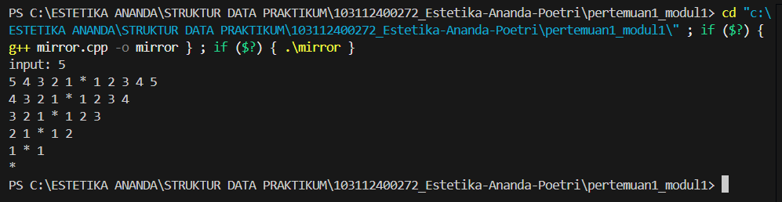

# <h1 align="center">Laporan Praktikum Modul 1 - Codeblocks IDE & Pengenalan Bahas C++ (Bagian Pertama)</h1>
<p align="center">Estetika Ananda Poetri Hariyanto - 103112400272</p>

## Dasar Teori
C++ adalah Bahasa pemrograman yang dikembangkan oleh Bjarne Stroustrup pada tahun 1979. Nama C++ menunjukkan bahwa itu adalah ekstensi dari bahasa C. Bahasa C++ menjadi standar ISO pada tahun 1998 dengan nama "C++98" dan beberapa kali mengalami perubahan melalui standar seperti C++11, C++14, C++17, dan C++20. C++ digunakan oleh para programer dalam pengembangan perangkat lunak sistem, Game, dan berbagai aplikasi lainnya [1].

### A. ...<br/>
...
#### 1. ...
#### 2. ...
#### 3. ...

### B. ...<br/>
...
#### 1. ...
#### 2. ...
#### 3. ...

## Guided 

### 1. Operasi Aritmatika

```C++
#include <iostream>
using namespace std;

int main() {
    int angka1, angka2;
    cout << "Masukkan angka1: ";
    cin >> angka1;
    cout << "Masukkan angka2: ";
    cin >> angka2;

    // penjumlahan
    cout << "Hasil penjumlahan: " << angka1 + angka2 << endl;
    // pengurangan
    cout << "Hasil pengurangan: " << angka1 - angka2 << endl;
    // perkalian
    cout << "Hasil perkalian: " << angka1 * angka2 << endl;

    // pembagian dan modulus (dicek dulu angka2 != 0)
    if (angka2 != 0) {
        cout << "Hasil pembagian: " << angka1 / angka2 << endl;
        cout << "Hasil modulus: " << angka1 % angka2 << endl;
    } else {
        cout << "Pembagian dan modulus tidak bisa dilakukan (angka2 = 0)" << endl;
    }

    return 0;
}
```
Program ini dibuat untuk menghitung operasi aritmatika dasar dengan dua input angka dari user. Setelah angka dimasukkan, program akan menampilkan hasil dari:
- Penjumlahan (angka1 + angka2)
- Pengurangan (angka1 - angka2)
- Perkalian (angka1 * angka2)
Pembagian dan modulus (angka1 / angka2 dan angka1 % angka2), tapi hanya dijalankan kalau angka2 tidak bernilai 0.
Kalau angka2 bernilai 0, program otomatis menampilkan pesan bahwa pembagian dan modulus tidak bisa dilakukan karena tidak valid.

### 2. Operasi Logika Aritmatika

```C++
#include <iostream>
using namespace std;

int main() {
    int angka1, angka2;
    cout << "Masukkan angka1: ";
    cin >> angka1;
    cout << "Masukkan angka2: ";
    cin >> angka2;

    if (angka1 > angka2) {
        cout << angka1 << " lebih besar dari " << angka2 << endl;
    } else if (angka1 < angka2) {
        cout << angka1 << " lebih kecil dari " << angka2 << endl;
    } else {
        cout << angka1 << " sama dengan " << angka2 << endl;
    }

    return 0;
}
```
Di program C++ lagi mainin logika aritmatika sederhana. Flow-nya:
pertama user disuruh masukin dua angka (angka1 sama angka2).
Itu kayak lagi ngetik angka di keyboard buat dibandingin.
kedua Terus ada percabangan if-else. Nah, bagian ini ibaratnya program lagi nanya ke dirinya sendiri:
Kalau angka1 > angka2 → berarti angka1 lebih gede dari angka2.
Kalau angka1 < angka2 → berarti angka1 lebih kecil dari angka2.
Kalau enggak dua-duanya → otomatis angka1 sama dengan angka2.

### 3. Operasi Perulangan For

```C++
#include <iostream>
using namespace std;

int main() {
    int angka1, angka2;
    cout << "Masukkan angka1: ";
    cin >> angka1;
    cout << "Masukkan angka2: ";
    cin >> angka2;

    // perulangan for pertama
    for (int i = 0; i < angka1; i++) {
        cout << i << " - ";
    }

    cout << endl;

    // perulangan for kedua
    for (int i = 0; i < angka2; i++) {
        cout << i << " - ";
    }

    cout << endl;

    return 0;
}
```
program ini pakai perulangan for buat ngulangin suatu proses. For itu ibaratnya kasih tahu komputer: 'Mulai dari angka segini, berhenti kalau udah nyampe sini, tiap langkah naik segini'. Nah, di contoh ini ada dua for loop. Yang pertama nge-print angka dari 0 sampai sebelum angka1, terus yang kedua nge-print angka dari 0 sampai sebelum angka2. Intinya, biar tidak lagi lagi nulis cout berkali-kali, cukup pake for aja.

### 4. Operasi Perulangan While

```C++
#include <iostream>
using namespace std;

int main() {
    int angka1, angka2;
    cout << "Masukkan angka1: ";
    cin >> angka1;
    cout << "Masukkan angka2: ";
    cin >> angka2;

    int i = 0;
    int j = 0;

    // perulangan while
    while (i < angka1) {
        cout << i << " - ";
        i++;
    }

    cout << endl;

    // perulangan do-while
    do {
        cout << j << " - ";
        j++;
    } while (j < angka2);  // <- diganti angka2

    cout << endl;

    return 0;
}
```
Perulangan while itu bekerja dengan cara memeriksa kondisi terlebih dahulu. Kalau kondisi bernilai true, maka perulangan dijalankan. Namun, jika sejak pertama kondisinya adalah false, maka perulangan tidak akan berjalan sama sekali.
Sedangkan perulangan do-while Bagian perulangannya akan dijalankan terlebih dahulu satu kali, kemudian baru memeriksa kondisi. Artinya, meskipun kondisi bernilai false sejak pertama, perulangan tetap akan dieksekusi minimal satu kali.

### 5. Struct

```C++
#include <iostream>
#include <string>
using namespace std;

int main() {
    const int jumlah = 3; // contoh, biar ga kepanjangan

    struct rapot {
        string nama;
        int nilai;
    };

    rapot siswa[jumlah];

    for (int i = 0; i < jumlah; i++) {
        cout << "Masukkan nama siswa: ";
        getline(cin, siswa[i].nama);

        cout << "Masukkan jumlah nilai: ";
        cin >> siswa[i].nilai;
        cin.ignore(); // buang newline setelah input angka
    }

    cout << "\n=== Data Siswa ===\n";
    int i = 0;
    while (i < jumlah) {
        cout << "Nama: " << siswa[i].nama 
             << " | Nilai: " << siswa[i].nilai << endl;
        i++;
    }

    return 0;
}
```
program ini untuk menyimpan data rapot mahasiswa pakai struct.
jadi, struct rapot itu seperti wadah custom  yang isinya hanya ada nama sama nilai saja. Lalu siswa[jumlah] untuk menyimpan beberapa data.

## Unguided 

### 1. Buatlah program yang menerima input an dua buah bilangan bertipe float, kemudian memberikan output an hasil penjumlahan, pengurangan, perkalian, dan pembagian dari dua bilangan tersebut.

```C++
#include <iostream>
using namespace std;

#include <iostream>
using namespace std;

int main() {
    float angka1, angka2;
    cout << "masukkan bilangan pertama : ";
    cin >> angka1;
    cout << "masukkan bilangan kedua   : ";
    cin >> angka2;

    cout << "\nHasil Penjumlahan : " << angka1 + angka2 << endl;
    cout << "hasil Pengurangan : " << angka1 - angka2 << endl;
    cout << "hasil Perkalian   : " << angka1 * angka2 << endl;

    if (angka2 != 0) {
        cout << "hasil Pembagian   : " << angka1 / angka2 << endl;
    } else {
        cout << "hasil Pembagian   : Error (pembagian dengan nol tidak terdefinisi)" << endl;
    }
    return 0;
}
```
### Output Unguided 1 :

##### Output 1


Program di atas sederhana, fungsinya untuk menghitung operasi aritmatika antara dua bilangan yang diinput user (penjumlahan, pengurangan, perkalian, dan pembagian). Kalau bilangan kedua = 0, program menampilkan pesan error karena tidak bisa dibagi nol. 

### 2. Buatlah sebuah program yang menerima masukan angka dan mengeluarkan output nilai angka tersebut dalam bentuk tulisan. Angka yang akan di-input-kan user adalah bilangan bulat positif mulai dari 0 s.d 100. Contoh 79 = Tujuh Puluh Sembilan.

```C++
#include <iostream>
using namespace std;

string satuan[] = {"", "satu", "dua", "tiga", "empat", "lima", "enam", "tujuh", "delapan", "sembilan"};
string belasan[] = {"sepuluh", "sebelas", "dua belas", "tiga belas", "empat belas", "lima belas", 
                    "enam belas", "tujuh belas", "delapan belas", "sembilan belas"};

string terbilang(int n) {
    if (n == 0) return "nol";
    if (n == 100) return "seratus";
    if (n < 10) return satuan[n];
    if (n < 20) return belasan[n - 10];
    if (n < 100) {
        int puluh = n / 10;
        int sisa = n % 10;
        string hasil = satuan[puluh] + " puluh";
        if (sisa > 0) hasil += " " + satuan[sisa];
        return hasil;
    }
    return "";
}

int main() {
    int angka;
    cout << "Masukkan angka (0-100): ";
    cin >> angka;

    if (angka < 0 || angka > 100) {
        cout << "Angka di luar jangkauan!" << endl;
    } else {
        cout << angka << " : " << terbilang(angka) << endl;
    }
    return 0;
}
```
### Output Unguided 2 :

##### Output 1


Program ini membaca angka dari user (0–100), lalu mengubah angka tersebut menjadi tulisan bahasa Indonesia, misalnya input 79 akan ditampilkan sebagai “79 : tujuh puluh sembilan”.

### 3. Buatlah Program yang dapat memberikan input dan output
input : 3
output :
3 2 1 * 1 2 3
2 1 * 1 2
1 * 1
*
(mirror)

```C++
#include <iostream>
using namespace std;

int main() {
    int n;
    cout << "input: ";
    cin >> n;

    for (int i = n; i >= 0; i--) {
        //mencetak angka secara menurun
        for (int j = i; j >= 1; j--) {
            cout << j << " ";
        }
        cout << "* ";
        //mencetak angka secara menaik
        for (int j = 1; j <= i; j++) {
            cout << j << " ";
        }
        cout << endl;
    }
    return 0;
}
```
### Output Unguided 3 :

##### Output 1


1. Input n → pengguna masukkan angka, misalnya 3.
2. Perulangan luar (for i = n; i >= 0; i--)
- Loop ini jalan dari n sampai 0.
- Jadi kalau n = 3, i = 3 → 2 → 1 → 0.
- Ini yang bikin baris pola turun ke bawah.
3. Perulangan pertama (for j = i; j >= 1; j--)
- Cetak angka menurun dari i sampai 1.
- Contoh i = 3 → cetak 3 2 1.
4. Cetak tanda *
- Selalu ada tanda * di tengah tiap baris.
5. Perulangan kedua (for j = 1; j <= i; j++)
- Cetak angka naik dari 1 sampai i.
- Contoh i = 3 → cetak 1 2 3.
6. cout << endl;
- Bikin baris baru agar hasilnya kebawah.

## Kesimpulan
Mempelajari dasar-dasar bahasa C++ pakai code blocks IDE. Lalu ada operasi aritmatika, logika. perulangan (for, while, do while), dan struct untuk menyimpan data. Mempelajari mandiri seperti operasi bilangan dengan tipe data float, meng konversikan angka ke bentuk tulisan, dan pembuatan pola (mirror).

## Referensi
[1] Penggunaan Bahasa C++ dalam Perkuliahan Jurusan Teknik Elektro Fakultas Teknik

