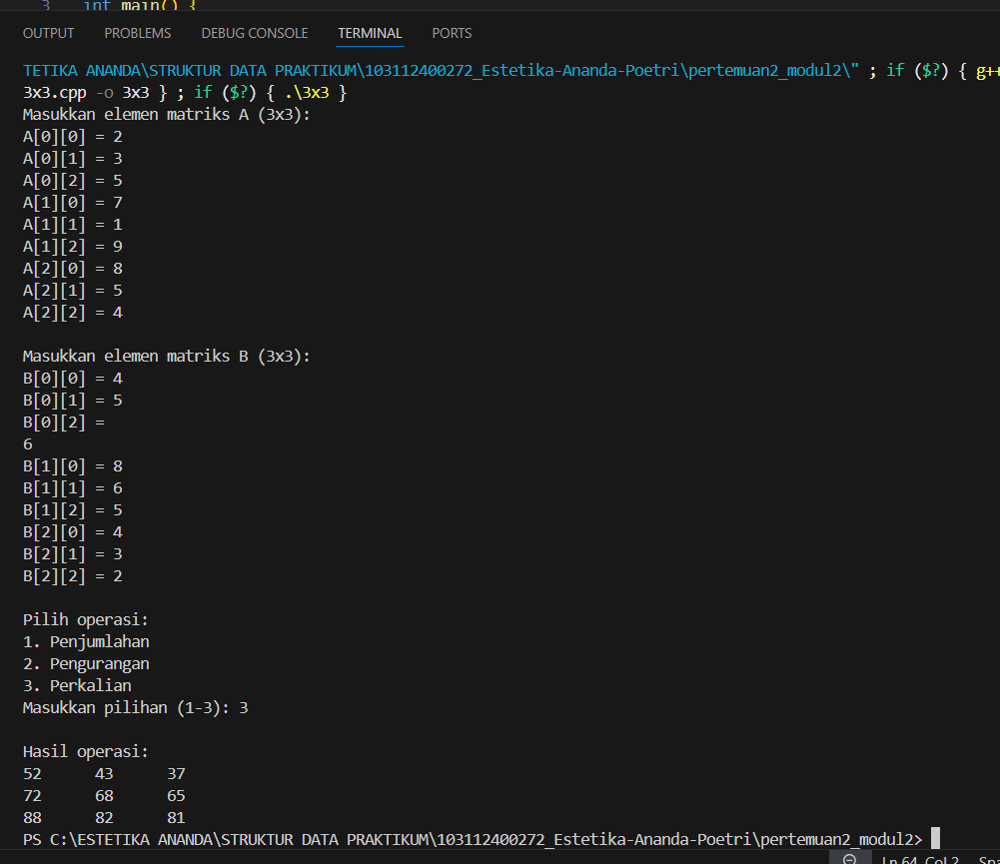
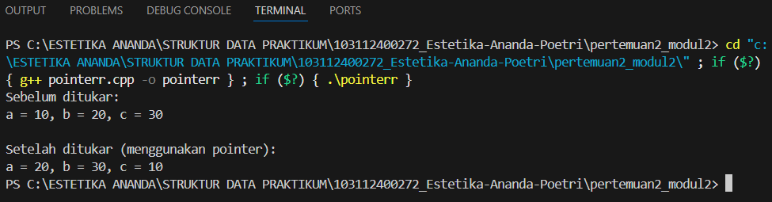
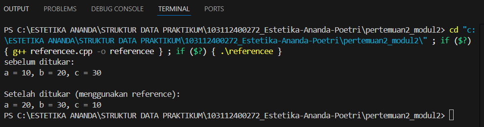

# <h1 align="center">Laporan Praktikum Modul 2 - Pengenalan Bahasa C++ (Bagian Kedua)</h1>
<p align="center">Estetika Ananda Poetri Hariyanto - 103112400272</p>

## Dasar Teori
Array merupakan sebuah variabel yang menyimpan lebih dari 1 buah data yang memiliki tipe data yang sama. Jadi dapat dikatakan bahwa array merupakan kumpulan dari data-data tunggal yang dijadikan dalam 1 variabel array yang alamat memorinya berbeda yang selanjutnya disebut elemen-elemen array yang bisa kita akses berdasarkan indeks.Array atau larik sendiri di definisikan sebagai pemesanan alokasi memory berurutan. Array (larik) merupakan tipe data tersetruktur dimana didalamnya terdiri dari komponen –komponen yang mempunyai tipe data yang sama. Didalam suatu array jumlah komponen banyaknya adalah tetap. [1].

### A. ...<br/>
...
#### 1. ...
#### 2. ...
#### 3. ...

### B. ...<br/>
...
#### 1. ...
#### 2. ...
#### 3. ...

## Guided 

### 1. Array 1 Dimensi

```C++
#include <iostream>
using namespace std;

int main(){
    int arr[5];

    for (int i = 0; i < 5; i++) {
        cout << "masukkan value indeks ke-" << i << ": ";
        cin >> arr[i];
    }

    int j = 0;
    while(j < 5) {
        cout << "isi indeks ke-" << j << " : " << arr[j] << endl;
        j++;
    }

    return 0;
}

```
Program ini digunakan untuk memasukkan 5 nilai ke dalam array dan kemudian menampilkan kembali nilai-nilai tersebut sesuai dengan indeksnya.

### 2. Array 2 Dimensi

```C++
#include <iostream>
using namespace std;

void tampilkanHasil(int arr[2][2]) {
    for (int i = 0; i < 2; i++) {
        for (int j = 0; j < 2; j++) {
            cout << arr[i][j] << " ";
        }
        cout << endl;
    }
}

int main() {
    int arrA[2][2] = {
        {1, 2},
        {3, 4},
    };
    int arrB[2][2] = {
        {2, 3},
        {4, 5},
    };
    int arrD[2][2] = {0};

    for (int i = 0; i < 2; i++) {
        for (int j = 0; j < 2; j++) {
            for (int k = 0; k < 2; k++) {
                arrD[i][j] += arrA[i][k] * arrB[k][j];
            }
        }
    }

    cout << "Hasil perkalian: " << endl;
    tampilkanHasil(arrD);

    return 0;
}
```
Program ini membuat dua matriks 2x2, yaitu A = {{1,2},{3,4}} dan B = {{2,3},{4,5}}, lalu mengalikan keduanya menggunakan rumus perkalian matriks. Hasil perkalian disimpan pada matriks D, kemudian ditampilkan dengan fungsi tampilkanHasil. Output akhir yang muncul di layar adalah matriks hasil perkalian:
10 13  
22 29

### 3. Function

```C++
#include<iostream>
using namespace std;

int cariMAX(int arr[], int size) {
    int MAX = arr[0];
    for (int i = 1; i < size; i++) {
        if (arr[i] > MAX) {
            MAX = arr[i];
        }
    }
    return MAX;
}

void operasiAritmetika(int arr[], int ukuran) {
    int totalJumlah = 0;
    for(int i = 0; i < ukuran; i++) {
        totalJumlah += arr[i];
    }
    cout << "total penjumlahan : " << totalJumlah << endl;

    int totalKali = 1;
    for (int i = 0; i < ukuran ; i++) {
        totalKali *= arr[i];
    }
    cout << "total perkalian : "  << totalKali << endl;
}

int main(){
    const int ukuran = 5;
    int arr[ukuran];
    for (int i = 0; i < ukuran; i++) {
        cout << "masukan nilai array ke-" << i << " : ";
        cin >> arr[i];
    }
    cout << "nilai MAX adalah : " << cariMAX(arr, ukuran) << endl;

    operasiAritmetika(arr, ukuran);
    return 0;
}

// pemanggilan function harus sesuai tipe data dan jumlah parameter
// pemanggilan array tidak perlu menyertakan ukuran array
//
```
Program di atas berfungsi untuk mencari nilai maksimum dari sebuah array serta menghitung jumlah dan perkalian semua elemen array.
per bagian:
Fungsi cariMAX
Menerima array dan ukurannya.
Membandingkan setiap elemen untuk mencari nilai terbesar.
Mengembalikan nilai maksimum.
Fungsi operasiAritmetika
Menjumlahkan seluruh elemen array lalu menampilkan hasilnya.
Mengalikan semua elemen array lalu menampilkan hasilnya.
Fungsi main
Membuat array dengan ukuran 5.
Meminta input nilai array dari pengguna sebanyak 5 kali.
Menampilkan nilai maksimum dengan memanggil fungsi cariMAX.
Menampilkan hasil penjumlahan dan perkalian dengan memanggil fungsi operasiAritmetika.
Pemanggilan fungsi harus sesuai dengan tipe data dan jumlah parameter.
Saat memanggil array ke dalam fungsi, tidak perlu menuliskan ukuran array lagi (cukup nama array saja).

### 4. Pointer

```C++
#include<iostream>
using namespace std;

void tukar(int *x, int *y) {
    int temp;
    temp = *x;
    *x = *y;
    *y = temp;
}

int main(){
    int a = 20, b = 30;
    int *ptr;

    ptr = &a;

    cout << "Value of a : " << a << endl;
    cout << "Address of a : " << &a << endl;
    cout << "Value stored of ptr (adress of a): " << ptr << endl;
    cout << "Value pointed to by ptr : " << *ptr << endl;

    tukar (&a, &b);
    cout << "After swaping value of a : " << a <<  " and b= " << b << endl;

    return 0;
}
```
Fungsi tukar(int *x, int *y)
Berfungsi untuk menukar nilai dua variabel.
Parameter berupa pointer (int *x, int *y) sehingga fungsi bisa langsung mengubah nilai asli variabel yang dikirim.
Prosesnya:
Simpan nilai *x ke temp.
Isi *x dengan nilai *y.
Isi *y dengan nilai temp.
Fungsi main
Membuat dua variabel a = 20 dan b = 30.
Membuat pointer ptr dan mengarahkannya ke alamat variabel a.
Menampilkan:
Nilai dari a.
Alamat memori a.
Nilai yang disimpan di ptr (yaitu alamat dari a).
Nilai yang ditunjuk oleh ptr (isi dari a, yaitu 20).
Memanggil fungsi tukar(&a, &b) → menukar nilai a dan b.
Menampilkan hasil setelah ditukar.
program ini untuk menunjukkan cara kerja pointer (mengakses alamat dan nilai variabel) serta menggunakan pointer untuk menukar nilai dua variabel.

### 5. Reference

```C++
#include<iostream>
using namespace std;

void tukar(int &x, int &y) {
    int temp;
    temp = x;
    x = y;
    y = temp;
}

int main(){
    int a = 20, b = 30;
    int& ref = a;

    cout << "Nilai a : " << a  << endl;
    cout << "alamat a (&a) : " << &a  << endl;
    cout << "Nilai ref (alias a) : " << ref  << endl;
    cout << "Almat ref (&ref) : " << &ref << endl;

    //menukar nilai a lewat reference
    ref = 50;
    cout << "\nsetelah ref = 50;" << a  << endl;
    cout << "Nilai a : " << a  << endl;
    cout << "Nilai ref : " << ref  << endl;
    

    tukar(a, b);
    cout << "After swapping, value of a=" << a << "and b=" << b << endl;

    return 0;
}
```
Fungsi tukar(int &x, int &y)
Fungsi ini menggunakan reference parameter (&) untuk menukar nilai dari dua variabel.
perubahan pada x dan y akan langsung mengubah nilai variabel asli yang dikirim dari main.
Deklarasi Variabel di main:
int a = 20, b = 30;
int& ref = a;
a bernilai 20, b bernilai 30.
ref adalah reference (alias) dari a. Jadi, ref bukan variabel baru, tetapi nama lain untuk a.

Menampilkan Nilai dan Alamat:
a dan ref memiliki nilai sama.

Alamat &a dan &ref juga sama, karena ref hanyalah alias dari a.
Mengubah Nilai melalui Reference:
ref = 50;
Karena ref alias dari a, maka a otomatis berubah jadi 50.

Menukar Nilai dengan Fungsi:
tukar(a, b);
Nilai a dan b akan tertukar.
Awalnya a = 50, b = 30 → setelah swap: a = 30, b = 50.

## Unguided 

### 1. Buatlah program yang dapat melakukan operasi penjumlahan, pengurangan, dan perkalian matriks 3x3.

```C++
#include <iostream>
using namespace std;
int main() {
    int A[3][3], B[3][3], C[3][3];
    int pilihan;
    // Input matriks A
    cout << "Masukkan elemen matriks A (3x3):\n";
    for (int i = 0; i < 3; i++) {
        for (int j = 0; j < 3; j++) {
            cout << "A[" << i << "][" << j << "] = ";
            cin >> A[i][j];
        }
    }
    // Input matriks B
    cout << "\nMasukkan elemen matriks B (3x3):\n";
    for (int i = 0; i < 3; i++) {
        for (int j = 0; j < 3; j++) {
            cout << "B[" << i << "][" << j << "] = ";
            cin >> B[i][j];
        }
    }
    // Pilihan operasi
    cout << "\nPilih operasi:\n";
    cout << "1. Penjumlahan\n";
    cout << "2. Pengurangan\n";
    cout << "3. Perkalian\n";
    cout << "Masukkan pilihan (1-3): ";
    cin >> pilihan;
    cout << "\nHasil operasi:\n";
    if (pilihan == 1) {
        // Penjumlahan
        for (int i = 0; i < 3; i++) {
            for (int j = 0; j < 3; j++) {
                C[i][j] = A[i][j] + B[i][j];
                cout << C[i][j] << "\t";
            }
            cout << endl;
        }
    } else if (pilihan == 2) {
        // Pengurangan
        for (int i = 0; i < 3; i++) {
            for (int j = 0; j < 3; j++) {
                C[i][j] = A[i][j] - B[i][j];
                cout << C[i][j] << "\t";
            }
            cout << endl;
        }
    } else if (pilihan == 3) {
        // Perkalian
        for (int i = 0; i < 3; i++) {
            for (int j = 0; j < 3; j++) {
                C[i][j] = 0;
                for (int k = 0; k < 3; k++) {
                    C[i][j] += A[i][k] * B[k][j];
                }
                cout << C[i][j] << "\t";
            }
            cout << endl;
        }
    } else {
        cout << "Pilihan tidak valid!" << endl;
    }
    return 0;
}
```
### Output Unguided 1 :

##### Output 1


Input Matriks A dan B =
Pertama, program akan meminta pengguna untuk memasukkan nilai-nilai elemen dari dua matriks, yaitu matriks A dan matriks B, masing-masing berukuran 3 baris dan 3 kolom.
Input dilakukan dengan dua perulangan for, yaitu untuk baris (i) dan kolom (j).

Menampilkan Menu Operasi =
Setelah kedua matriks dimasukkan, program menampilkan pilihan operasi:
1 untuk penjumlahan,
2 untuk pengurangan, dan
3 untuk perkalian.
Pengguna memilih salah satu operasi dengan mengetik angka 1–3.

Proses Perhitungan =
Berdasarkan pilihan pengguna:
Jika memilih 1, maka setiap elemen matriks dijumlahkan:
C[i][j] = A[i][j] + B[i][j]

Jika memilih 2, maka setiap elemen matriks dikurangkan:
C[i][j] = A[i][j] - B[i][j]

Jika memilih 3, maka dilakukan perkalian matriks dengan rumus:
C[i][j] = A[i][0]*B[0][j] + A[i][1]*B[1][j] + A[i][2]*B[2][j]

Menampilkan Hasil
Hasil perhitungan disimpan ke dalam matriks C, lalu ditampilkan di layar dalam bentuk tabel 3x3.
kalau pilihan tidak valid, program akan menampilkan pesan “Pilihan tidak valid!”.

### 2. Berdasarkan guided pointer dan reference sebelumnya, buatlah keduanya dapat menukar nilai dari 3 variabel.

POINTER

```C++
#include <iostream>
using namespace std;

void tukar3(int *x, int *y, int *z) {
    int temp;
    temp = *x;
    *x = *y;
    *y = *z;
    *z = temp;
}

int main() {
    int a = 10, b = 20, c = 30;

    cout << "sebelum ditukar:" << endl;
    cout << "a = " << a << ", b = " << b << ", c = " << c << endl;

    tukar3(&a, &b, &c);

    cout << "\nSetelah ditukar (menggunakan pointer):" << endl;
    cout << "a = " << a << ", b = " << b << ", c = " << c << endl;

    return 0;
}
```

REFERENCE

```C++
#include <iostream>
using namespace std;

void tukar3(int &x, int &y, int &z) {
    int temp;
    temp = x;
    x = y;
    y = z;
    z = temp;
}

int main() {
    int a = 10, b = 20, c = 30;

    cout << "sebelum ditukar:" << endl;
    cout << "a = " << a << ", b = " << b << ", c = " << c << endl;

    tukar3(a, b, c);

    cout << "\nSetelah ditukar (menggunakan reference):" << endl;
    cout << "a = " << a << ", b = " << b << ", c = " << c << endl;

    return 0;
}
```
### Output Unguided 2 :

##### Output 1

##### Output 2


POINTER
untuk pertukaran nilai ketiga variabel tersebut, yaitu a, b, dan c.
Ketika program dimulai, permasalahan yang akan dibahas adalah mengganti nilai awal dari ketiga variabel : a=10, b=20, c=30.
Dan akan menunjukkan nilai masing-masing tiga perusahaan tersebut.
Sebagai contoh fungsi tukar 3 dipanggil oleh parameter alamat dari sesuatu (&a, &b, &c).
Fungsi ini memiliki tiga parameter pointer (x, int y, *z bersifat) yang menerima alamat dari ketiganya.
Di dalam fungsi tukar 3, ketika pointer x, y, z dan ini dilakukan secara bergantian melihat satu sama lain Nilai :
Nilai a (yang ditunjuk oleh x) disimpan sementara di variabel temp.
B dipindahkan ke a, c dipindahkan ke b dan nilai awal dari a (yang disimpan dalam temp) dipindahkan ke c.
Sehingga ketika fungsi itu berjalan, nilai-nilai variabel hasilnya jadilah ini:
a_berisi nilai lama dari b
b_berisi nilai lama dari c
c_berisi nilai lama dari a
Program kemudian menunjukkan hasil setelah pertukaran.
Hasil akhir dari program menunjukkan bahwa ketiganya telah bertukar memakan uang secara berpasang-pasangan.

REFERENCE
untuk menukar nilai tiga variabel a, b, dan c. Sama seperti versi pointer, nilai asli a, b, dan c adalah 10, 20, dan 30. Nilai-nilai ini ditampilkan sebelum pertukaran dilakukan. Fungsi tukar 3 memiliki tiga parameter tipe referensi, yaitu int &x, int &y, dan int &z. Ini berarti parameter x, y, dan z secara langsung merujuk ke variabel a, b, dan c masing-masing dalam fungsi utama, bukan salinannya. Di dalam fungsi tukar 3, proses pertukaran pada dasarnya sama dengan versi pointer: a. suatu nilai disimpan di temp; b. nilai b dipindahkan ke a; c. nilai c dipindahkan ke b; d. nilai asli a, yang disimpan di temp, dipindahkan ke c. Setelah fungsi selesai dijalankan, nilai a, b, dan c ditukar secara melingkar. Program kemudian menampilkan nilai-nilai hasil pertukaran, menunjukkan bahwa nilai-nilai tersebut berubah secara langsung dalam variabel asli karena referensi tersebut bertindak sebagai alias dari variabel yang sebenarnya.

### 3. Diketahui sebuah array 1 dimensi sebagai berikut: arrA = (11,8,5,7,12,26,3,54,33,55)
Buatlah program yang dapat mencari nilai minimum, maksimum, dan rata-rata dari array tersebut! Gunakan function cariMinimum() untuk mencari nilai minimum dan function cariMaksimum() untuk mencari nilai maksimum, serta gunakan prosedur hitungRataRata() untuk menghitung nilai rata-rata! Buat program menggunakan menu switch-case seperti berikut ini:
Menu Program Array
1. Tampilkan isi array
2. cari nilai maksimum
3. cari nila minimum
4. Hitung nilai rata rata

```C++
#include <iostream>
using namespace std;

//function untuk mencari apakah nilai minimum
int cariMinimum(int arr[], int n) {
    int min = arr[0];
    for (int i = 1; i < n; i++) {
        if (arr[i] < min)
            min = arr[i];
    }
    return min;
}

//function untuk mencari apakah nilai maksimum
int cariMaksimum(int arr[], int n) {
    int maks = arr[0];
    for (int i = 1; i < n; i++) {
        if (arr[i] > maks)
            maks = arr[i];
    }
    return maks;
}

//untuk menghitung rata-rata
void hitungRataRata(int arr[], int n) {
    float total = 0;
    for (int i = 0; i < n; i++) {
        total += arr[i];
    }
    float rata = total / n;
    cout << "Nilai rata-rata: " << rata << endl;
}

int main() {
    int arrA[10] = {11, 8, 5, 7, 12, 26, 3, 54, 33, 55};
    int n = 10;
    int pilihan;

    do {
        cout << "\n=== Menu Program Array ===" << endl;
        cout << "1. Tampilkan isi array" << endl;
        cout << "2. Cari nilai maksimum" << endl;
        cout << "3. Cari nilai minimum" << endl;
        cout << "4. Hitung nilai rata-rata" << endl;
        cout << "5. Keluar" << endl;
        cout << "Pilih menu (1-5): ";
        cin >> pilihan;

        switch (pilihan) {
            case 1:
                cout << "Isi array: ";
                for (int i = 0; i < n; i++) {
                    cout << arrA[i] << " ";
                }
                cout << endl;
                break;

            case 2:
                cout << "Nilai maksimum: " << cariMaksimum(arrA, n) << endl;
                break;

            case 3:
                cout << "Nilai minimum: " << cariMinimum(arrA, n) << endl;
                break;

            case 4:
                hitungRataRata(arrA, n);
                break;

            case 5:
                cout << "Terima kasih, program selesai." << endl;
                break;

            default:
                cout << "Pilihan tidak valid!" << endl;
        }

    } while (pilihan != 5);

    return 0;
}
```
### Output Unguided 3 :

##### Output 1


Program ini membantu orang mempelajari cara menggunakan array, fungsi, dan prosedur di C ++.
penggunaan pendekatan menu dan fungsi terpisah, program menjadi lebih terstruktur, interaktif, dan mudah dibaca.
Hasil akhirnya menunjukkan bahwa:
Nilai maksimum = 55
Nilai minimum = 3
Nilai rata-rata = 21.4

## Kesimpulan
Dari semua percobaan dan program yang sudah kita coba di modul ini, bisa disimpulkan bahwa array, pointer, dan reference adalah konsep dasar yang sangat penting dalam pemrograman C++. Ketiganya saling terkait dan membantu kita mengatur data serta mengelola memori dengan lebih baik. 

1. **Array** itu seperti kotak penyimpanan untuk sekelompok data yang sama jenisnya, semua disatukan dalam satu variabel.

2. **Fungsi dan prosedur** membuat program kita terbagi menjadi bagian-bagian kecil yang rapi. Ini bikin kode lebih **mudah dibaca, terstruktur, dan bisa dipakai ulang** di tempat lain, tanpa harus menulis ulang.

3. **Pointer** adalah cara untuk menyimpan alamat memori dari suatu variabel. Ini berguna untuk **mengubah data langsung di tempatnya**, misalnya menukar nilai dua variabel tanpa perlu mengirim hasil balik dari fungsi.

4. **Reference** (seperti nama lain untuk variabel) mirip dengan pointer, tapi lebih mudah dan aman dipakai karena nggak perlu tanda bintang (*) untuk mengaksesnya. Reference langsung terhubung ke variabel asli, jadi kalau kita ubah reference, variabel aslinya ikut berubah.

5. Dari **latihan terbimbing dan bebas**, kita belajar bahwa:
   - Array bikin pengelolaan banyak data jadi lebih gampang.
   - Pointer dan reference membantu kita mengubah data di memori tanpa ribet.
   - Fungsi membuat program terlihat lebih bersih dan bekerja lebih efisien.
   - Alat bantu seperti **switch-case** dan **perulangan (looping)** bikin program jadi lebih interaktif dan bisa menanggapi input pengguna dengan dinamis.

Intinya, konsep-konsep ini adalah pondasi utama untuk pemrograman C++ yang terstruktur, terutama dalam mengolah data, mengatur memori, dan membangun program yang modular serta efisien. Dengan memahaminya, kita bisa bikin kode yang lebih kuat dan praktis.

## Referensi
[1] [https://osf.io/preprints/osf/mx6cp]

