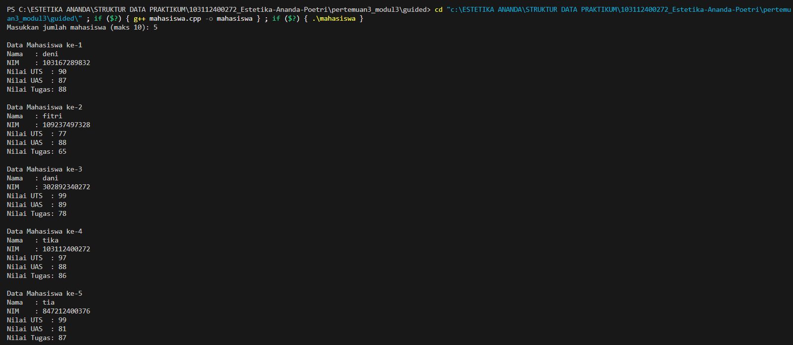
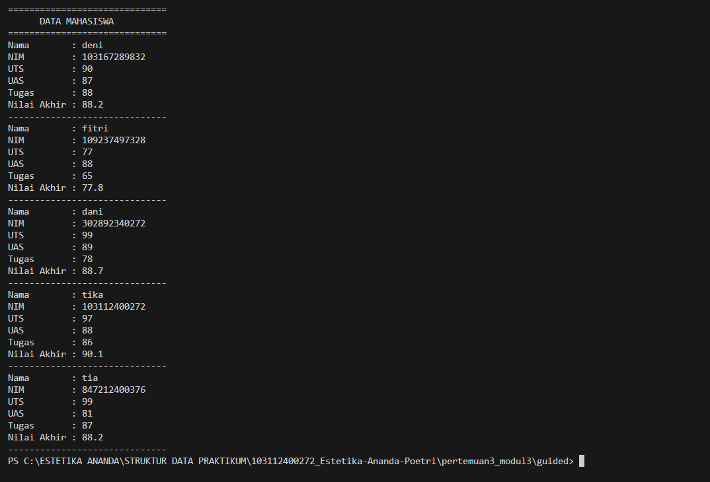
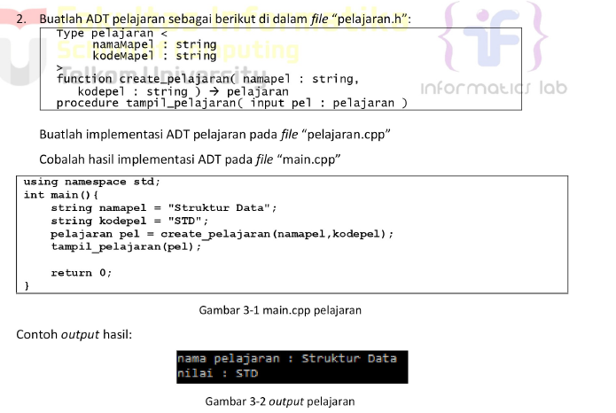
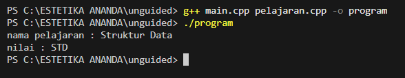
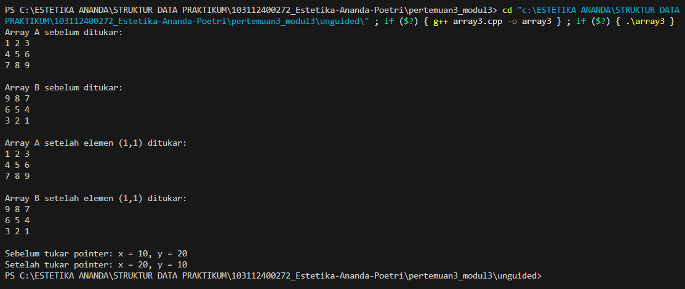

# <h1 align="center">Laporan Praktikum Modul 3 - Abstract Data Type (ADT)</h1>
<p align="center">Estetika Ananda Poetri Hariyanto - 103112400272</p>

## Dasar Teori
ADT adalah koleksi data dan operasi yang dapat digunakan untuk memanipulasi data tersebut.
Dalam C++, ADT dapat dibuat dalam sebuah class. Class dalam C++ merupakan pengembangan dari struct dalam bahasa pemrograman C [1].

### A. ...<br/>
...
#### 1. ...
#### 2. ...
#### 3. ...

### B. ...<br/>
...
#### 1. ...
#### 2. ...
#### 3. ...

## Guided 

### 1. struct.cpp

```C++
#include<iostream>
using namespace std;

struct mahasiswa{
    string nama;
    float nilai1, nilai2;
};

void inputMhs(mahasiswa &m){
    cout << "Masukkan nama mahasiswa : ";
    cin >> m.nama;
    cout << "Masukkan nilai 1 : ";
    cin >> m.nilai1;
    cout << "Masukkan nilai 2 : ";
    cin >> m.nilai2;
}

float rata2(mahasiswa m){
    return (m.nilai1 + m.nilai2)/2;
}

int main(){
    mahasiswa mhs; //pemanggilan struct (ADT)
    inputMhs(mhs); //pemanggilan prosedur
    cout << "Rata rata : " << rata2(mhs); // pemanggilan function

    return 0;
}

```
Program ini digunakan untuk menginput data mahasiswa (nama dan dua nilai), lalu menghitung rata-rata dari kedua nilai tersebut menggunakan fungsi dan prosedur.

### 2. pelajaran.h

```C++
//Header guard digunakan untuk mencegah file header yang sama 
//di-include lebih dari sekali dalam satu program
#ifndef PELAJARAN_H
#define PELAJARAN_H

#include <iostream>
#include <string>
using namespace std;

//deklarasi ADT pelajaran
struct pelajaran {
    string namaMapel;
    string kodeMapel;
};

//function untuk membuat data pelajaran
pelajaran create_pelajaran(string namaMapel, string kodepel);

//prosedur untuk menampilkan data pelajaran
void tampil_pelajaran(pelajaran pel);

#endif
```
Program file pelajaran.h ini adalah template atau rancangan awal untuk bekerja dengan data pelajaran. File ini untuk mencegah include gnda, mendefinisikan struktur pelajaran dan mendeklarasikan fungsi untuk membuat dan menampilkan data pelajaran.

### 3. Pelajaran.cpp

```C++
#include "pelajaran.h"

//implementasi function create_pelajaran
pelajaran create_pelajaran(string namaMapel, string kodepel) {
    pelajaran p;
    p.namaMapel = namaMapel;
    p.kodeMapel = kodepel;
    return p;
}

//implemtasi prosedur tampil_pelajaran
void tampil_pelajaran(pelajaran pel) {
    cout << "nama pelajaran : " << pel.namaMapel << endl;
    cout << "kode pelajaran : " << pel.kodeMapel << endl;
}
```
create_pelajaran() : membuat data pelajaran baru.
tampil_pelajaran() : menampilkan data pelajaran tsb.

tujuan program ini untuk mengelola data pelajaran dengan cara yang ter struktur dan mudah digunakan dalam program C++.
Membuat dan menampilkan data data dari pelajaran(mapel) secara rapi pakai fungsi dan struktur data (struct).

### 4. Main.cpp

```C++
#include <iostream> // mengimpor library
#include "pelajaran.h" // menggunakan file header eksternal bernama tersebut
using namespace std; // agar tdk perlu lagi menulis std setiap kali menggunakan fungsi dari standar library seperti cout atau string.

int main() { // fungsi utama
// dibawah ini adalah untuk membuat dua variabel bertpe string
    string namapel = "Struktur Data";
    string kodepel = "STD";

// dibawah ini adalah program untuk memanggil fungsi untuk membuat sebuah ibjek atau data pelajaran baru
pelajaran pel = create_pelajaran(namapel, kodepel);
tampil_pelajaran(pel); // menampilkan informasi pelajaran ke layar

return 0; // bahwa program berhasil dijalankan tanpa error
}
```
jadi program ini menyimpan nama dan kode pelajaran, membuat data peljaran menggunakan fungsi create_pelajaran(), dan menampilkan data pelajaran tsb dengan tampil_pelajaran()

## Unguided 

### 1. Buat program yang dapat menyimpan data mahasiswa (max. 10) ke dalam sebuah array dengan field nama, nim, uts, uas, tugas, dan nilai akhir. Nilai akhir diperoleh dari FUNGSI dengan rumus 0.3*uts+0.4*uas+0.3*tugas.

```C++
#include <iostream>
#include <string>
using namespace std;

//membuat struktur data
struct Mahasiswa {
    string nama;
    string nim;
    float uts;
    float uas;
    float tugas;
    float nilaiAkhir;
};

//fungsi menghitung nilai akhir
float hitungNilaiAkhir(float uts, float uas, float tugas) {
    return (0.3 * uts) + (0.4 * uas) + (0.3 * tugas);
}

//fungsi utama program
int main() {
    Mahasiswa mhs[10]; 
    int n;

//input jumlah mahasiswa
    cout << "Masukkan jumlah mahasiswa (maks 10): ";
    cin >> n;
    cin.ignore(); 

//input data setiap mahasiswa
    for (int i = 0; i < n; i++) {
        cout << "\nData Mahasiswa ke-" << i + 1 << endl;
        cout << "Nama   : ";
        getline(cin, mhs[i].nama);
        cout << "NIM    : ";
        getline(cin, mhs[i].nim);
        cout << "Nilai UTS  : ";
        cin >> mhs[i].uts;
        cout << "Nilai UAS  : ";
        cin >> mhs[i].uas;
        cout << "Nilai Tugas: ";
        cin >> mhs[i].tugas;
        cin.ignore(); 

//menghitung nilai akhir
        mhs[i].nilaiAkhir = hitungNilaiAkhir(mhs[i].uts, mhs[i].uas, mhs[i].tugas);
    }

//menampilkan hasil
    cout << "\n==============================" << endl;
    cout << "      DATA MAHASISWA" << endl;
    cout << "==============================" << endl;
    for (int i = 0; i < n; i++) {
        cout << "Nama        : " << mhs[i].nama << endl;
        cout << "NIM         : " << mhs[i].nim << endl;
        cout << "UTS         : " << mhs[i].uts << endl;
        cout << "UAS         : " << mhs[i].uas << endl;
        cout << "Tugas       : " << mhs[i].tugas << endl;
        cout << "Nilai Akhir : " << mhs[i].nilaiAkhir << endl;
        cout << "------------------------------" << endl;
    }
//akhir program
    return 0;
}
```
### Output Unguided 1 :

##### Output 1



Program ini dibuat untuk menyimpan dan menghitung nilai mahasiswa, kita bisa input sampai 10 mahasiswa, dan setiap mahasiswa punya data seperti nama, NIM, nilai UTS, UAS, dan nilai tugas. Setelah semua data dimasukkan, program akan menghitung nilai akhirnya secara otomatis dengan rumusnya yaitu,
nilai akhir = 30% UTS + 40% UAS + 30% TUGAS.

### 2. 

main.cpp
```C++
#include <iostream>
#include "pelajaran.h"
using namespace std;

int main() {
    string namapel = "Struktur Data";
    string kodepel = "STD";

    pelajaran pel = create_pelajaran(namapel, kodepel);
    tampil_pelajaran(pel);

    return 0;
}
```

pelajaran.cpp
```C++
#include <iostream>
#include "pelajaran.h"
using namespace std;

pelajaran create_pelajaran(string namapel, string kodepel) {
    pelajaran p;
    p.namapel = namapel;
    p.kodepel = kodepel;
    return p;
}

void tampil_pelajaran(pelajaran pel) {
    cout << "nama pelajaran : " << pel.namapel << endl;
    cout << "nilai : " << pel.kodepel << endl;
}
```

pelajaran.h
```C++
#ifndef PELAJARAN_H
#define PELAJARAN_H
#include <string>
using namespace std;

struct pelajaran {
    string namapel;
    string kodepel;
};


pelajaran create_pelajaran(string namapel, string kodepel);


void tampil_pelajaran(pelajaran pel);

#endif
```

### Output Unguided 2 :

##### Output 1


Program pada file main.cpp berfungsi untuk mengetes ADT pelajaran yang sudah dibuat.
Di dalamnya ada dua variabel, yaitu namapel berisi "Struktur Data" dan kodepel berisi "STD".
Kedua data itu dikirim ke fungsi create_pelajaran() untuk membuat objek pel.
Lalu objek tersebut ditampilkan ke layar dengan tampil_pelajaran(pel) yang menampilkan nama dan kode pelajaran.

### 3. Buatlah program dengan ketentuan:
- 2 buah array 2D integer berukuran 3x3 dan 2 buah pointer integer
- fungsi / prosedur yang menampilkan isi sebuah array integer 2D
- fungsi / prosedur yang akan menukarkan isi dari 2 array integer 2D pada posisi tertentu
- fungsi / prosedur yang akan menukarkan isi dari variabel yang ditunjuk oleh 2 buah pointer

```C++
#include <iostream>
using namespace std;


void tampilArray(int arr[3][3]) {
    for (int i = 0; i < 3; i++) {
        for (int j = 0; j < 3; j++) {
            cout << arr[i][j] << " ";
        }
        cout << endl;
    }
}


void tukarPosisiArray(int arr1[3][3], int arr2[3][3], int baris, int kolom) {
    int temp = arr1[baris][kolom];
    arr1[baris][kolom] = arr2[baris][kolom];
    arr2[baris][kolom] = temp;
}


void tukarPointer(int* p1, int* p2) {
    int temp = *p1;
    *p1 = *p2;
    *p2 = temp;
}

int main() {
    int A[3][3] = {
        {1, 2, 3},
        {4, 5, 6},
        {7, 8, 9}
    };
    int B[3][3] = {
        {9, 8, 7},
        {6, 5, 4},
        {3, 2, 1}
    };

    cout << "Array A sebelum ditukar:\n";
    tampilArray(A);
    cout << "\nArray B sebelum ditukar:\n";
    tampilArray(B);

  
    tukarPosisiArray(A, B, 1, 1);

    cout << "\nArray A setelah elemen (1,1) ditukar:\n";
    tampilArray(A);
    cout << "\nArray B setelah elemen (1,1) ditukar:\n";
    tampilArray(B);


    int x = 10, y = 20;
    int* ptr1 = &x;
    int* ptr2 = &y;

    cout << "\nSebelum tukar pointer: x = " << x << ", y = " << y << endl;
    tukarPointer(ptr1, ptr2);
    cout << "Setelah tukar pointer: x = " << x << ", y = " << y << endl;

    return 0;
}
```
### Output Unguided 3 :

##### Output 1


Program ini punya dua array 3x3 dan dua pointer angka.
Ada fungsi buat nunjukin isi array, fungsi buat tukar isi dua array di posisi tertentu, dan fungsi buat tukar nilai dari dua variabel lewat pointer.
Programnya nampilin isi array sebelum dan sesudah ditukar, terus nunjukin hasil tukar nilai antara dua variabelnya.

## Kesimpulan
Dari percobaan ini bisa disimpulkan kalau ADT (Abstract Data Type) membantu kita bikin program yang lebih rapi dan mudah diatur. Dengan ADT, data dan fungsinya bisa digabung jadi satu kesatuan, misalnya pakai struct di C++.

Kita juga belajar cara pakai fungsi dan prosedur untuk menghitung dan menampilkan data, header file biar program lebih terstruktur, serta array dan pointer untuk menyimpan dan menukar data.

Intinya, materi ini ngajarin dasar penting dalam C++ supaya kita bisa bikin program yang lebih teratur, efisien, dan gampang dikembangkan.

## Referensi
[1] [chrome-extension://efaidnbmnnnibpcajpcglclefindmkaj/https://rizkimuliono.blog.uma.ac.id/wp-content/uploads/sites/365/2017/05/ADT-Abstract-Data-Type.pdf]

