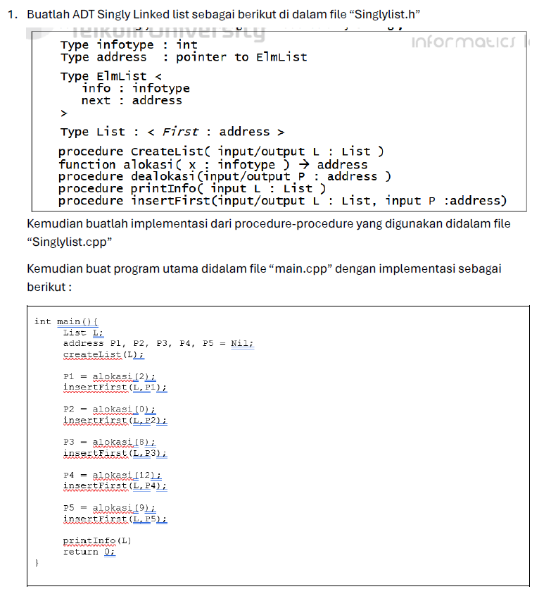
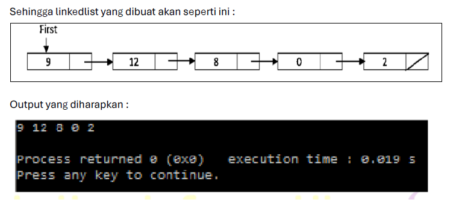
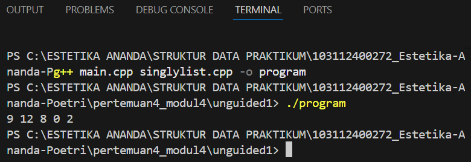
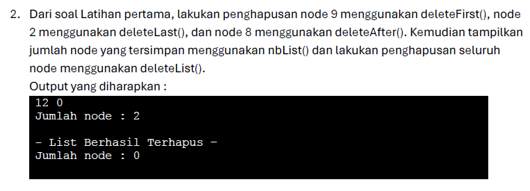
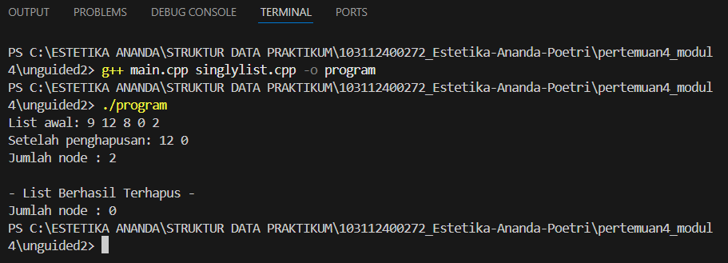

# <h1 align="center">Laporan Praktikum Modul 4 - Single Linked List (Bagian Pertama)</h1>
<p align="center">Estetika Ananda Poetri Hariyanto - 103112400272</p>

## Dasar Teori
Single linked list atau biasa disebut linked list  terdiri dari elemen-elemen individu, dimana masing-masing dihubungkan dengan pointer tunggal. Masing-masing elemen terdiri dari dua bagian, yaitu bagian data/informasi yang disimpan dan bagian pointer yang disebut dengan pointer next.
 List dapat dilintasi hanya satu arah dari head ke tail karena masing-masing elemen tidak terdapat link dengan elemen sebelumnya.  Sehingga, apabila kita mulai dari head dan berpindah ke beberapa elemen dan berharap dapat mengakses elemen sebelumnya, kita harus mulai dari head. [1].

### A. ...<br/>
...
#### 1. ...
#### 2. ...
#### 3. ...

### B. ...<br/>
...
#### 1. ...
#### 2. ...
#### 3. ...

## Guided

### 1. Guided 1

list.h
```C++
#ifndef LIST_H
#define LIST_H

#include <string>
using namespace std;

#define Nil nullptr

// ====== Struktur Data ======
struct infotype {
    string nama;
    string nim;
    int umur;
};

struct node {
    infotype isiData;
    node* next;
};

typedef node* address;

struct linkedList {
    address first;
};

// ====== Deklarasi Fungsi & Prosedur ======
bool isEmpty(linkedList List);
void createList(linkedList &List);
address alokasi(string nama, string nim, int umur);
void dealokasi(address &node);
void insertFirst(linkedList &List, address nodeBaru);
void insertAfter(linkedList &List, address nodeBaru, address Prev);
void insertLast(linkedList &List, address nodeBaru);
void printList(linkedList List);

#endif
```

list.cpp

```C++
#include "list.h"
#include <iostream>
using namespace std;

bool isEmpty(linkedList List) {
    return (List.first == Nil);
}

void createList(linkedList &List) {
    List.first = Nil;
}

address alokasi(string nama, string nim, int umur) {
    address nodeBaru = new node;
    nodeBaru->isiData.nama = nama;
    nodeBaru->isiData.nim = nim;
    nodeBaru->isiData.umur = umur;
    nodeBaru->next = Nil;
    return nodeBaru;
}

void dealokasi(address &node) {
    node->next = Nil;
    delete node;
    node = Nil;
}

void insertFirst(linkedList &List, address nodeBaru) {
    nodeBaru->next = List.first;
    List.first = nodeBaru;
}

void insertAfter(linkedList &List, address nodeBaru, address Prev) {
    if (Prev != Nil) {
        nodeBaru->next = Prev->next;
        Prev->next = nodeBaru;
    } else {
        cout << "Node sebelumnya tidak valid!" << endl;
    }
}

void insertLast(linkedList &List, address nodeBaru) {
    if (isEmpty(List)) {
        List.first = nodeBaru;
    } else {
        address nodeBantu = List.first;
        while (nodeBantu->next != Nil) {
            nodeBantu = nodeBantu->next;
        }
        nodeBantu->next = nodeBaru;
    }
}

void printList(linkedList List) {
    if (isEmpty(List)) {
        cout << "List kosong." << endl;
    } else {
        address nodeBantu = List.first;
        while (nodeBantu != Nil) {
            cout << "Nama : " << nodeBantu->isiData.nama
                 << ", NIM : " << nodeBantu->isiData.nim
                 << ", Usia : " << nodeBantu->isiData.umur << endl;
            nodeBantu = nodeBantu->next;
        }
    }
}
```

main.cpp

```C++
#include "list.h"
#include <iostream>
using namespace std;

int main() {
    linkedList List;
    createList(List);

    address m1 = alokasi("Andi", "12345", 20);
    address m2 = alokasi("Budi", "67890", 21);
    address m3 = alokasi("Citra", "11223", 19);

    insertFirst(List, m1);      // Andi di awal
    insertLast(List, m2);       // Budi di akhir
    insertAfter(List, m3, m1);  // Citra setelah Andi

    cout << "Isi Linked List Mahasiswa:\n";
    printList(List);

    return 0;
}
```
Program ini ditulis menggunakan bahasa C dan bertujuan untuk mempelajari cara kerja struktur data Linked List. Dengan program ini, pengguna dapat membuat list kosong, menambahkan data di berbagai posisi, serta menampilkan seluruh elemen list di layar.
Nama, NIM, UMUR.

### 2. Guided 2

list.cpp

```C++
#include "list.h"

// =====================
// FUNGSI DASAR
// =====================
void createList(linkedlist &L) {
    L.first = Nil;
}

bool isEmpty(linkedlist L) {
    return (L.first == Nil);
}

address alokasi(string nama, string nim, int umur) {
    address P = new elmlist;
    P->info.nama = nama;
    P->info.nim = nim;
    P->info.umur = umur;
    P->next = Nil;
    return P;
}

void dealokasi(address &P) {
    delete P;
    P = Nil;
}

// =====================
// INSERT
// =====================
void insertFirst(linkedlist &L, address P) {
    if (isEmpty(L)) {
        L.first = P;
    } else {
        P->next = L.first;
        L.first = P;
    }
}

void insertLast(linkedlist &L, address P) {
    if (isEmpty(L)) {
        insertFirst(L, P);
    } else {
        address Q = L.first;
        while (Q->next != Nil) {
            Q = Q->next;
        }
        Q->next = P;
    }
}

void insertAfter(linkedlist &L, address P, address Prec) {
    if (Prec != Nil) {
        P->next = Prec->next;
        Prec->next = P;
    }
}

// =====================
// DELETE
// =====================
void delFirst(linkedlist &L) {
    if (!isEmpty(L)) {
        address P = L.first;
        L.first = P->next;
        dealokasi(P);
    }
}

void delLast(linkedlist &L) {
    if (!isEmpty(L)) {
        if (L.first->next == Nil) {
            delFirst(L);
        } else {
            address Q = L.first;
            while (Q->next->next != Nil) {
                Q = Q->next;
            }
            address P = Q->next;
            Q->next = Nil;
            dealokasi(P);
        }
    }
}

void delAfter(linkedlist &L, address Prec, address P) {
    if (Prec != Nil && Prec->next != Nil) {
        P = Prec->next;
        Prec->next = P->next;
        dealokasi(P);
    }
}

// =====================
// UTILITAS
// =====================
void printList(linkedlist L) {
    if (isEmpty(L)) {
        cout << "List kosong." << endl;
    } else {
        address P = L.first;
        while (P != Nil) {
            cout << "Nama: " << P->info.nama
                 << " | NIM: " << P->info.nim
                 << " | Umur: " << P->info.umur << endl;
            P = P->next;
        }
    }
}

int nbList(linkedlist L) {
    int count = 0;
    address P = L.first;
    while (P != Nil) {
        count++;
        P = P->next;
    }
    return count;
}

void deleteList(linkedlist &L) {
    while (!isEmpty(L)) {
        delFirst(L);
    }
}
```

list.h

```C++
#ifndef LIST_H
#define LIST_H

#include <iostream>
#include <string>
using namespace std;

// =====================
// TIPE DATA
// =====================
#define Nil NULL

struct dataMahasiswa {
    string nama;
    string nim;
    int umur;
};

struct elmlist {
    dataMahasiswa info;
    elmlist* next;
};

typedef elmlist* address;

struct linkedlist {
    address first;
};

// =====================
// DEKLARASI FUNGSI
// =====================
void createList(linkedlist &L);
bool isEmpty(linkedlist L);
address alokasi(string nama, string nim, int umur);
void dealokasi(address &P);

void insertFirst(linkedlist &L, address P);
void insertLast(linkedlist &L, address P);
void insertAfter(linkedlist &L, address P, address Prec);

void delFirst(linkedlist &L);
void delLast(linkedlist &L);
void delAfter(linkedlist &L, address Prec, address P);

void printList(linkedlist L);
int nbList(linkedlist L);
void deleteList(linkedlist &L);

#endif
```

main.cpp

```C++
#include "list.h"
#include <iostream>
using namespace std;

int main() {
    linkedlist List;
    address nodeA, nodeB, nodeC, nodeD, nodeE = Nil;
    createList(List);

    nodeA = alokasi("Dhimas", "2311102151", 20);
    nodeB = alokasi("Arvin", "2211110014", 21);
    nodeC = alokasi("Rizal", "2311110029", 20);
    nodeD = alokasi("Satrio", "2211102173", 21);
    nodeE = alokasi("Joshua", "2311102133", 21);

    insertFirst(List, nodeA);
    insertLast(List, nodeB);
    insertAfter(List, nodeC, nodeA);
    insertAfter(List, nodeD, nodeC);
    insertLast(List, nodeE);

    cout << "--- ISI LIST SETELAH DILAKUKAN INSERT ---" << endl;
    printList(List);
    cout << "Jumlah node: " << nbList(List) << endl;
    cout << endl;

    delFirst(List);
    delLast(List);
    delAfter(List, nodeC, nodeD);

    cout << "--- ISI LIST SETELAH DILAKUKAN DELETE ---" << endl;
    printList(List);
    cout << "Jumlah node: " << nbList(List) << endl;
    cout << endl;

    deleteList(List);
    cout << "--- ISI LIST SETELAH DILAKUKAN HAPUS LIST ---" << endl;
    printList(List);
    cout << "Jumlah node: " << nbList(List) << endl;
    cout << endl;

    return 0;
}
```

program ini adalah program untuk implementasi lengkap Single Linked List dengan operasi dasar:
Membuat daftar kosong
Menambah data pada awal, tengah, atau akhir
Hapus datanya
Menampilkan semua daftar konten
Menghitung jumlah node
Menghapus data semuanya
Program ini berguna dalam memahami sifat dinamis dari struktur, seperti dalam daftar, item dapat ditambahkan atau dihapus kapan saja tanpa menggunakan array berukuran tetap.

Yang diperlukan adalah untuk menampilkan seluruh data mahasiswa yang telah berhasil dimasukkan ke dalam linked list : Nama, NIM, Umur
dari setiap node yang ada di dalam list, sesuai urutan penambahan data. Maksudnya dari code diatas membuktikan proses insertFirst, insertAfter, dan insertLast berhasil.

## Unguided 

### 1. 



main.cpp
```C++
#include "Singlylist.h"

int main() {
    List L;
    address P1, P2, P3, P4, P5;
    P1 = P2 = P3 = P4 = P5 = Nil;

    createList(L);

    P1 = alokasi(2);
    insertFirst(L, P1);

    P2 = alokasi(0);
    insertFirst(L, P2);

    P3 = alokasi(8);
    insertFirst(L, P3);

    P4 = alokasi(12);
    insertFirst(L, P4);

    P5 = alokasi(9);
    insertFirst(L, P5);

    printInfo(L);

    return 0;
}
```
singlylist.cpp
```C++
#include "Singlylist.h"

int main() {
    List L;
    address P1, P2, P3, P4, P5;
    P1 = P2 = P3 = P4 = P5 = Nil;

    createList(L);

    P1 = alokasi(2);
    insertFirst(L, P1);

    P2 = alokasi(0);
    insertFirst(L, P2);

    P3 = alokasi(8);
    insertFirst(L, P3);

    P4 = alokasi(12);
    insertFirst(L, P4);

    P5 = alokasi(9);
    insertFirst(L, P5);

    printInfo(L);

    return 0;
}
```
singlylist.h
```C++
#ifndef SINGLYLIST_H
#define SINGLYLIST_H
#include <iostream>
using namespace std;

#define Nil NULL

typedef int infotype;

typedef struct ElmList *address;

struct ElmList {
    infotype info;
    address next;
};

struct List {
    address first;
};

void createList(List &L);
address alokasi(infotype x);
void dealokasi(address &P);
void insertFirst(List &L, address P);
void printInfo(List L);

#endif
```

### Output Unguided 1 :

##### Output 1


createList → membuat list kosong.
alokasi → membuat node baru berisi data (info).
insertFirst → menambahkan node di awal list.
printInfo → menampilkan isi list secara berurutan.

Tujuan dari program ini adalah dapat mempelajari cara kerja dari struktur data dinamis atau bisa juga mempelajari cara kerja seperti mana lokasi elemen-elemen data ditambahkan, dilepas, atau diakses tanpa harus memiliki ukuran tertentu seperti array.

Khususnya, program ini bertujuan untuk:

Membuat list kosong sebagai tempat menyimpan data secara berurutan.

Bisa menambahkan elemen di awal daftar insertFirst sehingga data baru bisa dimasukkan ke depan tanpa menggeser elemen lain.

Program keluaran menunjukkan:
9 12 8 0 2
dimana hasilnya muncul karena urutan penyisipan menggunakan insertFirst, atau penambahan elemen baru di depan daftar.
Berikut adalah penjelasan langkah demi langkahnya:
Daftar startup kosong.
Pertama = BATAL
2. Sisipkan
→ Daftar: 2
(2 menjadi elemen pertama)
Masukkan 0 di depannya.
→ Daftar: 0 → 2
Masukkan 8 di depan.
→ Daftar: 8 → 0 → 2
Masukkan 12 di depan.
→ 12 → 8 → 0 → 2 Pilih 9 di depannya.
List: 9 → 12 → 8 → 0 → 2 Sehingga, setiap kali data baru dimasukkan di depan selalu.
Maka urutan akhir data yang ada di memori kebalikan dari urutan penyisipan karena posisinya dari insertFirst.
Jadi output akhirnya adalah: 9 12 8 0 2 yang merupakan rangkaian node dari First hingga akhir.

### 2. 

singlylist.cpp
```C++
#include "Singlylist.h"

void CreateList(List &L) {
    L.first = Nil;
}

address alokasi(infotype x) {
    address P = new ElmList;
    P->info = x;
    P->next = Nil;
    return P;
}

void dealokasi(address P) {
    delete P;
}

void printInfo(List L) {
    address P = L.first;
    while (P != Nil) {
        cout << P->info << " ";
        P = P->next;
    }
    cout << endl;
}

void insertFirst(List &L, address P) {
    P->next = L.first;
    L.first = P;
}

// ========================
// Bagian untuk nomor 2
// ========================

void deleteFirst(List &L, address &P) {
    if (L.first != Nil) {
        P = L.first;
        L.first = L.first->next;
        P->next = Nil;
    } else {
        P = Nil;
    }
}

void deleteLast(List &L, address &P) {
    if (L.first != Nil) {
        if (L.first->next == Nil) {
            P = L.first;
            L.first = Nil;
        } else {
            address Q = L.first;
            while (Q->next->next != Nil) {
                Q = Q->next;
            }
            P = Q->next;
            Q->next = Nil;
        }
    } else {
        P = Nil;
    }
}

void deleteAfter(List &L, address Prec, address &P) {
    if (Prec != Nil && Prec->next != Nil) {
        P = Prec->next;
        Prec->next = P->next;
        P->next = Nil;
    } else {
        P = Nil;
    }
}

int nbList(List L) {
    int count = 0;
    address P = L.first;
    while (P != Nil) {
        count++;
        P = P->next;
    }
    return count;
}

void deleteList(List &L) {
    address P;
    while (L.first != Nil) {
        deleteFirst(L, P);
        dealokasi(P);
    }
}
```

singlylist.h
```C++
#ifndef SINGLYLIST_H_INCLUDED
#define SINGLYLIST_H_INCLUDED

#include <iostream>
using namespace std;

#define Nil NULL

typedef int infotype;

struct ElmList {
    infotype info;
    ElmList *next;
};

typedef ElmList* address;

struct List {
    address first;
};

// ==== PROTOTYPE FUNCTION & PROCEDURE ====
void CreateList(List &L);
address alokasi(infotype x);
void dealokasi(address P);
void printInfo(List L);
void insertFirst(List &L, address P);

// Tambahan untuk nomor 2:
void deleteFirst(List &L, address &P);
void deleteLast(List &L, address &P);
void deleteAfter(List &L, address Prec, address &P);
int nbList(List L);
void deleteList(List &L);

#endif
```

main.cpp
```C++
#include "Singlylist.h"
#include <iostream>
using namespace std;

int main() {
    List L;
    address P1, P2, P3, P4, P5, Pdel;

    CreateList(L);

    // Membuat linked list sesuai soal
    P1 = alokasi(2);  insertFirst(L, P1);
    P2 = alokasi(0);  insertFirst(L, P2);
    P3 = alokasi(8);  insertFirst(L, P3);
    P4 = alokasi(12); insertFirst(L, P4);
    P5 = alokasi(9);  insertFirst(L, P5);

    cout << "List awal: ";
    printInfo(L);

    // Hapus 9 (deleteFirst)
    deleteFirst(L, Pdel);
    dealokasi(Pdel);

    // Hapus 2 (deleteLast)
    deleteLast(L, Pdel);
    dealokasi(Pdel);

    // Hapus 8 (deleteAfter)
    deleteAfter(L, L.first, Pdel);
    dealokasi(Pdel);

    cout << "Setelah penghapusan: ";
    printInfo(L);
    cout << "Jumlah node : " << nbList(L) << endl;

    // Hapus seluruh list
    deleteList(L);
    cout << endl << "- List Berhasil Terhapus -" << endl;
    cout << "Jumlah node : " << nbList(L) << endl;

    return 0;
}
```

### Output Unguided 2 :

##### Output 1


Program ini bertujuan untuk:
Membuat stuktur data Single Linked List.
Membuat penghapusan node tertentu (pertama, tengah, terakhir).
Menampilkan hasil list setelah penghapusan.
Menentukan node yang tersisa, lalu mengosongkan isi list secara keseluruhan di akhir.
pakai Operasi seperti insert, delete, dan count dilakukan dengan menelusuri pointer.
penghapusan node 9 dan 8.

## Kesimpulan
Implementasi program mencakup berbagai operasi dasar, yaitu:
Membuat list kosong menggunakan fungsi createList().
Menambahkan data di berbagai posisi (awal, tengah, akhir) dengan insertFirst(), insertAfter(), dan insertLast().
Menghapus data menggunakan delFirst(), delAfter(), dan delLast().
Menampilkan isi list dengan printList().
Menghitung jumlah node dengan nbList().
Menghapus seluruh list menggunakan deleteList() untuk membersihkan memori.

Program Single Linked List ini menunjukkan bahwa struktur data dinamis sangat efektif dan fleksibel untuk pengolahan data yang tidak memiliki ukuran tetap. Dengan berbagai operasi yang diimplementasikan, pengguna dapat memahami konsep dasar pengelolaan node, hubungan antara elemen dengan peran pointer, dan manajemen memori.

## Referensi
[1] [https://share.google/bzoLEXrZt54Awdq8b]

