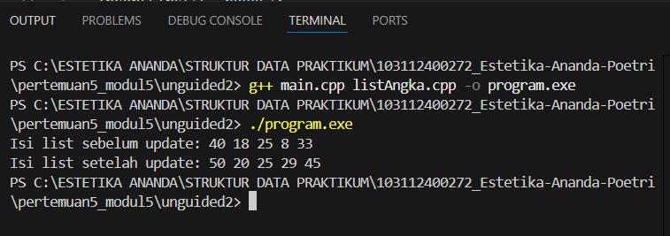
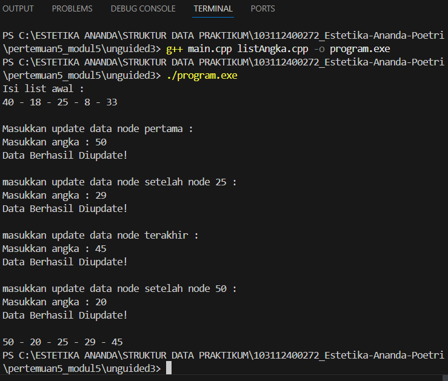
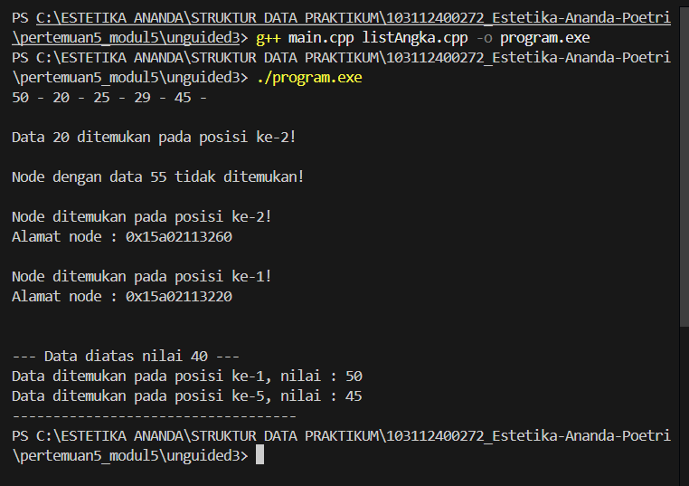
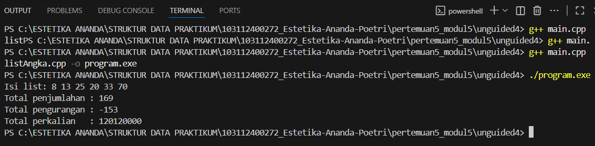

# <h1 align="center">Laporan Praktikum Modul 5 - Single Linked List (Bagian Kedua)</h1>
<p align="center">Estetika Ananda Poetri Hariyanto - 103112400272</p>

## Dasar Teori
Pencarian (searching) merupakan proses yang sering digunakan dalam pengelolaan data. Proses pencarian adalah menemukan nilai (data) tertentu didalam sekumpulan data yang bertipe sama (baik bertipe dasar atau bertipe bentukan). Search algoritma adalah algoritma yang menerima argument A danmencoba untuk mencari record yang mana key nya adalah Ax.
Pencarian (searching) merupakan proses yang sering digunakan dalam pengelolaan data. Proses pencarian adalah menemukan nilai (data) tertentu didalam sekumpulan data yang bertipe sama (baik bertipe dasar atau bertipe bentukan). Search algoritma adalah algoritma yang menerima argument A danmencoba untuk mencari record yang mana key nya adalah A [1].

### A. ...<br/>
...
#### 1. ...
#### 2. ...
#### 3. ...

### B. ...<br/>
...
#### 1. ...
#### 2. ...
#### 3. ...

## Guided

### 1. Guided 1

listBuah.cpp
```C++
#include "listBuah.h"
#include <iostream>
using namespace std;

//fungsi untuk cek apakah list kosong atau tidak
bool isEmpty(linkedlist List) {
    if(List.first == Nil){
        return true; 
    } else {
        return false;
    }
}

//pembuatan linked list kosong
void createList(linkedlist &List) {
    List.first = Nil;
}

//pembuatan node baru dengan menerapkan manajemen memori
address alokasi(string nama, int jumlah, float harga) { 
    address nodeBaru = new node; 
    nodeBaru->isidata.nama = nama;
    nodeBaru->isidata.jumlah = jumlah; 
    nodeBaru->isidata.harga = harga;
    nodeBaru->next = Nil;
    return nodeBaru;
}

//penghapusan node dengan menerapkan manajemen memori
void dealokasi(address &node) {
    node->next = Nil;
    delete node;
}

//prosedur-prosedur untuk insert / menambahkan node baru kedalam list
void insertFirst(linkedlist &List, address nodeBaru) {
    nodeBaru->next = List.first; 
    List.first = nodeBaru;
}

void insertAfter(linkedlist &List, address nodeBaru, address Prev) {
    if (Prev != Nil) {
        nodeBaru->next = Prev->next;
        Prev->next = nodeBaru;
    } else {
        cout << "Node sebelumnya tidak valid!" << endl;
    }
}

void insertLast(linkedlist &List, address nodeBaru) {
    if (isEmpty(List)) {
        List.first = nodeBaru;
    } else {
        address nodeBantu = List.first;
        while (nodeBantu->next != Nil) {
            nodeBantu = nodeBantu->next;
        }
        nodeBantu->next = nodeBaru;
    }
}

//prosedur-prosedur untuk delete / menghapus node yang ada didalam list
void delFirst(linkedlist &List){
    address nodeHapus;
    if (isEmpty(List) == false) {
        nodeHapus = List.first;
        List.first = List.first->next;
        nodeHapus->next = Nil;
        dealokasi(nodeHapus);
        cout << "Node pertama berhasil terhapus!" << endl;
    } else {
        cout << "List kosong!" << endl;
    }
}

void delLast(linkedlist &List){
    address nodeHapus, nodePrev;
    if(isEmpty(List) == false){
        nodeHapus = List.first;
        if(nodeHapus->next == Nil){
            List.first->next = Nil;
            dealokasi(nodeHapus);
        } else { 
            while(nodeHapus->next != Nil){
                nodePrev = nodeHapus; 
                nodeHapus = nodeHapus->next;
            }
            nodePrev->next = Nil; 
            dealokasi(nodeHapus);
        }
        cout << "Node terakhir berhasil terhapus!" << endl;
    } else {
        cout << "list kosong" << endl;
    }
}

void delAfter(linkedlist &List, address nodeHapus, address nodePrev){
    if(isEmpty(List) == true){
        cout << "List kosong!" << endl;
    } else { //jika list tidak kosong
        if (nodePrev != Nil && nodePrev->next != Nil) { 
            nodeHapus = nodePrev->next;       
            nodePrev->next = nodeHapus->next;  
            nodeHapus->next = Nil;         
            dealokasi(nodeHapus);
            cout << "Node setelah node " << nodePrev->isidata.nama << " berhasil terhapus!" << endl;
        } else {
            cout << "Node sebelumnya (prev) tidak valid!" << endl;
        }
    }
}

//prosedur untuk menampilkan isi list
void printList(linkedlist List) {
    if (isEmpty(List)) {
        cout << "List kosong." << endl;
    } else {
        address nodeBantu = List.first;
        while (nodeBantu != Nil) { 
            cout << "Nama Buah : " << nodeBantu->isidata.nama << ", Jumlah : " << nodeBantu->isidata.jumlah << ", Harga : " << nodeBantu->isidata.harga << endl;
            nodeBantu = nodeBantu->next;
        }
    }
}

//function untuk menampilkan jumlah node didalam list
int nbList(linkedlist List) {
    int count = 0;
    address nodeBantu = List.first;
    while (nodeBantu != Nil) {
        count++;
        nodeBantu = nodeBantu->next; 
    }
    return count;
}

//prosedur untuk menghapus list (menghapus semua node didalam list)
void deleteList(linkedlist &List){
    address nodeBantu, nodeHapus;
    nodeBantu = List.first;
    while(nodeBantu != Nil){
        nodeHapus = nodeBantu;
        nodeBantu = nodeBantu->next;
        dealokasi(nodeHapus); 
    }
    List.first = Nil; 
    cout << "List berhasil terhapus!" << endl;
}

/*----- MATERI PERTEMUAN 5 - SINGLY LINKED LIST (BAGIAN KEDUA) - PART 1 (UPDATE) -----*/
//prosedur-prosedur untuk melakukan update data node
void updateFirst(linkedlist List){
    if(isEmpty(List) == true){
        cout << "List kosong!" << endl;
    } else {
        cout << "Masukkan update data node pertama : " << endl;
        cout << "Nama buah : ";
        cin >> List.first->isidata.nama;
        cout << "Jumlah : ";
        cin >> List.first->isidata.jumlah;
        cout << "Harga : ";
        cin >> List.first->isidata.harga;
        cout << "Data Berhasil Diupdate!" << endl;
        cout << endl;
    }
}

void updateLast(linkedlist List){
    if (isEmpty(List) == true) {
        cout << "List Kosong!" << endl;
    } else {
        address nodeBantu = List.first;
        while (nodeBantu->next != Nil) {
            nodeBantu = nodeBantu->next;
        }
        cout << "masukkan update data node terakhir : " << endl;
        cout << "Nama buah : ";
        cin >> nodeBantu->isidata.nama;
        cout << "Jumlah : ";
        cin >> nodeBantu->isidata.jumlah;
        cout << "Harga : ";
        cin >> nodeBantu->isidata.harga;
        cout << "Data Berhasil Diupdate!" << endl;
        cout << endl;
    }
}

void updateAfter(linkedlist List, address nodePrev){
    if(isEmpty(List) == true){
        cout << "List kosong!" << endl;
    } else {
        if (nodePrev != Nil && nodePrev->next != Nil){
            address nodeBantu = nodePrev->next;
            cout << "masukkan update data node setelah node " << nodePrev->isidata.nama << " : " << endl;
            cout << "Nama buah : ";
            cin >> nodeBantu->isidata.nama;
            cout << "Jumlah : ";
            cin >> nodeBantu->isidata.jumlah;
            cout << "Harga : ";
            cin >> nodeBantu->isidata.harga;
            cout << "Data Berhasil Diupdate!" << endl;
            cout << endl;
        } else {
            cout << "Node sebelumnya (prev) tidak valid!" << endl;
        }
    }
}

/*----- MATERI PERTEMUAN 5 - SINGLY LINKED LIST (BAGIAN KEDUA) - PART 2 (SEARCHING) -----*/
//prosedur-prosedur untuk searching data
//prosedur untuk mencari node berdasarkan data
void FindNodeByData(linkedlist list, string data){
    if(isEmpty(list) == true){
        cout << "List kosong!" << endl;
    } else {
        address nodeBantu = list.first;
        int posisi = 0;
        bool found = false;
        while(nodeBantu != Nil){
            posisi++;
            if(nodeBantu->isidata.nama == data){
                cout << "Data " << data << " ditemukan pada posisi ke-" << posisi << "!" << endl;
                cout << "Nama Buah : " << nodeBantu->isidata.nama << ", Jumlah : " << nodeBantu->isidata.jumlah << ", Harga : " << nodeBantu->isidata.harga << endl;
                found = true;
                break;
            }
            nodeBantu = nodeBantu->next;
        }
        if(found == false){
            cout << "Node dengan data " << data << " tidak ditemukan!" << endl;
        }
    }
    cout << endl;
}

//prosedur untuk mencari node berdasarkan alamat node
void FindNodeByAddress(linkedlist list, address node) {
    if(isEmpty(list) == true) {
        cout << "List kosong!" << endl;
    } else {
        address nodeBantu = list.first;
        int posisi = 0;
        bool found = false;
        while (nodeBantu != Nil) {
            posisi++;
            if(nodeBantu == node) {
                cout << "Node ditemukan pada posisi ke-" << posisi << "!" << endl;
                cout << "Alamat node : " << nodeBantu << endl;
                cout << "Nama Buah : " << nodeBantu->isidata.nama << ", Jumlah : " << nodeBantu->isidata.jumlah << ", Harga : " << nodeBantu->isidata.harga << endl;
                found = true;
                break;
            }
            nodeBantu = nodeBantu->next;
        }
        if(found == false) {
            cout << "Node dengan alamat " << node << " tidak ditemukan dalam list!" << endl;
        }
    }
    cout << endl;
}

//prosedur untuk mencari node berdasarkan range data (range harga)
void FindNodeByRange(linkedlist list, float hargaAwal, float hargaAkhir) {
    if(isEmpty(list) == true) {
        cout << "List kosong!" << endl;
    } else {
        address nodeBantu = list.first;
        int posisi = 0;
        bool found = false;
        cout << "--- Buah dalam range harga " << hargaAwal << " - " << hargaAkhir << " ---" << endl;
        cout << "-------------------------------------------" << endl;
        while (nodeBantu != Nil) {
            posisi++;
            float harga = nodeBantu->isidata.harga;
            if(harga >= hargaAwal && harga <= hargaAkhir) {
                cout << "Data ditemukan pada posisi ke-" << posisi << " :" << endl;
                cout << "Nama Buah : " << nodeBantu->isidata.nama << ", Jumlah : " << nodeBantu->isidata.jumlah << ", Harga : " << nodeBantu->isidata.harga << endl;
                cout << "-------------------------------------------" << endl;
                found = true;
            }
            nodeBantu = nodeBantu->next;
        }
        if(found == false) {
            cout << "Tidak ada data buah dalam range harga tersebut!" << endl;
            cout << "-------------------------------------------" << endl;
        }
    }
    cout << endl;
}
```

listBuah.h

```C++
//Header guard digunakan untuk mencegah file header yang sama 
//di-include lebih dari sekali dalam satu program.
#ifndef LISTBUAH_H
#define LISTBUAH_H
#define Nil NULL

#include<iostream>
using namespace std;

struct buah{
    string nama;
    int jumlah; 
    float harga;
};

typedef buah dataBuah; //Memberikan nama alias databuah untuk struct buah.

typedef struct node *address; //Mendefinisikan alias address sebagai pointer ke struct node

struct node{ // node untuk isi dari linked listnya, isi setiap node adalah data & pointer next
    dataBuah isidata;
    address next;
};

struct linkedlist{ //ini linked list nya
    address first;
};

//semua function & prosedur yang akan dipakai
//Materi modul 4
bool isEmpty(linkedlist List);
void createList(linkedlist &List);
address alokasi(string nama, int jumlah, float harga);
void dealokasi(address &node);
void printList(linkedlist List);
void insertFirst(linkedlist &List, address nodeBaru);
void insertAfter(linkedlist &List, address nodeBaru, address Prev);
void insertLast(linkedlist &List, address nodeBaru);
void delFirst(linkedlist &List);
void delLast(linkedlist &List);
void delAfter(linkedlist &List, address nodeHapus, address nodePrev);
int nbList(linkedlist List);
void deleteList(linkedlist &List);

//materi modul 5 (part 1 - update)
void updateFirst(linkedlist List);
void updateLast(linkedlist List);
void updateAfter(linkedlist List, address prev);

//materi modul 5 (part 2 - searching)
void FindNodeByData(linkedlist list, string data);
void FindNodeByAddress(linkedlist list, address node);
void FindNodeByRange(linkedlist list, float hargaAwal, float HargaAkhir);

#endif
```

main.cpp

```C++
#include "listBuah.h"

#include<iostream>
using namespace std;

int main(){
    linkedlist List;
    address nodeA, nodeB, nodeC, nodeD, nodeE = Nil;
    createList(List);

    dataBuah dtBuah;

    nodeA = alokasi("Jeruk", 100, 3000);
    nodeB = alokasi("Apel", 75, 4000);
    nodeC = alokasi("Pir", 87, 5000);
    nodeD = alokasi("Semangka", 43, 11500);
    nodeE = alokasi("Durian", 15, 31450);

    insertFirst(List, nodeA);
    insertLast(List, nodeB);
    insertAfter(List, nodeC, nodeA);
    insertAfter(List, nodeD, nodeC);
    insertLast(List, nodeE);

    cout << "--- ISI LIST SETELAH DILAKUKAN INSERT ---" << endl;
    printList(List);
    cout << "jumlah node : " << nbList(List) << endl;
    cout << endl;

    updateFirst(List);
    updateLast(List);
    updateAfter(List, nodeD);

    cout << "--- ISI LIST SETELAH DILAKUKAN UPDATE ---" << endl;
    printList(List);
    cout << "jumlah node : " << nbList(List) << endl;
    cout << endl;

    FindNodeByData(List, "kelapa");
    FindNodeByAddress(List, nodeC);
    FindNodeByRange(List, 5000, 10000);

    delFirst(List);
    delLast(List);
    delAfter(List, nodeD, nodeC);

    cout << "--- ISI LIST SETELAH DILAKUKAN DELETE ---" << endl;
    printList(List);
    cout << "jumlah node : " << nbList(List) << endl;
    cout << endl;

    deleteList(List);
    cout << "--- ISI LIST SETELAH DILAKUKAN HAPUS LIST ---" << endl;
    printList(List);
    cout << "jumlah node : " << nbList(List) << endl;
    cout << endl;

    return 0;
}
```
Contoh kode tersebut memperlihatkan cara menerapkan struktur data Single Linked List dalam bahasa C++. Fungsinya untuk mengelola data buah, mencakup nama, kuantitas, dan harga masing‑masing. Seluruh tahapan pembuatan node, penambahan elemen, pengubahan nilai, pencarian entri, implementasinya mengandalkan manajemen memori dinamis dengan memanfaatkan pointer dan perintah new dan delete.

## Unguided 

### 1. Buat ADT dari soal terlampir, kemudian buat implementasi function dan procedure tsb, kemudian lakukan pada main.cpp.

listAngka.cpp
```C++
#include "listAngka.h"
#include <iostream>
using namespace std;

void createList(linkedList &L) {
    L.first = Nil;
}

node* alokasi(int x) {
    node* p = new node;
    p->angka = x;
    p->next = Nil;
    return p;
}

void dealokasi(node* p) {
    delete p;
}

void printList(linkedList L) {
    node* p = L.first;
    while (p != Nil) {
        cout << p->angka << " ";
        p = p->next;
    }
    cout << endl;
}

void insertFirst(linkedList &L, node* p) {
    p->next = L.first;
    L.first = p;
}

void insertLast(linkedList &L, node* p) {
    if (L.first == Nil) {
        L.first = p;
    } else {
        node* q = L.first;
        while (q->next != Nil) {
            q = q->next;
        }
        q->next = p;
    }
}

void insertAfter(linkedList &L, node* p, node* prec) {
    if (prec != Nil) {
        p->next = prec->next;
        prec->next = p;
    }
}

void delAfter(linkedList &L, node* &p, node* prec) {
    if (prec != Nil && prec->next != Nil) {
        p = prec->next;
        prec->next = p->next;
        p->next = Nil;
    }
}
```
listAngka.h
```C++
#ifndef LISTANGKA_H
#define LISTANGKA_H

#include <iostream>
using namespace std;

#define Nil NULL

typedef int dataAngka;

struct node {
    dataAngka angka;
    node* next;
};

struct linkedList {
    node* first;
};

// ===== Deklarasi Fungsi dan Prosedur =====
void createList(linkedList &L);
node* alokasi(int x);
void dealokasi(node* p);
void printList(linkedList L);
void insertFirst(linkedList &L, node* p);
void insertLast(linkedList &L, node* p);
void insertAfter(linkedList &L, node* p, node* prec);
void delAfter(linkedList &L, node* &p, node* prec);

#endif
```
main.cpp
```C++
#include <iostream>
#include "listAngka.h"  
int main() {
    linkedList L;
    createList(L);

    //membuat node
    node *nodeA, *nodeB, *nodeC, *nodeD, *nodeE, *nodeF;
    nodeA = alokasi(8);
    nodeB = alokasi(13);
    nodeC = alokasi(18);
    nodeD = alokasi(25);
    nodeE = alokasi(33);
    nodeF = alokasi(40);

    // === Proses Insert ===
    insertFirst(L, nodeB);
    insertLast(L, nodeA);
    insertAfter(L, nodeD, nodeB);
    insertFirst(L, nodeC);
    insertLast(L, nodeE);
    insertFirst(L, nodeF);

    // === Hapus node setelah nodeC ===
    node* delNode;
    delAfter(L, delNode, nodeC);
    dealokasi(delNode);

    cout << "Isi list sebelum update: ";
    printList(L); // ini menampilkan list awal

    // === Update data (Nomor 1) ===
    nodeF->angka = 50;   // 40 → 50
    nodeA->angka = 29;   // 8 → 29
    nodeE->angka = 45;   // 33 → 45
    nodeC->angka = 20;   // 18 → 20

    cout << "Isi list setelah update: ";
    printList(L); //ini menampilkan hasil setelah update

    return 0;
}
```

### Output Unguided 1 :

##### Output 1


Program ini menampilkan bagaimana cara kerja struktur data Single Linked List, yaitu kumpulan elemen (node) yang saling terhubung menggunakan pointer.
Setiap node menyimpan data angka dan alamat (pointer) ke node berikutnya.
Dengan kata lain, program ini melatih cara mengelola data menggunakan pointer, bukan array, sehingga ukuran datanya bisa berubah-ubah secara dinamis saat program berjalan.

### 2. Buatlah procedure updateFirst, updateLast, dan updateAfter dengan rincian yang terlampir, kemudian pada main.cpp lakukanlah:
1. update data 40 jadi 50
1. update data 8 jadi 29
1. update data 33 jadi 45
1. update data 18 jadi 20
tampilkan seluruh list setelah di update.

listAngka.cpp
```C++
#include "listAngka.h"
#include <iostream>
using namespace std;

// ===== Fungsi dasar =====
void createList(linkedList &L) {
    L.first = Nil;
}

node* alokasi(int x) {
    node* p = new node;
    p->angka = x;
    p->next = Nil;
    return p;
}

void dealokasi(node* p) {
    delete p;
}

void printList(linkedList L) {
    node* p = L.first;
    while (p != Nil) {
        cout << p->angka;
        if (p->next != Nil) cout << " - ";
        p = p->next;
    }
    cout << endl;
}

void insertFirst(linkedList &L, node* p) {
    p->next = L.first;
    L.first = p;
}

void insertLast(linkedList &L, node* p) {
    if (L.first == Nil) {
        L.first = p;
    } else {
        node* q = L.first;
        while (q->next != Nil) {
            q = q->next;
        }
        q->next = p;
    }
}

void insertAfter(linkedList &L, node* p, node* prec) {
    if (prec != Nil) {
        p->next = prec->next;
        prec->next = p;
    }
}

void delAfter(linkedList &L, node* &p, node* prec) {
    if (prec != Nil && prec->next != Nil) {
        p = prec->next;
        prec->next = p->next;
        p->next = Nil;
    }
}

// ====== FUNGSI UPDATE (Nomor 1) ======
void updateFirst(linkedList &L) {
    if (L.first != Nil) {
        cout << "Masukkan update data node pertama : " << endl;
        cout << "Masukkan angka : ";
        cin >> L.first->angka;
        cout << "Data Berhasil Diupdate!" << endl << endl;
    } else {
        cout << "List kosong, tidak bisa update." << endl;
    }
}

void updateLast(linkedList &L) {
    if (L.first == Nil) {
        cout << "List kosong, tidak bisa update." << endl;
        return;
    }

    node* p = L.first;
    while (p->next != Nil) {
        p = p->next;
    }

    cout << "masukkan update data node terakhir : " << endl;
    cout << "Masukkan angka : ";
    cin >> p->angka;
    cout << "Data Berhasil Diupdate!" << endl << endl;
}

void updateAfter(linkedList &L, node* prec) {
    if (prec != Nil && prec->next != Nil) {
        cout << "masukkan update data node setelah node " << prec->angka << " : " << endl;
        cout << "Masukkan angka : ";
        cin >> prec->next->angka;
        cout << "Data Berhasil Diupdate!" << endl << endl;
    } else {
        cout << "Node sebelumnya tidak valid / tidak punya penerus." << endl;
    }
}
```

listAngka.h
```C++
#ifndef LISTANGKA_H
#define LISTANGKA_H

#include <iostream>
using namespace std;

#define Nil NULL

typedef int dataAngka;

struct node {
    dataAngka angka;
    node* next;
};

struct linkedList {
    node* first;
};

// ==== Deklarasi fungsi dasar ====
void createList(linkedList &L);
node* alokasi(int x);
void dealokasi(node* p);
void printList(linkedList L);
void insertFirst(linkedList &L, node* p);
void insertLast(linkedList &L, node* p);
void insertAfter(linkedList &L, node* p, node* prec);
void delAfter(linkedList &L, node* &p, node* prec);

// ==== Fungsi update (Nomor 1) ====
void updateFirst(linkedList &L);
void updateLast(linkedList &L);
void updateAfter(linkedList &L, node* prec);

#endif
```

main.cpp
```C++
#include <iostream>
#include "listAngka.h"
using namespace std;

int main() {
    linkedList L;
    createList(L);

    //membuat node
    node *nodeA, *nodeB, *nodeC, *nodeD, *nodeE, *nodeF;
    nodeA = alokasi(8);
    nodeB = alokasi(25);
    nodeC = alokasi(18);
    nodeD = alokasi(33);
    nodeE = alokasi(40);
    nodeF = alokasi(29); // akan dipakai untuk insert tambahan (opsional)

    // === SUSUN LIST SESUAI CONTOH ===
    insertFirst(L, nodeD);  // 33
    insertFirst(L, nodeA);  // 8 - 33
    insertFirst(L, nodeB);  // 25 - 8 - 33
    insertFirst(L, nodeC);  // 18 - 25 - 8 - 33
    insertFirst(L, nodeE);  // 40 - 18 - 25 - 8 - 33

    cout << "Isi list awal :" << endl;
    printList(L);
    cout << endl;

    // === PROSES UPDATE SESUAI OUTPUT CONTOH ===
    updateFirst(L);          // ubah data pertama (40 -> 50)
    updateAfter(L, nodeB);   // ubah data setelah node 25 (8 -> 29)
    updateLast(L);           // ubah data terakhir (33 -> 45)
    updateAfter(L, nodeE);   // ubah data setelah node 50 (18 -> 20)

    // === CETAK HASIL AKHIR ===
    printList(L);

    return 0;
}
```

### Output Unguided 2 :

##### Output 1


Program ini merupakan implementasi struktur data Single Linked List yang digunakan untuk menyimpan dan memperbarui data bilangan bulat secara dinamis. Program ini menunjukkan proses pembuatan list, penambahan node di berbagai posisi, serta cara memperbarui nilai node pertama, terakhir, dan node setelah elemen tertentu menggunakan fungsi update yang terhubung dengan pointer.

### 3. Buatlah procedure searchbydata, searchbyaddress, dan searchbyrange dengan rincian nya, kemudian pada main.cpp lakukanlah:
1. mencari data nilai 20
2. mencari data nilai 55
3. mencari data alamat nodeB
4. mencari data alamat nodeA
5. mencari data dengan nilai minimal 40

listAngka.cpp
```C++
#include "listAngka.h"

//program membuat list kosong
void createList(linkedList &L) {
    L.first = Nil;
}

//mengalokasi node baru
node* alokasi(int x) {
    node *p = new node;
    p->data = x;
    p->next = Nil;
    return p;
}

//menyisipkan node di akhir list
void insertLast(linkedList &L, node *p) {
    if (L.first == Nil) {
        L.first = p;
    } else {
        node *q = L.first;
        while (q->next != Nil) {
            q = q->next;
        }
        q->next = p;
    }
}

//menampilkan isi list
void printList(linkedList L) {
    node *p = L.first;
    while (p != Nil) {
        cout << p->data << " - ";
        p = p->next;
    }
    cout << endl;
}

// ===================================================
// ============== SEARCH FUNCTIONS ===================
// ===================================================

//search oleh data
void SearchByData(linkedList L, int data) {
    node *p = L.first;
    int pos = 1;
    bool found = false;

    while (p != Nil) {
        if (p->data == data) {
            cout << "Data " << data << " ditemukan pada posisi ke-" << pos << "!" << endl;
            found = true;
            break;
        }
        p = p->next;
        pos++;
    }

    if (!found) {
        cout << "Node dengan data " << data << " tidak ditemukan!" << endl;
    }
    cout << endl;
}

//search oleh address
void SearchByAddress(linkedList L, node *address) {
    node *p = L.first;
    int pos = 1;
    bool found = false;

    while (p != Nil) {
        if (p == address) {
            cout << "Node ditemukan pada posisi ke-" << pos << "!" << endl;
            cout << "Alamat node : " << p << endl;
            found = true;
            break;
        }
        p = p->next;
        pos++;
    }

    if (!found) {
        cout << "Node dengan alamat " << address << " tidak ditemukan dalam list!" << endl;
    }
    cout << endl;
}

//search oleh range
void SearchByRange(linkedList L, int nilaiMin) {
    cout << "--- Data diatas nilai " << nilaiMin << " ---" << endl;
    node *p = L.first;
    int pos = 1;
    bool found = false;

    while (p != Nil) {
        if (p->data >= nilaiMin) {
            cout << "Data ditemukan pada posisi ke-" << pos << ", nilai : " << p->data << endl;
            found = true;
        }
        p = p->next;
        pos++;
    }

    if (!found) {
        cout << "Tidak ada data dengan nilai >= " << nilaiMin << endl;
    }
    cout << "-----------------------------------" << endl;
}
```

listAngka.h
```C++
#ifndef LISTANGKA_H_INCLUDED
#define LISTANGKA_H_INCLUDED

#include <iostream>
using namespace std;

#define Nil NULL

struct node {
    int data;
    node *next;
};

struct linkedList {
    node *first;
};

void createList(linkedList &L);
node* alokasi(int x);
void insertLast(linkedList &L, node *p);
void printList(linkedList L);

// prosedur pencarian
void SearchByData(linkedList L, int data);
void SearchByAddress(linkedList L, node *address);
void SearchByRange(linkedList L, int nilaiMin);

#endif
```

main.cpp
```C++
#include <iostream>
#include "listAngka.h"
using namespace std;

int main() {
    linkedList L;
    createList(L);

    // Alokasi node
    node *nodeA = alokasi(50);
    node *nodeB = alokasi(20);
    node *nodeC = alokasi(25);
    node *nodeD = alokasi(29);
    node *nodeE = alokasi(45);

    // Masukkan ke list
    insertLast(L, nodeA);
    insertLast(L, nodeB);
    insertLast(L, nodeC);
    insertLast(L, nodeD);
    insertLast(L, nodeE);

    printList(L);
    cout << endl;

    // Mencari data nilai 20
    SearchByData(L, 20);

    // Mencari data nilai 55
    SearchByData(L, 55);

    // Mencari data alamat nodeB
    SearchByAddress(L, nodeB);

    // Mencari data alamat nodeA
    SearchByAddress(L, nodeA);

    // Mencari data dengan nilai minimal 40
    SearchByRange(L, 40);

    return 0;
}
```

### Output Unguided 3 :

##### Output 1


Program ini dibuat untuk menampilkan cara kerja pencarian data dalam struktur data Linked List. Di dalamnya, ada sekumpulan angka yang disimpan dalam bentuk node-node yang saling terhubung.

### 4. Lakukanlahoperasi aritmetika penjumlahan, dan perkalian terhadap semua data yang ada di dalam list tsb untuk penjumlahan nilai awal adalah 0, untuk pengurangan nilai awal adalah nilai node pertama, untuk perkalian nilai awal adalah 1.

listAngka.cpp
```C++
#include "listAngka.h"


void createList(linkedList &L) {
    L.first = Nil;
}


node* alokasi(int x) {
    node* P = new node;
    P->info = x;
    P->next = Nil;
    return P;
}


void insertLast(linkedList &L, node* P) {
    if (L.first == Nil) {
        L.first = P;
    } else {
        node* Q = L.first;
        while (Q->next != Nil) {
            Q = Q->next;
        }
        Q->next = P;
    }
}


void showAll(linkedList L) {
    node* P = L.first;
    while (P != Nil) {
        cout << P->info << " ";
        P = P->next;
    }
    cout << endl;
}


void operasiAritmatika(linkedList L) {
    if (L.first == Nil) {
        cout << "List kosong!" << endl;
        return;
    }

    node *P = L.first;
    int totalTambah = 0;
    int totalKurang = P->info;   
    long long totalKali = 1;    


    while (P != Nil) {
        totalTambah += P->info;
        totalKali *= P->info;
        P = P->next;
    }


    P = L.first->next;
    while (P != Nil) {
        totalKurang -= P->info;
        P = P->next;
    }

    cout << "Total penjumlahan : " << totalTambah << endl;
    cout << "Total pengurangan : " << totalKurang << endl;
    cout << "Total perkalian   : " << totalKali << endl;
}
```

listAngka.h
```C++
#ifndef LISTANGKA_H
#define LISTANGKA_H

#include <iostream>
using namespace std;

#define Nil NULL

struct node {
    int info;
    node *next;
};

struct linkedList {
    node *first;
};

void createList(linkedList &L);
node* alokasi(int x);
void insertLast(linkedList &L, node* P);
void showAll(linkedList L);
void operasiAritmatika(linkedList L);

#endif
```

main.cpp
```C++
#include <iostream>
#include "listAngka.h"
using namespace std;

int main() {
    linkedList L;
    createList(L);

    //membuat node dan mengisi data
    node *A, *B, *C, *D, *E, *F;
    A = alokasi(8);
    B = alokasi(13);
    C = alokasi(25);
    D = alokasi(20);
    E = alokasi(33);
    F = alokasi(70);

    //memasukkan ke dalam list
    insertLast(L, A);
    insertLast(L, B);
    insertLast(L, C);
    insertLast(L, D);
    insertLast(L, E);
    insertLast(L, F);

    //menampilkan isi list
    cout << "Isi list: ";
    showAll(L);

    //melakukan operasi aritmetika
    operasiAritmatika(L);

    return 0;
}
```

### Output Unguided 4 :

##### Output 1


Program ini dibuat untuk menyimpan beberapa angka dalam bentuk daftar yang saling terhubung (linked list), lalu menghitung hasil dari operasi penjumlahan, pengurangan, dan perkalian terhadap semua angka tersebut. Setiap angka disimpan di dalam node, dan program menelusuri setiap node satu per satu untuk melakukan perhitungan. Dengan cara ini, kita bisa mengolah data angka tanpa menggunakan array, tapi memakai konsep pointer dan node yang saling terhubung.

## Kesimpulan
Secara keseluruhan, program semua ini adalah contoh penerapan struktur data Single Linked List menggunakan bahasa C++. Fungsinya adalah untuk mengelola data secara dinamis. Program ini melibatkan beberapa tahapan, seperti membuat list, menambahkan node, menghapus data, memperbarui nilai, mencari data, serta melakukan operasi aritmetika seperti penjumlahan, pengurangan, dan perkalian. Melalui proses tersebut, terlihat bagaimana data dapat dihubungkan dan diproses satu demi satu tanpa harus menggunakan array dengan ukuran tetap.

Dengan pendekatan ini, pengguna bisa memahami bahwa linked list memberikan fleksibilitas dalam mengelola data karena ukuran list bisa diubah sesuai kebutuhan.
Selain itu, linked list memungkinkan akses dan manipulasi data secara efisien dengan bantuan pointer. Program ini juga membantu memahami cara mengelola memori secara dinamis menggunakan perintah new dan delete, serta konsep keterhubungan antar elemen dalam struktur data linear.

## Referensi
[1] [https://www.scribd.com/document/749489190/Makalah-Searching]

