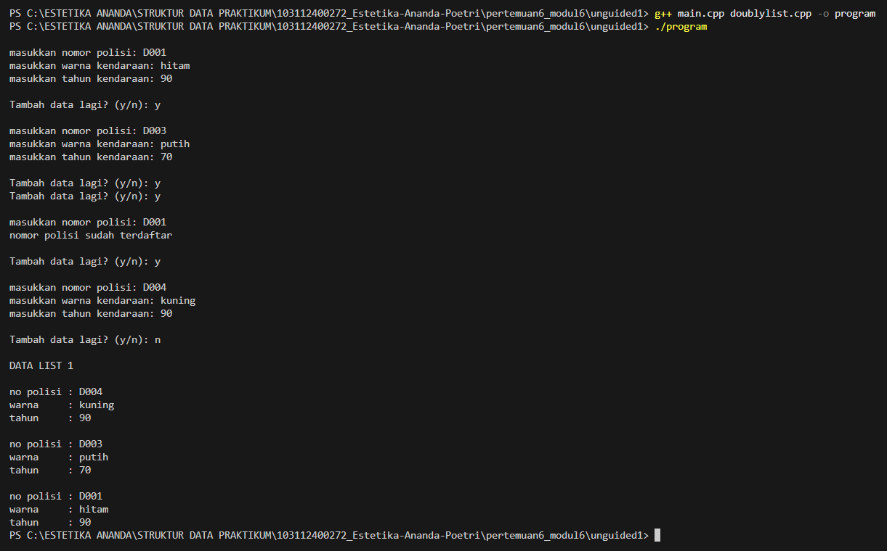
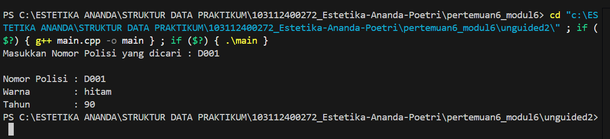
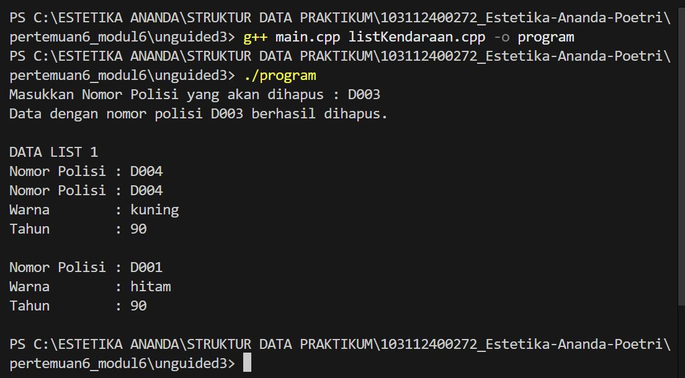

# <h1 align="center">Laporan Praktikum Modul 6 - Double Linked List (Bagian pertama)</h1>
<p align="center">Estetika Ananda Poetri Hariyanto - 103112400272</p>

## Dasar Teori
Elemen-elemen dihubungkan dengan dua pointer dalam satu elemen. Struktur ini menyebabkan list bisa melintas baik ke depan maupun ke belakang. Masing-masing elemen pada double linked list terdiri atas tiga bagian, di samping data/informasi dan pointer next, masing-masing elemen dilengkapi dengan pointer prev yang menunjuk ke elemen sebelumnya. Double linked list dibentuk dengan menyusun sejumlah elemen sehingga pointer next menunjuk ke elemen yang mengikutinya dan pointer prev menunjuk ke elemen yang mendahuluinya.
Untuk menunjukkan head dari double linked list, maka pointer prev dari elemen pertama menunjuk NULL. Untuk menunjukkan tail dari double linked list tersebut, maka pointer next dari elemen terakhir menunjuk NULL [1].

### A. ...<br/>
...
#### 1. ...
#### 2. ...
#### 3. ...

### B. ...<br/>
...
#### 1. ...
#### 2. ...
#### 3. ...

## Guided

### 1. Guided 1

listMakanan.cpp
```C++
#include "listMakanan.h"
#include <iostream>
using namespace std;

bool isEmpty(linkedlist List) {
    if(List.first == Nil){
        return true; 
    } else {
        return false;
    }
}

void createList(linkedlist &List) {
    List.first = Nil;
    List.last = Nil;
}

//pembuatan node baru dengan menerapkan manajemen memori
address alokasi(string nama, string jenis, float harga, float rating) { 
    address nodeBaru = new node;
    nodeBaru->isidata.nama = nama;
    nodeBaru->isidata.jenis = jenis; 
    nodeBaru->isidata.harga = harga;
    nodeBaru->isidata.rating =  rating;
    nodeBaru->next = Nil;
    nodeBaru->prev = Nil;
    return nodeBaru;
}

void dealokasi(address &node) {
    node->next = Nil;
    node->prev = Nil;
    delete node;
}

void insertFirst(linkedlist &List, address nodeBaru){
    if (isEmpty(List)) {
        List.first = List.last = nodeBaru;
    } else {
        nodeBaru->next = List.first;
        List.first->prev = nodeBaru;
        List.first = nodeBaru;
    }
    cout << "Node " << nodeBaru->isidata.nama << " berhasil ditambahkan sebagai node pertama list" << endl;
}

void insertLast(linkedlist &List, address nodeBaru){
    if(isEmpty(List) == true){
        List.first = List.last = nodeBaru;
    } else {
        nodeBaru->prev = List.last;
        List.last->next = nodeBaru;
        List.last = nodeBaru;
    }
    cout << "Node " << nodeBaru->isidata.nama << " berhasil ditambahkan sebagai node terakhir list" << endl;
}

void insertAfter(linkedlist &List, address nodeBaru, address nodePrev){
    if(isEmpty(List) == true){
        List.first = List.last = nodeBaru;
    } else {
        if (nodePrev != Nil){
            if(nodePrev == List.last){
                insertLast(List, nodeBaru);
            } else {
                nodeBaru->next = nodePrev->next;
                nodeBaru->prev = nodePrev;
                (nodePrev->next)->prev = nodeBaru;
                nodePrev->next = nodeBaru;
                cout << "Node " << nodeBaru->isidata.nama << " berhasil ditambahkan setelah node " << nodePrev->isidata.nama << endl;
            }
        } else {
            cout << "node sebelumnya (nodePrev) tidak valid!" << endl;
        }
    }
}

void insertBefore(linkedlist &List, address nodeBaru, address nodeNext){
    if(isEmpty(List) == true){
        List.first = List.last = nodeBaru;
    } else {
        if (nodeNext != Nil){
            if(nodeNext == List.first){
                insertFirst(List, nodeBaru);
            } else {
                nodeBaru->next = nodeNext;
                nodeBaru->prev = nodeNext->prev;
                (nodeNext->prev)->next = nodeBaru;
                nodeNext->prev = nodeBaru;
                cout << "Node " << nodeBaru->isidata.nama << " berhasil ditambahkan sebelum node " << nodeNext->isidata.nama << endl;
            }
        } else {
            cout << "node setelahnya (nodeNext) tidak valid!" << endl;
        }
    }
}

void printList(linkedlist List) {
    if (isEmpty(List) == true) {
        cout << "List kosong!" << endl;
    } else {
        address nodeBantu = List.first;
        while (nodeBantu != Nil) { 
            cout << "Nama makanan : " << nodeBantu->isidata.nama << endl;
            cout << "Jenis        : " << nodeBantu->isidata.jenis << endl;
            cout << "Harga        : " << nodeBantu->isidata.harga << endl; 
            cout << "Rating       : " << nodeBantu->isidata.rating << endl;
            cout << "-------------------------------" << endl;
            nodeBantu = nodeBantu->next;
        }
    }
}

void updateFirst(linkedlist List){
    if(isEmpty(List) == true){
        cout << "List kosong!" << endl;
    } else {
        cout << "Masukkan update data node pertama : " << endl;
        cout << "Nama makanan : ";
        getline(cin, List.first->isidata.nama);
        cout << "Jenis makanan : ";
        getline(cin, List.first->isidata.jenis);
        cout << "Harga : ";
        cin >> List.first->isidata.harga;
        cout << "Rating : ";
        cin >> List.first->isidata.rating;
        cin.ignore(); //menghapus karakter newline (/n) dari input buffer
        cout << "Data Berhasil Diupdate!" << endl;
        cout << endl; 
    }
}

void updateLast(linkedlist List){
    if(isEmpty(List) == true){
        cout << "List kosong!" << endl;
    } else {
        cout << "Masukkan update data node terakhir : " << endl;
        cout << "Nama makanan : ";
        getline(cin, List.last->isidata.nama);
        cout << "Jenis makanan : ";
        getline(cin, List.last->isidata.jenis);
        cout << "Harga : ";
        cin >> List.last->isidata.harga;
        cout << "Rating : ";
        cin >> List.last->isidata.rating;
        cin.ignore(); //menghapus karakter newline (/n) dari input buffer
        cout << "Data Berhasil Diupdate!" << endl;
        cout << endl; 
    }
}

void updateAfter(linkedlist List, address nodePrev){
    if(isEmpty(List) == true){
        cout << "List kosong!" << endl;
    } else {
        if(nodePrev != Nil && nodePrev->next != Nil){
            address nodeBantu = nodePrev->next;
            cout << "masukkan update data node setelah node " << nodePrev->isidata.nama << " : " << endl;
            cout << "Nama makanan : ";
            getline(cin, nodeBantu->isidata.nama);
            cout << "Jenis makanan : ";
            getline(cin, nodeBantu->isidata.jenis);
            cout << "Harga : ";
            cin >> nodeBantu->isidata.harga;
            cout << "Rating : ";
            cin >> nodeBantu->isidata.rating;
            cin.ignore(); //menghapus karakter newline (/n) dari input buffer
            cout << "Data Berhasil Diupdate!" << endl;
            cout << endl;
        } else {
            cout << "Node sebelumnya (nodePrev) tidak valid!" << endl;
        }
    }
}

void updateBefore(linkedlist List, address nodeNext){
    if(isEmpty(List) == true){
        cout << "List kosong!" << endl;
    } else {
        if (nodeNext != Nil && nodeNext->prev != Nil){
            address nodeBantu = nodeNext->prev;
            cout << "masukkan update data node sebelum node " << nodeNext->isidata.nama << " : " << endl;
            cout << "Nama makanan : ";
            getline(cin, nodeBantu->isidata.nama);
            cout << "Jenis makanan : ";
            getline(cin, nodeBantu->isidata.jenis);
            cout << "Harga : ";
            cin >> nodeBantu->isidata.harga;
            cout << "Rating : ";
            cin >> nodeBantu->isidata.rating;
            cin.ignore(); //menghapus karakter newline (/n) dari input buffer
            cout << "Data Berhasil Diupdate!" << endl;
            cout << endl;
        } else {
            cout << "Node sebelumnya (prev) tidak valid!" << endl;
        }
    }
}
```

listMakanan.h

```C++
#ifndef LISTMAKANAN_H
#define LISTMAKANAN_H
#define Nil NULL

#include<iostream>
using namespace std;

struct makanan{
    string nama;
    string jenis; 
    float harga;
    float rating; 
};

typedef makanan dataMakanan;

typedef struct node *address;

struct node{
    dataMakanan isidata;
    address next;
    address prev;
};

struct linkedlist{
    address first;
    address last;
};

bool isEmpty(linkedlist List);
void createList(linkedlist &List);
address alokasi(string nama, string jenis, float harga, float rating);
void dealokasi(address &node);

void insertFirst(linkedlist &List, address nodeBaru);
void insertLast(linkedlist &List, address nodeBaru);
void insertAfter(linkedlist &List, address nodeBaru, address Prev);
void insertBefore(linkedlist &List, address nodeBaru, address nodeNext);

void printList(linkedlist List);

void updateFirst(linkedlist List);
void updateLast(linkedlist List);
void updateAfter(linkedlist List, address prev);
void updateBefore(linkedlist List, address nodeNext);

#endif
```

main.cpp

```C++
#include "listMakanan.h"
#include <iostream>

using namespace std;

int main(){
    linkedlist List;
    address nodeA, nodeB, nodeC, nodeD, nodeE = Nil;
    createList(List);

    dataMakanan dtMakanan;

    nodeA = alokasi("Nasi Rames", "Makanan Berat", 10000, 8.5);
    nodeB = alokasi("Ayam Geprek", "Makanan Berat", 13000, 9.0);
    nodeC = alokasi("Risol Mayo", "Makanan Ringan", 3500, 8.8);
    nodeD = alokasi("Mie Ayam", "Makanan Berat", 15000, 9.9);
    nodeE = alokasi("Donat", "Makanan Ringan", 2000, 7.7);

    insertFirst(List, nodeD);
    insertLast(List, nodeE);
    insertAfter(List, nodeA, nodeD);
    insertBefore(List, nodeC, nodeE);
    insertLast(List, nodeB);
    cout << endl;

    //D - A - C - E - B
    cout << "--- Isi List Setelah Insert ---" << endl;
    printList(List);
    cout << endl;

    updateFirst(List);
    updateLast(List);
    updateBefore(List, nodeC);
    updateAfter(List, nodeC);

    cout << "--- Isi List Setelah Update ---" << endl;
    printList(List);

    return 0;
}
```
Program ini adalah simulasi pengelolaan daftar makanan menggunakan struktur data double linked list dalam bahasa C++.
Artinya, setiap data makanan disimpan dalam sebuah “rantai” node, di mana tiap node punya penunjuk ke node berikutnya (next) dan node sebelumnya (prev).

listMakanan.h
Struktur datanya:
struct makanan → menyimpan data makanan:
nama, jenis, harga, dan rating.
struct node → mewakili satu data makanan dalam daftar.
Setiap node punya:
isidata → data makanan itu sendiri
next → alamat node setelahnya
prev → alamat node sebelumnya
struct linkedlist → menyimpan alamat:
first → node pertama di daftar
last → node terakhir di daftar

listMakanan.cpp
- isEmpty(List)
Cek apakah list kosong.
Kalau List.first masih NULL, berarti belum ada data.
- createList(List)
Membuat list baru yang masih kosong.
Awalnya first dan last diset ke NULL.
- alokasi(...)
Membuat node baru di memori dan mengisi data makanan:
nama
jenis
harga
rating
Node ini masih terpisah dan belum dimasukkan ke dalam list.
- dealokasi(node)
Menghapus node dari memori dan memutuskan semua koneksi (next dan prev).

updateFirst → ubah data node pertama
updateLast → ubah data node terakhir
updateAfter(List, nodePrev) → ubah node setelah nodePrev
updateBefore(List, nodeNext) → ubah node sebelum nodeNext

### 2. Guided 2

listMakanan.cpp
```C++
#include "listMakanan.h"
#include <iostream>
#include <string>
using namespace std;

bool isEmpty(linkedlist List) {
    if(List.first == Nil){
        return true; 
    } else {
        return false;
    }
}

void createList(linkedlist &List) {
    List.first = Nil;
    List.last = Nil;
}

//pembuatan node baru dengan menerapkan manajemen memori
address alokasi(string nama, string jenis, float harga, float rating) { 
    address nodeBaru = new node;
    nodeBaru->isidata.nama = nama;
    nodeBaru->isidata.jenis = jenis; 
    nodeBaru->isidata.harga = harga;
    nodeBaru->isidata.rating =  rating;
    nodeBaru->next = Nil;
    nodeBaru->prev = Nil;
    return nodeBaru;
}

void dealokasi(address &node) {
    node->next = Nil;
    node->prev = Nil;
    delete node;
}

void insertFirst(linkedlist &List, address nodeBaru){
    if (isEmpty(List)) {
        List.first = List.last = nodeBaru;
    } else {
        nodeBaru->next = List.first;
        List.first->prev = nodeBaru;
        List.first = nodeBaru;
    }
    cout << "Node " << nodeBaru->isidata.nama << " berhasil ditambahkan sebagai node pertama list" << endl;
}

void insertLast(linkedlist &List, address nodeBaru){
    if(isEmpty(List) == true){
        List.first = List.last = nodeBaru;
    } else {
        nodeBaru->prev = List.last;
        List.last->next = nodeBaru;
        List.last = nodeBaru;
    }
    cout << "Node " << nodeBaru->isidata.nama << " berhasil ditambahkan sebagai node terakhir list" << endl;
}

void insertAfter(linkedlist &List, address nodeBaru, address nodePrev){
    if(isEmpty(List) == true){
        List.first = List.last = nodeBaru;
    } else {
        if (nodePrev != Nil){
            if(nodePrev == List.last){
                insertLast(List, nodeBaru);
            } else {
                nodeBaru->next = nodePrev->next;
                nodeBaru->prev = nodePrev;
                (nodePrev->next)->prev = nodeBaru;
                nodePrev->next = nodeBaru;
                cout << "Node " << nodeBaru->isidata.nama << " berhasil ditambahkan setelah node " << nodePrev->isidata.nama << endl;
            }
        } else {
            cout << "node sebelumnya (nodePrev) tidak valid!" << endl;
        }
    }
}

void insertBefore(linkedlist &List, address nodeBaru, address nodeNext){
    if(isEmpty(List) == true){
        List.first = List.last = nodeBaru;
    } else {
        if (nodeNext != Nil){
            if(nodeNext == List.first){
                insertFirst(List, nodeBaru);
            } else {
                nodeBaru->next = nodeNext;
                nodeBaru->prev = nodeNext->prev;
                (nodeNext->prev)->next = nodeBaru;
                nodeNext->prev = nodeBaru;
                cout << "Node " << nodeBaru->isidata.nama << " berhasil ditambahkan sebelum node " << nodeNext->isidata.nama << endl;
            }
        } else {
            cout << "node setelahnya (nodeNext) tidak valid!" << endl;
        }
    }
}

void printList(linkedlist List) {
    if (isEmpty(List) == true) {
        cout << "List kosong!" << endl;
    } else {
        address nodeBantu = List.first;
        while (nodeBantu != Nil) { 
            cout << "Nama makanan : " << nodeBantu->isidata.nama << endl;
            cout << "Jenis        : " << nodeBantu->isidata.jenis << endl;
            cout << "Harga        : " << nodeBantu->isidata.harga << endl; 
            cout << "Rating       : " << nodeBantu->isidata.rating << endl;
            cout << "-------------------------------" << endl;
            nodeBantu = nodeBantu->next;
        }
    }
}

void updateFirst(linkedlist List){
    if(isEmpty(List) == true){
        cout << "List kosong!" << endl;
    } else {
        cout << "Masukkan update data node pertama : " << endl;
        cout << "Nama makanan : ";
        getline(cin, List.first->isidata.nama);
        cout << "Jenis makanan : ";
        getline(cin, List.first->isidata.jenis);
        cout << "Harga : ";
        cin >> List.first->isidata.harga;
        cout << "Rating : ";
        cin >> List.first->isidata.rating;
        cin.ignore(); //menghapus karakter newline (/n) dari input buffer
        cout << "Data Berhasil Diupdate!" << endl;
        cout << endl; 
    }
}

void updateLast(linkedlist List){
    if(isEmpty(List) == true){
        cout << "List kosong!" << endl;
    } else {
        cout << "Masukkan update data node terakhir : " << endl;
        cout << "Nama makanan : ";
        getline(cin, List.last->isidata.nama);
        cout << "Jenis makanan : ";
        getline(cin, List.last->isidata.jenis);
        cout << "Harga : ";
        cin >> List.last->isidata.harga;
        cout << "Rating : ";
        cin >> List.last->isidata.rating;
        cin.ignore(); //menghapus karakter newline (/n) dari input buffer
        cout << "Data Berhasil Diupdate!" << endl;
        cout << endl; 
    }
}

void updateAfter(linkedlist List, address nodePrev){
    if(isEmpty(List) == true){
        cout << "List kosong!" << endl;
    } else {
        if(nodePrev != Nil && nodePrev->next != Nil){
            address nodeBantu = nodePrev->next;
            cout << "masukkan update data node setelah node " << nodePrev->isidata.nama << " : " << endl;
            cout << "Nama makanan : ";
            getline(cin, nodeBantu->isidata.nama);
            cout << "Jenis makanan : ";
            getline(cin, nodeBantu->isidata.jenis);
            cout << "Harga : ";
            cin >> nodeBantu->isidata.harga;
            cout << "Rating : ";
            cin >> nodeBantu->isidata.rating;
            cin.ignore(); //menghapus karakter newline (/n) dari input buffer
            cout << "Data Berhasil Diupdate!" << endl;
            cout << endl;
        } else {
            cout << "Node sebelumnya (nodePrev) tidak valid!" << endl;
        }
    }
}

void updateBefore(linkedlist List, address nodeNext){
    if(isEmpty(List) == true){
        cout << "List kosong!" << endl;
    } else {
        if (nodeNext != Nil && nodeNext->prev != Nil){
            address nodeBantu = nodeNext->prev;
            cout << "masukkan update data node sebelum node " << nodeNext->isidata.nama << " : " << endl;
            cout << "Nama makanan : ";
            getline(cin, nodeBantu->isidata.nama);
            cout << "Jenis makanan : ";
            getline(cin, nodeBantu->isidata.jenis);
            cout << "Harga : ";
            cin >> nodeBantu->isidata.harga;
            cout << "Rating : ";
            cin >> nodeBantu->isidata.rating;
            cin.ignore(); //menghapus karakter newline (/n) dari input buffer
            cout << "Data Berhasil Diupdate!" << endl;
            cout << endl;
        } else {
            cout << "Node sebelumnya (prev) tidak valid!" << endl;
        }
    }
}

// SEARCHING
void findByName(linkedlist List, string nama){
    if(isEmpty(List)){
        cout << "List kosong!" << endl;
        return;
    }
    address p = List.first;
    while(p != Nil){
        if(p->isidata.nama == nama){
            cout << "Ditemukan (berdasarkan nama):" << endl;
            cout << "Nama makanan : " << p->isidata.nama << endl;
            cout << "Jenis        : " << p->isidata.jenis << endl;
            cout << "Harga        : " << p->isidata.harga << endl;
            cout << "Rating       : " << p->isidata.rating << endl;
            return;
        }
        p = p->next;
    }
    cout << "Data dengan nama \"" << nama << "\" tidak ditemukan." << endl;
}

void findByJenis(linkedlist List, string jenis){
    if(isEmpty(List)){
        cout << "List kosong!" << endl;
        return;
    }
    address p = List.first;
    while(p != Nil){
        if(p->isidata.jenis == jenis){
            cout << "Ditemukan (berdasarkan jenis):" << endl;
            cout << "Nama makanan : " << p->isidata.nama << endl;
            cout << "Jenis        : " << p->isidata.jenis << endl;
            cout << "Harga        : " << p->isidata.harga << endl;
            cout << "Rating       : " << p->isidata.rating << endl;
            return;
        }
        p = p->next;
    }
    cout << "Data dengan jenis \"" << jenis << "\" tidak ditemukan." << endl;
}

void findByMinRating(linkedlist List, float minRating){
    if(isEmpty(List)){
        cout << "List kosong!" << endl;
        return;
    }
    address p = List.first;
    while(p != Nil){
        if(p->isidata.rating >= minRating){
            cout << "Ditemukan (rating >= " << minRating << "):" << endl;
            cout << "Nama makanan : " << p->isidata.nama << endl;
            cout << "Jenis        : " << p->isidata.jenis << endl;
            cout << "Harga        : " << p->isidata.harga << endl;
            cout << "Rating       : " << p->isidata.rating << endl;
            return;
        }
        p = p->next;
    }
    cout << "Tidak ada data dengan rating >= " << minRating << "." << endl;
}

// DELETE
void deleteFirst(linkedlist &List){
    if(isEmpty(List) == true){
        cout << "List kosong! Tidak ada node yang dihapus." << endl;
        return;
    }
    address pDel = List.first;
    if(List.first == List.last){
        List.first = List.last = Nil;
    } else {
        List.first = pDel->next;
        List.first->prev = Nil;
        pDel->next = Nil;
    }
    pDel->prev = Nil;
    cout << "Node " << pDel->isidata.nama << " berhasil dihapus dari posisi pertama." << endl;
    dealokasi(pDel);
}

void deleteLast(linkedlist &List){
    if(isEmpty(List) == true){
        cout << "List kosong! Tidak ada node yang dihapus." << endl;
        return;
    }
    address pDel = List.last;
    if(List.first == List.last){
        List.first = List.last = Nil;
    } else {
        List.last = pDel->prev;
        List.last->next = Nil;
        pDel->prev = Nil;
    }
    pDel->next = Nil;
    cout << "Node " << pDel->isidata.nama << " berhasil dihapus dari posisi terakhir." << endl;
    dealokasi(pDel);
}

void deleteAfter(linkedlist &List, address Prev){
    if(isEmpty(List) == true){
        cout << "List kosong! Tidak ada node yang dihapus." << endl;
        return;
    }
    if(Prev == Nil || Prev->next == Nil){
        cout << "Node sebelumnya (Prev) tidak valid atau tidak ada node setelahnya!" << endl;
        return;
    }
    if(Prev->next == List.last){
        deleteLast(List);
        return;
    }
    address pDel = Prev->next;
    Prev->next = pDel->next;
    pDel->next->prev = Prev;
    pDel->next = Nil;
    pDel->prev = Nil;
    cout << "Node " << pDel->isidata.nama << " berhasil dihapus setelah node " << Prev->isidata.nama << "." << endl;
    dealokasi(pDel);
}

void deleteBefore(linkedlist &List, address nodeNext){
    if(isEmpty(List) == true){
        cout << "List kosong! Tidak ada node yang dihapus." << endl;
        return;
    }
    if(nodeNext == Nil || nodeNext->prev == Nil){
        cout << "Node setelahnya (nodeNext) tidak valid atau tidak ada node sebelumnya!" << endl;
        return;
    }
    if(nodeNext->prev == List.first){
        deleteFirst(List);
        return;
    }
    address pDel = nodeNext->prev;
    nodeNext->prev = pDel->prev;
    pDel->prev->next = nodeNext;
    pDel->next = Nil;
    pDel->prev = Nil;
    cout << "Node " << pDel->isidata.nama << " berhasil dihapus sebelum node " << nodeNext->isidata.nama << "." << endl;
    dealokasi(pDel);
}

void deleteNode(linkedlist &List, address target){
    if(isEmpty(List) == true || target == Nil){
        cout << "Target tidak valid atau list kosong!" << endl;
        return;
    }
    if(target == List.first){
        deleteFirst(List);
    } else if(target == List.last){
        deleteLast(List);
    } else {
        address L = target->prev;
        address R = target->next;
        L->next = R;
        R->prev = L;
        target->next = Nil;
        target->prev = Nil;
        cout << "Node " << target->isidata.nama << " berhasil dihapus dari tengah list." << endl;
        dealokasi(target);
    }
}

void deleteByName(linkedlist &List, string nama){
    if(isEmpty(List)){
        cout << "List kosong! Tidak ada node yang dihapus." << endl;
        return;
    }

    address target = List.first;
    while(target != Nil && target->isidata.nama != nama){
        target = target->next;
    }
    if(target == Nil){
        cout << "Node dengan nama \"" << nama << "\" tidak ditemukan." << endl;
        return;
    }

    deleteNode(List, target);
    cout << "Node dengan nama \"" << nama << "\" telah dihapus dan didealokasi." << endl;
}
```

listMakanan.h

```C++
#ifndef LISTMAKANAN_H
#define LISTMAKANAN_H
#define Nil NULL

#include<iostream>
using namespace std;

struct makanan{
    string nama;
    string jenis; 
    float harga;
    float rating; 
};

typedef makanan dataMakanan;

typedef struct node *address;

struct node{
    dataMakanan isidata;
    address next;
    address prev;
};

struct linkedlist{
    address first;
    address last;
};

bool isEmpty(linkedlist List);
void createList(linkedlist &List);
address alokasi(string nama, string jenis, float harga, float rating);
void dealokasi(address &node);

void insertFirst(linkedlist &List, address nodeBaru);
void insertLast(linkedlist &List, address nodeBaru);
void insertAfter(linkedlist &List, address nodeBaru, address Prev);
void insertBefore(linkedlist &List, address nodeBaru, address nodeNext);

void printList(linkedlist List);

void updateFirst(linkedlist List);
void updateLast(linkedlist List);
void updateAfter(linkedlist List, address prev);
void updateBefore(linkedlist List, address nodeNext);

// Searching
void findByName(linkedlist List, string nama);
void findByJenis(linkedlist List, string jenis);
void findByMinRating(linkedlist List, float minRating);

// Delete
void deleteFirst(linkedlist &List);
void deleteLast(linkedlist &List);
void deleteAfter(linkedlist &List, address Prev);
void deleteBefore(linkedlist &List, address nodeNext);

void deleteNode(linkedlist &List, address target);
void deleteByName(linkedlist &List, string nama);

#endif
```

main.cpp

```C++
#include "listMakanan.h"
#include <iostream>

using namespace std;

int main(){
    linkedlist List;
    address nodeA, nodeB, nodeC, nodeD, nodeE = Nil;
    createList(List);

    dataMakanan dtMakanan;

    nodeA = alokasi("Nasi Rames", "Makanan Berat", 10000, 8.5);
    nodeB = alokasi("Ayam Geprek", "Makanan Berat", 13000, 9.0);
    nodeC = alokasi("Risol Mayo", "Makanan Ringan", 3500, 8.8);
    nodeD = alokasi("Mie Ayam", "Makanan Berat", 15000, 9.9);
    nodeE = alokasi("Donat", "Makanan Ringan", 2000, 7.7);

    insertFirst(List, nodeD);
    insertLast(List, nodeE);
    insertAfter(List, nodeA, nodeD);
    insertBefore(List, nodeC, nodeE);
    insertLast(List, nodeB);
    cout << endl;

    //D - A - C - E - B
    cout << "--- Isi List Setelah Insert ---" << endl;
    printList(List);
    cout << endl;

    updateFirst(List);
    updateLast(List);
    updateBefore(List, nodeC);
    updateAfter(List, nodeA);

    cout << "--- Isi List Setelah Update ---" << endl;
    printList(List);

    cout << endl;

    findByName(List, "Nasgor");

    deleteByName(List, "Nasgor");
    deleteFirst(List);
    deleteBefore(List, nodeE);

    cout << endl << "--- Isi List Setelah Delete ---" << endl;
    printList(List);

    return 0;
}
```
a. struct makanan
Ini adalah tipe data untuk menyimpan satu makanan
b. struct node
Node adalah elemen dalam linked list.
Setiap node menyimpan:
data makanan (isidata)
alamat node sebelumnya (prev)
alamat node berikutnya (next)
c. struct linkedlist
first → menunjuk ke node pertama
last → menunjuk ke node terakhir

insertFirst(List, nodeBaru)

Menambahkan node baru di depan list.
Kalau list kosong → node itu jadi first dan last.
Kalau tidak kosong → nodeBaru dihubungkan ke node lama paling depan.

Fungsi Menambah Data (Insert) =
- insertFirst(List, nodeBaru)
Menambahkan node baru di depan list.
Kalau list kosong → node itu jadi first dan last.
Kalau tidak kosong → nodeBaru dihubungkan ke node lama paling depan.
- insertLast(List, nodeBaru)
Menambahkan node baru di belakang list.
- insertAfter(List, nodeBaru, nodePrev)
Menambah node setelah node tertentu.
- insertBefore(List, nodeBaru, nodeNext)
Menambah node sebelum node tertentu.

Cara mengupdate Data =
updateFirst() → ubah data node paling depan.
updateLast() → ubah data node paling belakang.
updateAfter(nodePrev) → ubah node setelah node tertentu.
updateBefore(nodeNext) → ubah node sebelum node tertentu.

Pencarian =
findByName(List, nama) → cari berdasarkan nama makanan.
findByJenis(List, jenis) → cari berdasarkan jenis makanan.
findByMinRating(List, minRating) → cari makanan yang rating-nya minimal sekian.
Kalau ketemu → tampilkan datanya.
Kalau tidak → kasih pesan “tidak ditemukan”.

Menghapus Node =
deleteFirst() → hapus node pertama.
deleteLast() → hapus node terakhir.
deleteAfter(Prev) → hapus node setelah node tertentu.
deleteBefore(nodeNext) → hapus node sebelum node tertentu.
deleteNode() → hapus node di posisi mana pun (otomatis tahu posisinya).
deleteByName() → cari node berdasarkan nama, lalu hapus.

Alur pada main.cpp nya =
- Buat list kosong dengan createList(List).
- Buat node-node makanan (pakai alokasi()).
- Tambahkan node ke list dengan berbagai cara (insertFirst, insertLast, insertAfter, dll).

Setelahnya list berisi urutan:
D - A - C - E - B

- Tampilkan isi list.
- Lakukan beberapa update data.
- Cari makanan dengan nama tertentu (findByName("Nasgor")).
- Hapus data dengan nama tertentu (deleteByName("Nasgor")).
- Tampilkan list lagi untuk melihat hasil akhir.

## Unguided 

### 1. Buatlah sebuah program yang menggunakan struktur data Doubly Linked List untuk mencatat data kendaraan.
Setiap kendaraan memiliki informasi berupa nomor polisi, warna, dan tahun pembuatan.
Program harus bisa:
Menambahkan data kendaraan baru di bagian akhir daftar.
Menolak penambahan jika nomor polisi sudah terdaftar sebelumnya.
Menampilkan seluruh data kendaraan mulai dari yang terakhir dimasukkan sampai yang pertama.

doublylist.cpp
```C++
#include "Doublylist.h"

void CreateList(List &L) {
    L.First = Nil;
    L.Last = Nil;
}

address alokasi(infotype x) {
    address P = new ElmList;
    P->info = x;
    P->next = Nil;
    P->prev = Nil;
    return P;
}

void dealokasi(address &P) {
    delete P;
    P = Nil;
}

bool isDuplicate(List L, string nopol) {
    address P = L.First;
    while (P != Nil) {
        if (P->info.nopol == nopol) {
            return true;
        }
        P = P->next;
    }
    return false;
}

void insertLast(List &L, address P) {
    if (L.First == Nil) {
        L.First = P;
        L.Last = P;
    } else {
        P->prev = L.Last;
        L.Last->next = P;
        L.Last = P;
    }
}

void printInfo(List L) {
    address P = L.Last; 
    cout << endl << "DATA LIST 1" << endl;
    while (P != Nil) {
        cout << "\nno polisi : " << P->info.nopol
             << "\nwarna     : " << P->info.warna
             << "\ntahun     : " << P->info.thnBuat << endl;
        P = P->prev;
    }
}
```

doublylist.h
```C++
#ifndef DOUBLYLIST_H
#define DOUBLYLIST_H

#include <iostream>
#include <string>
using namespace std;

#define Nil NULL

struct kendaraan {
    string nopol;
    string warna;
    int thnBuat;
};

typedef kendaraan infotype;

struct ElmList;
typedef ElmList* address;

struct ElmList {
    infotype info;
    address next;
    address prev;
};

struct List {
    address First;
    address Last;
};

// PROTOTYPE
void CreateList(List &L);
address alokasi(infotype x);
void dealokasi(address &P);
void printInfo(List L);
void insertLast(List &L, address P);
bool isDuplicate(List L, string nopol);

#endif
```

main.cpp
```C++
#include "Doublylist.h"

int main() {
    List L;
    CreateList(L);

    infotype x;
    char lanjut = 'y';

    while (lanjut == 'y' || lanjut == 'Y') {
        cout << "\nmasukkan nomor polisi: ";
        cin >> x.nopol;

        if (isDuplicate(L, x.nopol)) {
            cout << "nomor polisi sudah terdaftar\n";
        } else {
            cout << "masukkan warna kendaraan: ";
            cin >> x.warna;
            cout << "masukkan tahun kendaraan: ";
            cin >> x.thnBuat;

            address P = alokasi(x);
            insertLast(L, P);
        }

        cout << "\nTambah data lagi? (y/n): ";
        cin >> lanjut;
    }

    printInfo(L);

    return 0;
}
```
### Output Unguided 1 :

##### Output 1


Program ini digunakan untuk mencatat data kendaraan dengan cara yang teratur. Saat pengguna memasukkan data, seperti nomor polisi, warna, dan tahun kendaraan, program akan memeriksa apakah nomor polisi tersebut sudah pernah dimasukkan sebelumnya. Kalau belum ada, datanya akan disimpan di bagian akhir daftar. Setelah semua data selesai dimasukkan, program akan menampilkan daftar kendaraan mulai dari yang paling terakhir dimasukkan hingga yang paling awal.

### 2. Carilah elemen dengan nomor polisi D001 dengan membuat fungsi baru.
fungsi findElm(L: List, x: infotype): address.

main.cpp
```C++
#include <iostream>
#include <string>
using namespace std;

#define Nil NULL
struct infotype {
    string nopol;
    string warna;
    int tahun;
};

typedef struct elmList *address;

struct elmList {
    infotype info;
    address next;
    address prev;
};

struct List {
    address first;
    address last;
};

bool isEmpty(List L) {
    return (L.first == Nil);
}

void createList(List &L) {
    L.first = Nil;
    L.last = Nil;
}

address alokasi(infotype x) {
    address P = new elmList;
    P->info = x;
    P->next = Nil;
    P->prev = Nil;
    return P;
}

void insertLast(List &L, address P) {
    if (isEmpty(L)) {
        L.first = P;
        L.last = P;
    } else {
        L.last->next = P;
        P->prev = L.last;
        L.last = P;
    }
}

address findElm(List L, infotype x) {
    address P = L.first;
    while (P != Nil) {
        if (P->info.nopol == x.nopol) {
            return P;  
        }
        P = P->next;
    }
    return Nil; 
}

void tampilkanData(address P) {
    if (P != Nil) {
        cout << "Nomor Polisi : " << P->info.nopol << endl;
        cout << "Warna        : " << P->info.warna << endl;
        cout << "Tahun        : " << P->info.tahun << endl;
    } else {
        cout << "Data tidak ditemukan." << endl;
    }
}

int main() {
    List L;
    createList(L);
    infotype x;
    x = {"D001", "hitam", 90};
    insertLast(L, alokasi(x));

    x = {"B202", "merah", 95};
    insertLast(L, alokasi(x));

    x = {"F303", "biru", 88};
    insertLast(L, alokasi(x));

    infotype cari;
    cout << "Masukkan Nomor Polisi yang dicari : ";
    cin >> cari.nopol;

    address hasil = findElm(L, cari);

    cout << endl;
    tampilkanData(hasil);

    return 0;
}
```
### Output Unguided 2 :

##### Output 1


Program ini mirip seperti catatan digital untuk kendaraan.
Kita bisa menambahkan beberapa data kendaraan ke dalam daftar, lalu ketika ingin mencari kendaraan tertentu, cukup mengetik nomor polisinya.
Kalau datanya ada, program akan menampilkan informasi lengkapnya seperti warna dan tahun kendaraan.

### 3. Hapus elemen dengan nomor polisi D003 dengan procedure delete.
- procedure deleteFirst(input/output L : List, P: address)
- procedure deleteLast(input/output L: List, P: address)
- procedure deleteAfter (input Prec: address, input/output P address)

listKendaraan.cpp
```C++
#include "listKendaraan.h"

bool isEmpty(linkedlist L) {
    return (L.first == Nil);
}

void createList(linkedlist &L) {
    L.first = Nil;
    L.last = Nil;
}

address alokasi(string nopol, string warna, int tahun) {
    address P = new node;
    P->info.nopol = nopol;
    P->info.warna = warna;
    P->info.tahun = tahun;
    P->next = Nil;
    P->prev = Nil;
    return P;
}

void dealokasi(address &P) {
    delete P;
    P = Nil;
}

void insertFirst(linkedlist &L, address P) {
    if (isEmpty(L)) {
        L.first = L.last = P;
    } else {
        P->next = L.first;
        L.first->prev = P;
        L.first = P;
    }
}

void insertLast(linkedlist &L, address P) {
    if (isEmpty(L)) {
        L.first = L.last = P;
    } else {
        P->prev = L.last;
        L.last->next = P;
        L.last = P;
    }
}

void printList(linkedlist L) {
    if (isEmpty(L)) {
        cout << "List kosong!" << endl;
    } else {
        address P = L.first;
        while (P != Nil) {
            cout << "Nomor Polisi : " << P->info.nopol << endl;
            cout << "Warna        : " << P->info.warna << endl;
            cout << "Tahun        : " << P->info.tahun << endl;
            cout << endl;
            P = P->next;
        }
    }
}

void deleteFirst(linkedlist &L, address &P) {
    if (isEmpty(L)) {
        P = Nil;
    } else if (L.first == L.last) {
        P = L.first;
        L.first = L.last = Nil;
    } else {
        P = L.first;
        L.first = L.first->next;
        L.first->prev = Nil;
        P->next = Nil;
    }
}

void deleteLast(linkedlist &L, address &P) {
    if (isEmpty(L)) {
        P = Nil;
    } else if (L.first == L.last) {
        P = L.last;
        L.first = L.last = Nil;
    } else {
        P = L.last;
        L.last = L.last->prev;
        L.last->next = Nil;
        P->prev = Nil;
    }
}

void deleteAfter(linkedlist &L, address Prec, address &P) {
    if (Prec != Nil && Prec->next != Nil) {
        P = Prec->next;
        Prec->next = P->next;
        if (P->next != Nil) {
            P->next->prev = Prec;
        } else {
            L.last = Prec;
        }
        P->next = Nil;
        P->prev = Nil;
    }
}

void deleteByNomor(linkedlist &L, string nopol) {
    address P = L.first;
    address Prec = Nil;

    while (P != Nil && P->info.nopol != nopol) {
        Prec = P;
        P = P->next;
    }

    if (P == Nil) {
        cout << "Data dengan nomor polisi " << nopol << " tidak ditemukan." << endl;
    } else {
        if (P == L.first) {
            deleteFirst(L, P);
        } else if (P == L.last) {
            deleteLast(L, P);
        } else {
            deleteAfter(L, Prec, P);
        }
        cout << "Data dengan nomor polisi " << nopol << " berhasil dihapus." << endl;
        dealokasi(P);
    }
}
```

listKendaraan.h
```C++
#ifndef LISTKENDARAAN_H
#define LISTKENDARAAN_H
#define Nil NULL
#include <iostream>
#include <string>
using namespace std;

struct kendaraan {
    string nopol;
    string warna;
    int tahun;
};

typedef kendaraan infotype;
typedef struct node *address;

struct node {
    infotype info;
    address next;
    address prev;
};

struct linkedlist {
    address first;
    address last;
};

// ===== Deklarasi fungsi =====
bool isEmpty(linkedlist L);
void createList(linkedlist &L);
address alokasi(string nopol, string warna, int tahun);
void dealokasi(address &P);

void insertFirst(linkedlist &L, address P);
void insertLast(linkedlist &L, address P);
void printList(linkedlist L);

void deleteFirst(linkedlist &L, address &P);
void deleteLast(linkedlist &L, address &P);
void deleteAfter(linkedlist &L, address Prec, address &P);
void deleteByNomor(linkedlist &L, string nopol);

#endif
```

main.cpp
```C++
#include "listKendaraan.h"

int main() {
    linkedlist L;
    createList(L);

    // Tambah data kendaraan sesuai contoh
    insertFirst(L, alokasi("D001", "hitam", 90));
    insertFirst(L, alokasi("D003", "biru", 95));
    insertFirst(L, alokasi("D004", "kuning", 90));

    string hapusNopol;

    cout << "Masukkan Nomor Polisi yang akan dihapus : ";
    cin >> hapusNopol;

    deleteByNomor(L, hapusNopol);
    cout << endl;

    cout << "DATA LIST 1" << endl;
    printList(L);

    return 0;
}
```

### Output Unguided 3 :

##### Output 1


Program ini menyimpan data kendaraan dalam list dua arah yaitu pakai double linked list
lalu Pengguna mengetik nomor polisi yang ingin dihapus (D003)
jika program mencari datanya → kalau ketemu, node dihapus sesuai posisinya
sehingga menampilkan pesan keberhasilan dan menampilkan sisa data kendaraan.

## Kesimpulan
Dari percobaan program Double Linked List untuk mencatat data kendaraan, bisa disimpulkan kalau struktur data ini sangat membantu buat mengatur data yang bisa berubah-ubah jumlahnya. Setiap data kendaraan disimpan dalam bentuk simpul node yang saling terhubung ke depan dan ke belakang lewat pointer prev dan next. Karena itu, proses menambah, mencari, atau menghapus data jadi lebih gampang tanpa perlu ngatur ulang seluruh data seperti di array.

Program ini bisa menjalankan berbagai fungsi penting, seperti nambah data kendaraan baru, ngecek nomor polisi biar nggak dobel, nampilin semua data dari awal sampai akhir atau sebaliknya, dan juga bisa hapus data tertentu sesuai nomor polisi.

Jadi, secara keseluruhan, penggunaan Double Linked List terbukti efektif buat sistem pencatatan kendaraan karena bisa nyimpen dan ngatur data dengan cara yang fleksibel, rapi, dan efisien.

## Referensi
[1] [chrome-extension://efaidnbmnnnibpcajpcglclefindmkaj/https://tita.lecturer.pens.ac.id/ASD/M6_M7_DLL_Insert/Double%20Linked%20List.pdf]

