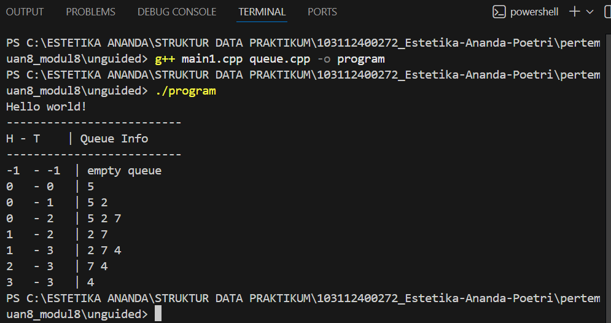
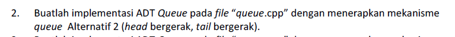
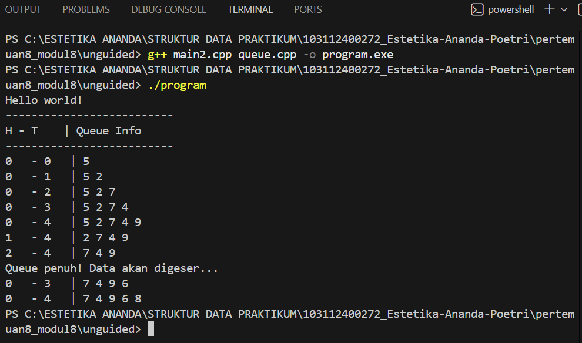
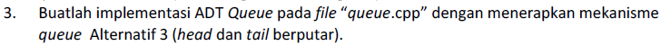
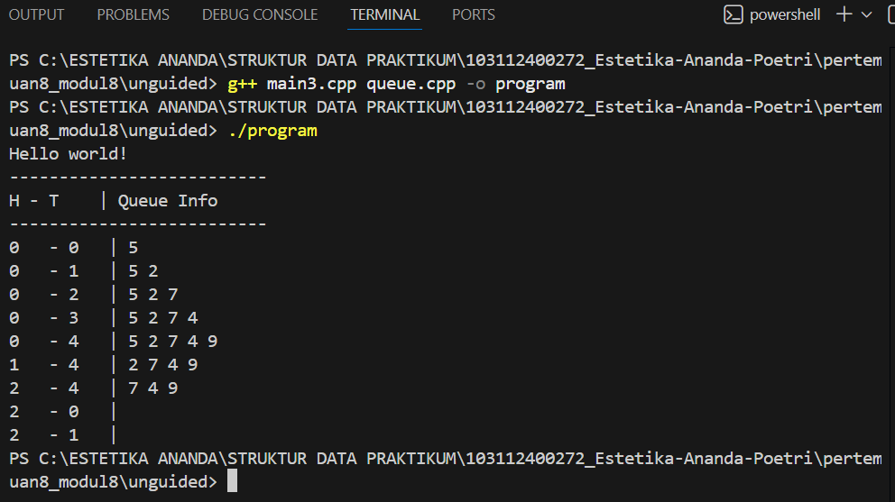

# <h1 align="center">Laporan Praktikum Modul 8 - Queue</h1>
<p align="center">Estetika Ananda Poetri Hariyanto - 103112400272</p>

## Dasar Teori
Queue atau antrian adalah suatu jenis struktur data yang dapat diproses dengan sifat FIFO (First In First Out), dimana elemen yang pertama kali masuk ke antrian akan keluar pertama kali. Ada dua jenis operasi yang bisa dilakukan di antrian: enqueue (memasukkan elemen baru ke dalam elemen) dan dequeue (adalah mengeluarkan satu elemen dari suatu antrian). Antrian dapat dibuat dengan menggunakan: Linear Array dan Circular Array [1].

### A. ...<br/>
...
#### 1. ...
#### 2. ...
#### 3. ...

### B. ...<br/>
...
#### 1. ...
#### 2. ...
#### 3. ...

## Guided

### 1. Guided 1

queue.cpp
```C++
#include "queue.h"
using namespace std;

void CreateQueue(queue &Q) {
    Q.head = nullptr;
    Q.tail = nullptr;
}

bool isEmpty(queue Q) {
    return Q.head == nullptr;
}

bool isFull(queue) {
    return false;
}

void enQueue(queue &Q, const string &nama) {
    Node* baru = new Node{nama, nullptr};
    if (isEmpty(Q)) {
        Q.head = Q.tail = baru;
    } else {
        Q.tail->next = baru;
        Q.tail = baru;
    }
    cout << "nama " << nama << " berhasil ditambahkan kedalam queue!" << endl;
}

void deQueue(queue &Q) {
    if (isEmpty(Q)) {
        cout << "Queue kosong!" << endl;
        return;
    }
    Node* hapus = Q.head;
    cout << "Menghapus data " << hapus->nama << "..." << endl;
    Q.head = Q.head->next;
    if (Q.head == nullptr) {
        Q.tail = nullptr;
    }
    delete hapus;
}

void viewQueue(queue Q) {
    if (isEmpty(Q)) {
        cout << "Queue kosong!" << endl;
        return;
    }
    int i = 1;
    for (Node* p = Q.head; p != nullptr; p = p->next) {
        cout << i++ << ". " << p->nama << endl;
    }
}

void clearQueue(queue &Q) {
    while (!isEmpty(Q)) {
        deQueue(Q);
    }
}
```

queue.h

``` C++
#ifndef QUEUE_H
#define QUEUE_H

#include <iostream>
#include <string>
using namespace std;

struct Node {
    string nama;
    Node* next;
};

struct queue {
    Node* head;
    Node* tail;
};

void CreateQueue(queue &Q);
bool isEmpty(queue Q);
bool isFull(queue Q);
void enQueue(queue &Q, const string &nama);
void deQueue(queue &Q);
void viewQueue(queue Q);
void clearQueue(queue &Q);

#endif
```

main.cpp

```C++
#include "queue.h"
#include <iostream>
using namespace std;

int main() {
    queue Q;
    CreateQueue(Q);

    enQueue(Q, "Dhimas");
    enQueue(Q, "Arvin");
    enQueue(Q, "Rizal");
    enQueue(Q, "Hafiz");
    enQueue(Q, "Fathur");
    enQueue(Q, "Atha");

    cout << endl << "--- Isi Queue Setelah enQueue ---" << endl;
    viewQueue(Q);

    deQueue(Q);
    deQueue(Q);
    deQueue(Q);
    deQueue(Q);

    cout << endl << "--- Isi Queue Setelah deQueue ---" << endl;
    viewQueue(Q);

    clearQueue(Q);
    return 0;
}
```
Program ini adalah implementasi struktur data queue (antrian) menggunakan linked list dalam bahasa C++. Queue bekerja dengan konsep FIFO (First In, First Out), artinya data yang pertama masuk adalah data yang pertama keluar.
Program ini menunjukkan cara membuat, menambah data, menghapus data, menampilkan isi, dan mengosongkan antrian dengan memanfaatkan struktur data linked list.

### 2. Guided 2

queue.cpp
```C++
#include "queue.h"
#include <iostream>

using namespace std;

// NOTE : 
// Implementasi 1 = head diam, tail bergerak (Queue Linear Statis, kerana head nya tetap diam)
// Implementasi 2 = head bergerak, tail bergerak (Queue Linear Dinamis, karena head & tail nya sama-sama bergerak)
// Implementasi 3 = head dan tail berputar (Queue Circular, karena jika udh mentok tapi masih ada space, diputar sehingga tail bisa ada didepan head)

bool isEmpty(queue Q){
    if(Q.head == -1 && Q.tail == -1){
        return true;
    } else {
        return false;
    }
}

//isFull implmenetasi 1 & 2
bool isFull(queue Q){
    if(Q.tail == MAKSIMAL - 1){
        return true;
    } else {
        return false;
    }
}

// //isFull implementasi 3
// bool isFull(queue Q){
//     if((Q.tail + 1) % MAKSIMAL == Q.head){
//         return true;
//     } else {
//         return false;
//     }
// }

void CreateQueue(queue &Q){ //terbentuk queue dengan head = -1 dan tail = -1 
    Q.head = -1;
    Q.tail = -1;
}
 

//enqueue implementasi 1 & 2
void enQueue(queue &Q, string nama){
    if(isFull(Q) == true){
        cout << "Queue sudah penuh!" << endl;
    } else {
        if(isEmpty(Q) == true){
            Q.head = Q.tail = 0;
        } else {
            Q.tail++;
        }
        Q.nama[Q.tail] = nama;
        cout << "nama " << nama << " berhasil ditambahkan kedalam queue!" << endl;
    }
}

// //enQueue implementasi 3
// void enQueue(queue &Q, string nama){
//     if(isFull(Q) == true){
//         cout << "Queue sudah penuh!" << endl;
//     } else {
//         if(isEmpty(Q) == true){
//             Q.head = Q.tail = 0;
//         } else {
//             Q.tail = (Q.tail + 1) % MAKSIMAL; // bergerak melingkar
//         }
//         Q.nama[Q.tail] = nama;
//         cout << "nama " << nama << " berhasil ditambahkan kedalam queue!" << endl;
//     }
// }

//dequeue implementasi 1
void deQueue(queue &Q){
    if(isEmpty(Q) == true){
        cout << "Queue kosong!" << endl;
    } else {
        cout << "Mengahapus data " << Q.nama[Q.head] << "..." << endl;
        for(int i = 0; i < Q.tail; i++){
            Q.nama[i] =  Q.nama[i+1];
        }
        Q.tail--;
        if(Q.tail < 0){ //kalo semua isi queue nya udh dikelaurin, set head & tail ke -1
            Q.head = -1;
            Q.tail = -1;
        }
    }
}

// //dequeue implementasi 2
// void deQueue(queue &Q){
//     if(isEmpty(Q) == true){
//         cout << "Queue kosong!" << endl;
//     } else {
//         cout << "Mengahapus data " << Q.nama[Q.head] << "..." << endl;
//         Q.head++;
//         if(Q.head > Q.tail){ //kalo elemennya udh abis (head akan lebih 1 dari tail), maka reset ulang head & tail ke -1
//             Q.head = -1;
//             Q.tail = -1;
//         }
//     }
// }

// //deQueue implementasi 3
// void deQueue(queue &Q){
//     if(isEmpty(Q) == true){
//         cout << "Queue kosong!" << endl;
//     } else {
//         cout << "Mengahapus data " << Q.nama[Q.head] << "..." << endl;
//         if(Q.head == Q.tail){ //kalo elemennya tinggal 1, langsungkan saja head & tail nya reset ke -1
//             Q.head = -1;
//             Q.tail = -1;
//         } else {
//             Q.head = (Q.head + 1) % MAKSIMAL; // bergerak melingkar
//         }
//     }
// }

//viewQueue implementasi 1 & 2
void viewQueue(queue Q){
    if(isEmpty(Q) == true){
        cout << "Queue kosong!" << endl;
    } else {
        for(int i = Q.head; i <= Q.tail; i++){
            cout << i -  Q.head + 1 << ". " << Q.nama[i] << endl;
        }
    }
    cout << endl;
}

// //viewQueue implementasi 3
// void viewQueue(queue Q){
//     if(isEmpty(Q) == true){
//         cout << "Queue kosong!" << endl;
//     } else {
//         int i = Q.head;
//         int count = 1;
//         while(true){
//             cout << count << ". " << Q.nama[i] << endl;
//             if(i == Q.tail){
//                 break;
//             }
//             i = (i + 1) % MAKSIMAL;
//             count++;
//         }   
//     }
// }
```
queue.h
```C++
#ifndef QUEUE_H
#define QUEUE_H

#include <string>
using namespace std;

#define MAKSIMAL 10   // atau kapasitas sesuai kebutuhan

struct queue {
    int head;
    int tail;
    string nama[MAKSIMAL];
};

// Prototipe fungsi
void CreateQueue(queue &Q);
bool isEmpty(queue Q);
bool isFull(queue Q);
void enQueue(queue &Q, string nama);
void deQueue(queue &Q);
void viewQueue(queue Q);

#endif
```

main.cpp
```C++
#include "queue.h"
#include <iostream>

using namespace std;

int main(){
    queue Q;

    CreateQueue(Q);
    enQueue(Q, "dhimas");
    enQueue(Q, "Arvin");
    enQueue(Q, "Rizal");
    enQueue(Q, "Hafizh");
    enQueue(Q, "Fathur");
    enQueue(Q, "Daffa");
    cout << endl;

    cout << "--- Isi Queue Setelah enQueue ---" << endl;
    viewQueue(Q);
    cout << endl;

    deQueue(Q);
    deQueue(Q);
    deQueue(Q);
    deQueue(Q);
    // deQueue(Q);
    // deQueue(Q);
    cout << endl;

    cout << "--- Isi Queue Setelah deQueue ---" << endl;
    viewQueue(Q);

    return 0;
}
```
Program ini sebenarnya cuma bikin antrian sederhana pakai array, yang cara kerjanya mirip orang lagi ngantri: siapa yang datang duluan, dia yang dilayani dulu (prinsip FIFO). Waktu antrian pertama kali dibuat, posisi head dan tail diset ke -1 sebagai tanda bahwa antriannya masih kosong. Kalau ada data baru masuk lewat fungsi enQueue, program akan cek dulu apakah antriannya sudah penuh. Kalau belum, data dimasukkan ke posisi paling belakang (tail) lalu tail digeser satu langkah ke kanan.

Saat data dikeluarkan dengan deQueue, program akan mengambil data paling depan, lalu semua data di belakangnya digeser maju supaya antriannya tetap rapi. Untuk melihat isi antrian, fungsi viewQueue tinggal menampilkan semua data dari depan sampai belakang. Di main.cpp, program memasukkan beberapa nama ke dalam antrian, menampilkannya, lalu menghapus beberapa nama, dan akhirnya memperlihatkan kondisi antrian setelah sebagian data keluar.

## Unguided 

### 1. 

queue.cpp
```C++
#include "queue.h"
#include <iomanip>
using namespace std;

// ===============================
// FUNGSI DASAR QUEUE
// ===============================
void createQueue(Queue &Q) {
    Q.head = -1;
    Q.tail = -1;
}

bool isEmpty(Queue Q) {
    return (Q.tail == -1);
}

bool isFull(Queue Q) {
    return (Q.tail == MAX - 1);
}

void printQueue(Queue Q) {
    cout << left << setw(3) << Q.head << " - " << setw(3) << Q.tail << " | ";
    if (isEmpty(Q)) {
        cout << "empty queue";
    } else {
        for (int i = Q.head; i <= Q.tail; i++) {
            cout << Q.data[i] << " ";
        }
    }
    cout << endl;
}

// ===============================
// ALTERNATIF 1: HEAD DIAM, TAIL BERGERAK
// ===============================
void enqueue1(Queue &Q, int value) {
    if (isFull(Q)) {
        cout << "Queue penuh!" << endl;
    } else {
        if (isEmpty(Q)) {
            Q.head = Q.tail = 0;
        } else {
            Q.tail++;
        }
        Q.data[Q.tail] = value;
    }
}

void dequeue1(Queue &Q) {
    if (isEmpty(Q)) {
        cout << "Queue kosong!" << endl;
    } else {
        if (Q.head == Q.tail) {
            createQueue(Q);
        } else {
            Q.head++;
        }
    }
}

// ===============================
// ALTERNATIF 2: HEAD & TAIL BERGERAK
// ===============================
void enqueue2(Queue &Q, int value) {
    if (isFull(Q)) {
        cout << "Queue penuh! Data akan digeser..." << endl;
        int j = 0;
        for (int i = Q.head; i <= Q.tail; i++) {
            Q.data[j++] = Q.data[i];
        }
        Q.tail = j - 1;
        Q.head = 0;
    }

    if (isEmpty(Q)) {
        Q.head = Q.tail = 0;
    } else {
        Q.tail++;
    }

    Q.data[Q.tail] = value;
}

void dequeue2(Queue &Q) {
    if (isEmpty(Q)) {
        cout << "Queue kosong!" << endl;
    } else {
        if (Q.head == Q.tail) {
            createQueue(Q);
        } else {
            Q.head++;
        }
    }
}

// ===============================
// ALTERNATIF 3: CIRCULAR QUEUE
// ===============================
void enqueue3(Queue &Q, int value) {
    if ((Q.tail + 1) % MAX == Q.head) {
        cout << "Queue penuh (Circular)!" << endl;
        return;
    }

    if (isEmpty(Q)) {
        Q.head = Q.tail = 0;
    } else {
        Q.tail = (Q.tail + 1) % MAX;
    }

    Q.data[Q.tail] = value;
}

void dequeue3(Queue &Q) {
    if (isEmpty(Q)) {
        cout << "Queue kosong (Circular)!" << endl;
        return;
    }

    if (Q.head == Q.tail) {
        createQueue(Q);
    } else {
        Q.head = (Q.head + 1)%MAX;
    }
}
```

queue.h
```C++
#ifndef QUEUE_H
#define QUEUE_H
#include <iostream>
using namespace std;

const int MAX = 5;

struct Queue {
    int data[MAX];
    int head;
    int tail;
};

// ===== FUNGSI DASAR =====
void createQueue(Queue &Q);
bool isEmpty(Queue Q);
bool isFull(Queue Q);
void printQueue(Queue Q);

// ===== ALTERNATIF 1: HEAD DIAM, TAIL BERGERAK =====
void enqueue1(Queue &Q, int value);
void dequeue1(Queue &Q);

// ===== ALTERNATIF 2: HEAD & TAIL BERGERAK =====
void enqueue2(Queue &Q, int value);
void dequeue2(Queue &Q);

// ===== ALTERNATIF 3: CIRCULAR QUEUE =====
void enqueue3(Queue &Q, int value);
void dequeue3(Queue &Q);

#endif
```

main1.cpp
```C++
#include "queue.h"
#include <iostream>
using namespace std;

int main() {
    Queue Q;
    createQueue(Q);

    cout << "Hello world!" << endl;
    cout << "--------------------------" << endl;
    cout << "H - T \t | Queue Info" << endl;
    cout << "--------------------------" << endl;

    printQueue(Q);
    enqueue1(Q, 5); printQueue(Q);
    enqueue1(Q, 2); printQueue(Q);
    enqueue1(Q, 7); printQueue(Q);
    dequeue1(Q); printQueue(Q);
    enqueue1(Q, 4); printQueue(Q);
    dequeue1(Q); printQueue(Q);
    dequeue1(Q); printQueue(Q);

    return 0;
}
```
### Output Unguided 1 :

##### Output 1


Program ini sedang membuat sebuah antrian, mirip seperti orang yang sedang mengantri. Siapa yang datang duluan, dia juga yang dilayani atau keluar duluan (FIFO).

Struktur programnya sendiri terbagi menjadi tiga bagian utama. Pertama, ada fungsi-fungsi dasar yang dipakai untuk mengelola antrian. Kedua, ada tiga macam cara atau teknik untuk membangun antrian tersebut. Dan terakhir, ada program utama yang menjalankan dan mengetes semua fungsi tadi.

### 2. 

main2.cpp
```C++
#include "queue.h"
#include <iostream>
#include <iomanip>
using namespace std;

int main() {
    Queue Q;
    createQueue(Q);

    cout << "Hello world!" << endl;
    cout << "--------------------------" << endl;
    cout << "H - T \t | Queue Info" << endl;
    cout << "--------------------------" << endl;

    enqueue2(Q, 5);  printQueue(Q);
    enqueue2(Q, 2);  printQueue(Q);
    enqueue2(Q, 7);  printQueue(Q);
    enqueue2(Q, 4);  printQueue(Q);
    enqueue2(Q, 9);  printQueue(Q);
    dequeue2(Q);     printQueue(Q);
    dequeue2(Q);     printQueue(Q);
    enqueue2(Q, 6);  printQueue(Q);
    enqueue2(Q, 8);  printQueue(Q);

    return 0;
}
```
queue.cpp
```C++
#include "queue.h"
#include <iomanip>
using namespace std;

// ===============================
// FUNGSI DASAR QUEUE
// ===============================
void createQueue(Queue &Q) {
    Q.head = -1;
    Q.tail = -1;
}

bool isEmpty(Queue Q) {
    return (Q.tail == -1);
}

bool isFull(Queue Q) {
    return (Q.tail == MAX - 1);
}

void printQueue(Queue Q) {
    cout << left << setw(3) << Q.head << " - " << setw(3) << Q.tail << " | ";
    if (isEmpty(Q)) {
        cout << "empty queue";
    } else {
        for (int i = Q.head; i <= Q.tail; i++) {
            cout << Q.data[i] << " ";
        }
    }
    cout << endl;
}

// ===============================
// ALTERNATIF 1: HEAD DIAM, TAIL BERGERAK
// ===============================
void enqueue1(Queue &Q, int value) {
    if (isFull(Q)) {
        cout << "Queue penuh!" << endl;
    } else {
        if (isEmpty(Q)) {
            Q.head = Q.tail = 0;
        } else {
            Q.tail++;
        }
        Q.data[Q.tail] = value;
    }
}

void dequeue1(Queue &Q) {
    if (isEmpty(Q)) {
        cout << "Queue kosong!" << endl;
    } else {
        if (Q.head == Q.tail) {
            createQueue(Q);
        } else {
            Q.head++;
        }
    }
}

// ===============================
// ALTERNATIF 2: HEAD & TAIL BERGERAK
// ===============================
void enqueue2(Queue &Q, int value) {
    if (isFull(Q)) {
        cout << "Queue penuh! Data akan digeser..." << endl;
        int j = 0;
        for (int i = Q.head; i <= Q.tail; i++) {
            Q.data[j++] = Q.data[i];
        }
        Q.tail = j - 1;
        Q.head = 0;
    }

    if (isEmpty(Q)) {
        Q.head = Q.tail = 0;
    } else {
        Q.tail++;
    }

    Q.data[Q.tail] = value;
}

void dequeue2(Queue &Q) {
    if (isEmpty(Q)) {
        cout << "Queue kosong!" << endl;
    } else {
        if (Q.head == Q.tail) {
            createQueue(Q);
        } else {
            Q.head++;
        }
    }
}

// ===============================
// ALTERNATIF 3: CIRCULAR QUEUE
// ===============================
void enqueue3(Queue &Q, int value) {
    if ((Q.tail + 1) % MAX == Q.head) {
        cout << "Queue penuh (Circular)!" << endl;
        return;
    }

    if (isEmpty(Q)) {
        Q.head = Q.tail = 0;
    } else {
        Q.tail = (Q.tail + 1) % MAX;
    }

    Q.data[Q.tail] = value;
}

void dequeue3(Queue &Q) {
    if (isEmpty(Q)) {
        cout << "Queue kosong (Circular)!" << endl;
        return;
    }

    if (Q.head == Q.tail) {
        createQueue(Q);
    } else {
        Q.head = (Q.head + 1)%MAX;
    }
}
```

queue.h
```C++
#ifndef QUEUE_H
#define QUEUE_H
#include <iostream>
using namespace std;

const int MAX = 5;

struct Queue {
    int data[MAX];
    int head;
    int tail;
};

// ===== FUNGSI DASAR =====
void createQueue(Queue &Q);
bool isEmpty(Queue Q);
bool isFull(Queue Q);
void printQueue(Queue Q);

// ===== ALTERNATIF 1: HEAD DIAM, TAIL BERGERAK =====
void enqueue1(Queue &Q, int value);
void dequeue1(Queue &Q);

// ===== ALTERNATIF 2: HEAD & TAIL BERGERAK =====
void enqueue2(Queue &Q, int value);
void dequeue2(Queue &Q);

// ===== ALTERNATIF 3: CIRCULAR QUEUE =====
void enqueue3(Queue &Q, int value);
void dequeue3(Queue &Q);

#endif
```

### Output Unguided 2 :

##### Output 1


Program ini menjalankan queue versi Alternatif 2, yaitu versi di mana head dan tail bisa bergerak, dan kalau queue penuh tapi masih ada ruang kosong di depan, datanya akan digeser ke kiri supaya tetap bisa menampung data baru.

### 3. 

queue.cpp
```C++
#include "queue.h"
#include <iomanip>
using namespace std;

// ===============================
// FUNGSI DASAR QUEUE
// ===============================
void createQueue(Queue &Q) {
    Q.head = -1;
    Q.tail = -1;
}

bool isEmpty(Queue Q) {
    return (Q.tail == -1);
}

bool isFull(Queue Q) {
    return (Q.tail == MAX - 1);
}

void printQueue(Queue Q) {
    cout << left << setw(3) << Q.head << " - " << setw(3) << Q.tail << " | ";
    if (isEmpty(Q)) {
        cout << "empty queue";
    } else {
        for (int i = Q.head; i <= Q.tail; i++) {
            cout << Q.data[i] << " ";
        }
    }
    cout << endl;
}

// ===============================
// ALTERNATIF 1: HEAD DIAM, TAIL BERGERAK
// ===============================
void enqueue1(Queue &Q, int value) {
    if (isFull(Q)) {
        cout << "Queue penuh!" << endl;
    } else {
        if (isEmpty(Q)) {
            Q.head = Q.tail = 0;
        } else {
            Q.tail++;
        }
        Q.data[Q.tail] = value;
    }
}

void dequeue1(Queue &Q) {
    if (isEmpty(Q)) {
        cout << "Queue kosong!" << endl;
    } else {
        if (Q.head == Q.tail) {
            createQueue(Q);
        } else {
            Q.head++;
        }
    }
}

// ===============================
// ALTERNATIF 2: HEAD & TAIL BERGERAK
// ===============================
void enqueue2(Queue &Q, int value) {
    if (isFull(Q)) {
        cout << "Queue penuh! Data akan digeser..." << endl;
        int j = 0;
        for (int i = Q.head; i <= Q.tail; i++) {
            Q.data[j++] = Q.data[i];
        }
        Q.tail = j - 1;
        Q.head = 0;
    }

    if (isEmpty(Q)) {
        Q.head = Q.tail = 0;
    } else {
        Q.tail++;
    }

    Q.data[Q.tail] = value;
}

void dequeue2(Queue &Q) {
    if (isEmpty(Q)) {
        cout << "Queue kosong!" << endl;
    } else {
        if (Q.head == Q.tail) {
            createQueue(Q);
        } else {
            Q.head++;
        }
    }
}

// ===============================
// ALTERNATIF 3: CIRCULAR QUEUE
// ===============================
void enqueue3(Queue &Q, int value) {
    if ((Q.tail + 1) % MAX == Q.head) {
        cout << "Queue penuh (Circular)!" << endl;
        return;
    }

    if (isEmpty(Q)) {
        Q.head = Q.tail = 0;
    } else {
        Q.tail = (Q.tail + 1) % MAX;
    }

    Q.data[Q.tail] = value;
}

void dequeue3(Queue &Q) {
    if (isEmpty(Q)) {
        cout << "Queue kosong (Circular)!" << endl;
        return;
    }

    if (Q.head == Q.tail) {
        createQueue(Q);
    } else {
        Q.head = (Q.head + 1)%MAX;
    }
}
```

queue.h
```C++
#ifndef QUEUE_H
#define QUEUE_H
#include <iostream>
using namespace std;

const int MAX = 5;

struct Queue {
    int data[MAX];
    int head;
    int tail;
};

// ===== FUNGSI DASAR =====
void createQueue(Queue &Q);
bool isEmpty(Queue Q);
bool isFull(Queue Q);
void printQueue(Queue Q);

// ===== ALTERNATIF 1: HEAD DIAM, TAIL BERGERAK =====
void enqueue1(Queue &Q, int value);
void dequeue1(Queue &Q);

// ===== ALTERNATIF 2: HEAD & TAIL BERGERAK =====
void enqueue2(Queue &Q, int value);
void dequeue2(Queue &Q);

// ===== ALTERNATIF 3: CIRCULAR QUEUE =====
void enqueue3(Queue &Q, int value);
void dequeue3(Queue &Q);

#endif
```

main3.cpp
```C++
#include "queue.h"
#include <iostream>
#include <iomanip>
using namespace std;

int main() {
    Queue Q;
    createQueue(Q);

    cout << "Hello world!" << endl;
    cout << "--------------------------" << endl;
    cout << "H - T \t | Queue Info" << endl;
    cout << "--------------------------" << endl;

    enqueue3(Q, 5);  printQueue(Q);
    enqueue3(Q, 2);  printQueue(Q);
    enqueue3(Q, 7);  printQueue(Q);
    enqueue3(Q, 4);  printQueue(Q);
    enqueue3(Q, 9);  printQueue(Q);
    dequeue3(Q);     printQueue(Q);
    dequeue3(Q);     printQueue(Q);
    enqueue3(Q, 6);  printQueue(Q);
    enqueue3(Q, 8);  printQueue(Q);

    return 0;
}
```

### Output Unguided 3 :

##### Output 1


Program ini memperlihatkan cara kerja Circular Queue. Berbeda dengan queue biasa, saat posisi tail sudah mencapai ujung array, dia bisa kembali lagi ke indeks awal — seolah-olah array berbentuk lingkaran. Ruang kosong yang ada di depan pun tetap bisa dipakai, jadi tidak ada memori yang terbuang.

Di sistem ini, head selalu menunjukkan data paling depan, sedangkan tail menunjukkan data paling belakang. Keduanya bergerak mengikuti operasi masuk dan keluarnya data.

Keuntungan besarnya adalah kita tidak perlu menggeser data sama sekali, sehingga prosesnya jauh lebih efisien.

## Kesimpulan
Struktur data Queue (antrian) adalah salah satu struktur penting dalam pemrograman yang bekerja dengan prinsip FIFO (First In, First Out). Artinya, data yang pertama masuk akan menjadi data yang pertama keluar. Di dalam queue terdapat dua operasi utama yaitu enqueue untuk menambah data dan dequeue untuk menghapus data.

Dalam pembahasan dan implementasi yang dilakukan, ada beberapa cara membangun queue, baik dengan linked list maupun array, masing-masing punya kelebihan dan kekurangannya:

1. Queue dengan Linked List

Pada cara ini, queue bersifat dinamis karena memori dialokasikan sesuai kebutuhan. Selama memori masih cukup, jumlah data bisa terus bertambah. Proses enqueue dan dequeue juga lebih efisien karena cukup mengatur pointer head dan tail tanpa perlu menggeser data.

2. Queue dengan Array Linear (Head tetap, Tail bergerak)

Metode ini sederhana, tetapi kurang efisien. Saat data di-dequeue, ruang kosong di depan tidak bisa dipakai lagi. Ketika tail sudah sampai ujung array, queue dianggap penuh meskipun masih ada ruang kosong di awal.

3. Queue dengan Array Linear (Head dan Tail bergerak)

Pada versi ini, saat array penuh, semua data digeser ke depan agar ada ruang kosong baru. Cara ini masih bekerja dengan baik, namun proses penggeseran menambah waktu eksekusi sehingga kurang efisien untuk data besar.

4. Circular Queue (Array Melingkar)

Ini adalah implementasi array yang paling efisien. Head dan tail bisa kembali ke indeks awal sehingga seluruh kapasitas array bisa digunakan tanpa perlu menggeser data. Circular queue memanfaatkan memori lebih optimal dan mempercepat proses enqueue–dequeue.

## Referensi
[1] [chrome-extension://efaidnbmnnnibpcajpcglclefindmkaj/https://pdfs.semanticscholar.org/b259/03fee61c41cb7f5b8fe848278da393cc5193.pdf]

